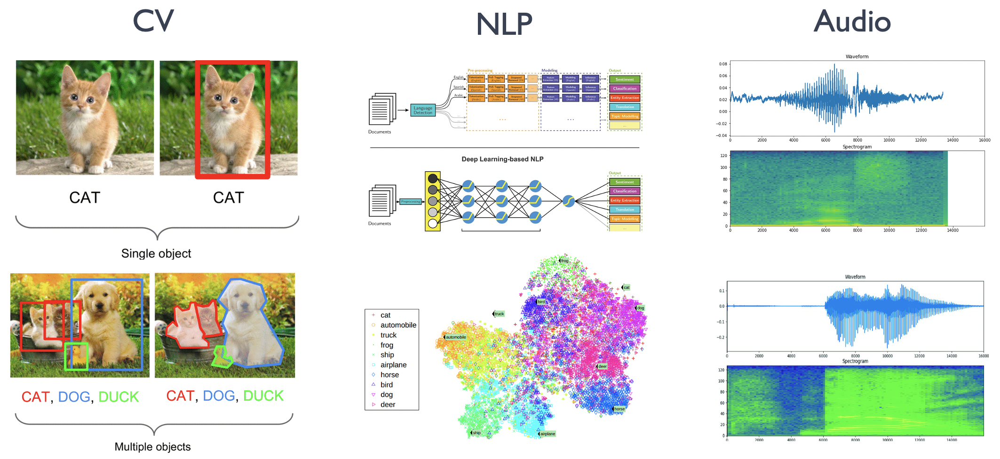
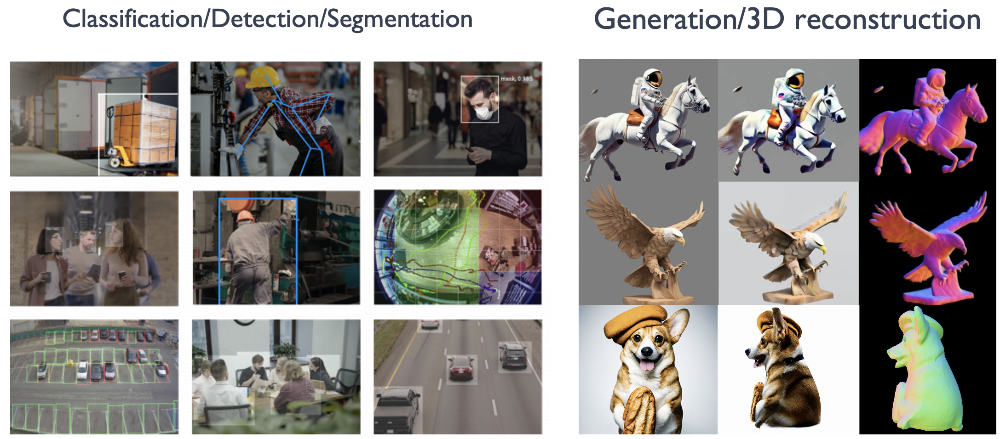
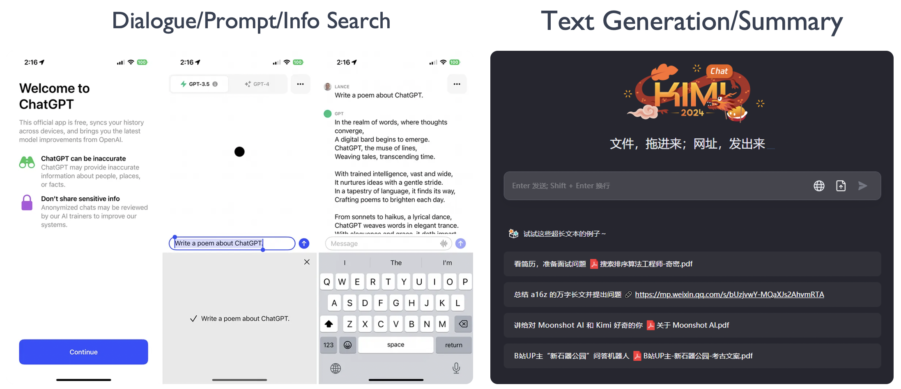
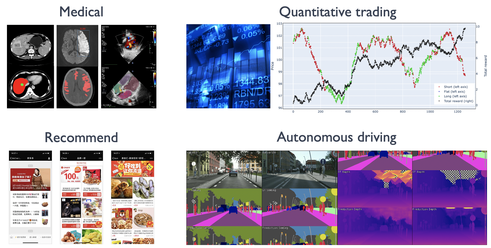
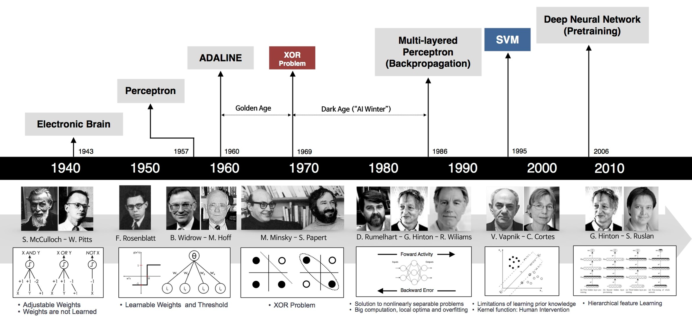
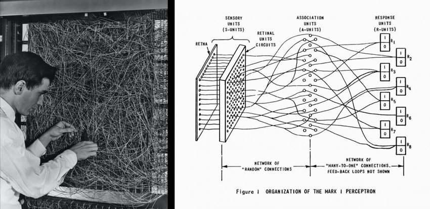
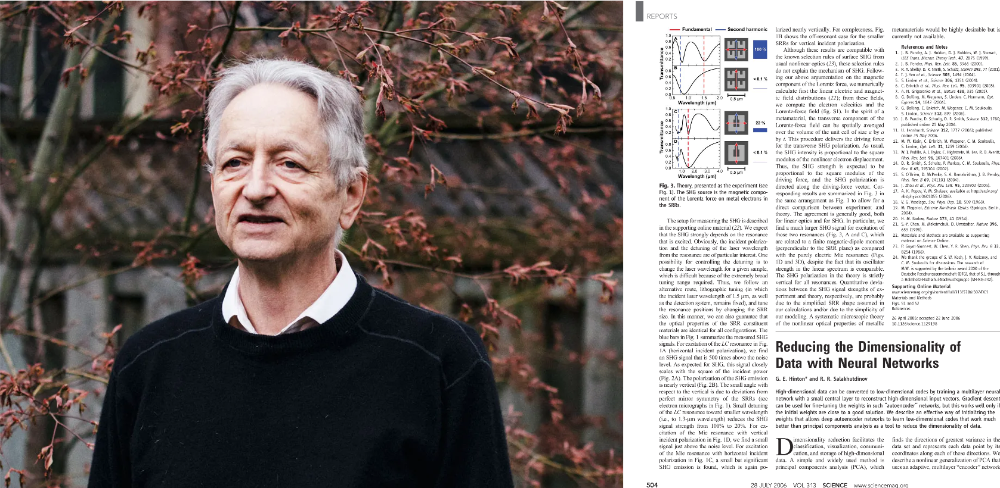
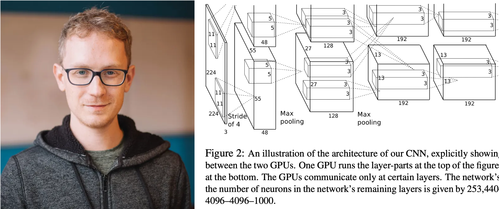
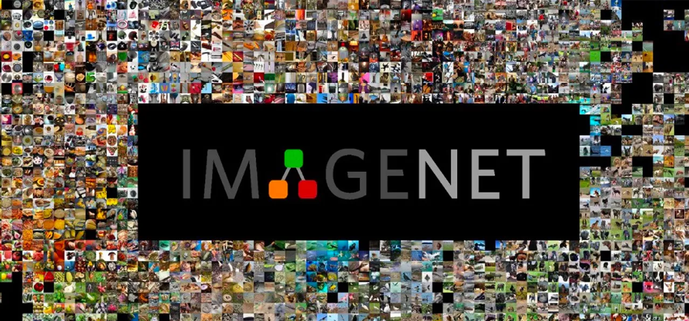

<!--Copyright © ZOMI 适用于[License](https://github.com/chenzomi12/DeepLearningSystem)版权许可-->

# AI 的历史与现状

本章将介绍 AI 的由来、现状和趋势，让大家能够了解 AI 应用的由来与趋势，为后面理解 AI 系统的设计形成初步的基础。在后面章节介绍的人工智能系统（AI System）奠定基础，值得注意的是，这些系统设计原则大部分也适合于机器学习系统（ML System）。

因为系统本身是随着上层应用的发展而不断演化的，从人工智能本身的发展脉络和趋势可以观察到：目前模型不断由小模型到大模型分布式训练演进，由单一的模型训练方式演化出针对特定应用的深度强化学习的训练方式，企业级人工智能模型生产由独占使用硬件资源到云上多租户共享 AI 集群资源进行模型训练。

看 AI 算法模型结构本身的发展，训练与部署需求使得模型结构快速演变；执行与部署流程上，资源管理变得越来越复杂，给 AI 系统的设计和开发带来越来越大的挑战的同时，也充满了新的系统设计，研究与工程实践的机遇。

希望在后面的章节中，不仅能给读者带来较为系统化的 AI 知识，也希望能激发开发者对 AI 系统研究的兴趣，掌握相应的 AI 系统研究方法与设计原则，深入地去了解 AI 系统发展的趋势与脉络。

## AI 的领域应用

人工智能正在日益渗透到所有的技术领域，而深度学习(DL)是目前人工智能中最活跃的分支。最近几年，DL取得了许多重要进展，其中一些因为事件跟大众关系密切而引人瞩目，而有的虽然低调但意义重大。深度学习从业人员应该保持足够的嗅觉，这个领域正在发生很多事情，必须要跑的足够的快才能跟上时代步伐。深度学习在计算机视觉 CV、自然语言处理 NLP、语音识别 Audio 这三大领域方向中都取得了显著的成果。

### CV 领域应用

深度学习因其可信度而得到广泛认可。计算机视觉，尤其是图像识别，是深度学习能力的一些最早重要演示的主题，最近在人脸识别和物体检测方面。

- 物体检测与跟踪：深度学习算法已用于各种应用，例如自动驾驶汽车、无人机和安全摄像头的实时检测和跟踪对象。例如，自动驾驶汽车使用深度学习来识别和跟踪周围环境中的车辆、行人和其他物体。同样，配备深度学习算法的无人机可以实时检测和跟踪感兴趣的物体，例如野生动物或车辆。

- 图像与视频识别：深度学习模型可以非常准确地识别和分类图像和视频，从而支持图像搜索引擎、内容审核和推荐系统等应用。例如，Google和Bing等搜索引擎使用深度学习算法，根据图像查询提供准确且相关的搜索结果。同样，Facebook和YouTube等内容审核平台使用深度学习来自动标记和删除不当内容。

- 面部识别：深度学习算法可以高精度识别和匹配人脸，实现安全访问控制、监控甚至个性化营销等应用。例如，出于安全目的，机场和政府大楼使用面部识别来筛查乘客和员工。同样，零售商使用面部识别来分析客户行为和偏好，并提供个性化的购物体验。

### NLP 领域应用

深度学习与NLP有着密切的联系。深度学习是一种机器学习方法，它通过建立多层神经网络来模拟人脑的学习过程。NLP则是一种人工智能技术，它研究如何让计算机更好地理解和处理自然语言。NLP的基本概念主要包括文本处理和自然语言理解。

- 文本处理：对文本数据进行的一系列处理过程，包括分词、词性标注、句法分析和语义分析等。这些处理过程可以帮助计算机更好地理解和处理自然语言文本数据。自然语言理解则是让计算机能够理解自然语言文本数据的含义和上下文信息，从而能够做出相应的响应和决策。

- 词向量表示：词向量表示是将词语转化为计算机能够处理的数据格式。深度学习可以通过建立神经网络模型，利用大量语料库进行训练，从而学习到词向量表示。这种表示方式可以更好地捕捉词语的语义信息，为后续的自然语言处理任务提供更好的基础。

- 文本分类与情感分析：深度学习可以通过建立卷积神经网络（CNN）或循环神经网络（RNN）等模型，对文本进行分类或情感分析。例如，利用CNN模型对文本进行分类，可以识别文本所属的类别；利用RNN模型进行情感分析，可以判断文本表达的情感倾向。

- 机器翻译：机器翻译是NLP领域的一个重要应用，它是将一种自然语言文本自动翻译成另一种自然语言文本的过程。深度学习可以通过建立神经网络模型，利用大量双语语料库进行训练，从而实现高质量的机器翻译。

### Audio 领域应用

随着深度学习技术的快速发展，智能音频处理作为其中的一个重要应用领域，利用深度学习技术可以实现音频信号的分析、识别和合成等任务。深度学习技术在智能音频处理中的应用与创新为音频信号的分析、识别和合成等任务提供了强大的工具和方法。通过深度学习技术，可以实现音频信号的自动处理和优化，提高音频处理的效率和准确性。未来，我们可以进一步研究和探索深度学习技术在智能音频处理中的新应用和创新，以满足不断增长的音频处理需求。

- 音频信号分析：深度学习技术可以用于音频信号的分析，如音频分类、音频分割和音频降噪等。通过训练深度神经网络模型，可以提取音频信号的特征，并对音频进行分类或分割。此外，深度学习技术还可以应用于音频降噪，通过学习噪声模型和信号模型，实现对噪声的自动去除。

- 语音识别：深度学习技术在语音识别领域取得了重大突破。通过使用深度神经网络模型，可以将语音信号转化为文本信息。深度学习模型可以自动学习语音信号的特征，并通过大规模的训练数据提高识别准确率。语音识别技术的应用包括语音助手、语音翻译和语音控制等。

- 音频合成：深度学习技术可以用于音频合成，如语音合成和音乐合成等。通过训练深度神经网络模型，可以生成逼真的语音合成结果。此外，深度学习技术还可以用于音乐合成，通过学习音乐的模式和结构，生成新的音乐作品。

- 端到端的音频处理：传统的音频处理方法通常需要多个步骤和模块，而深度学习技术可以实现端到端的音频处理。通过训练端到端的深度学习模型，可以直接从原始音频信号中提取特征并完成音频处理任务，简化了处理流程并提高了效率。

- 跨模态音频处理：深度学习技术可以实现跨模态的音频处理，将音频信号与其他模态的信息进行融合和处理。例如，可以将音频信号与图像或文本信息进行联合处理，实现更加丰富和准确的音频分析和合成。

## AI 场景与行业应用

随着人工智能技术的发展与推广，人工智能逐渐在互联网、制造业、医疗、金融等不同行业和场景涌现大范围的应用。

- 金融行业：金融行业一直是人工智能技术的重要应用场景。通过深度学习技术，可以实现对客户信用评估、风险管理、反欺诈等方面的智能化分析。目前，我国多家金融机构已经在尝试将AI应用于金融行业，如中国银行、中国平安、招商银行等。这些金融机构通过AI实现对客户数据的快速处理和分析，提高业务效率，降低风险。

- 医疗行业：医疗行业一直是人工智能技术的重要应用场景。通过深度学习技术，可以实现对疾病诊断、药物研发、病历管理等方面的智能化分析。目前，我国多家医疗机构已经在尝试将AI模型应用于医疗行业，如清华大学、北京大学、复旦大学等。这些医疗机构通过AI实现对病历数据的快速处理和分析，提高疾病诊断准确率，降低药物研发成本。

- 教育行业：教育行业一直是人工智能技术的重要应用场景。通过深度学习技术，可以实现对学生的个性化教育、智能辅导、智能评估等方面的智能化分析。通过 AI 的应用实现对学生的个性化教育，提高学习效果，降低教育成本。

- 互联网行业：谷歌、百度、微软必应（Bing）等公司通过人工智能技术进行更好的文本向量化，提升检索质量，同时人工智能进行点击率预测，获取更高的利润。

- 自动驾驶：通过深度学习，自动驾驶车辆能够更准确地识别道路上的物体，更安全地执行驾驶决策，更稳定地控制车辆的行驶。如通过物体检测模型能够进行更好的路标检测，道路线检测进而增强自动驾驶方案。同时，深度学习还能够提高自动驾驶车辆的适应性和智能化水平，使其能够更好地应对复杂的交通环境和多种驾驶场景。在未来，随着自动驾驶技术的不断发展，深度学习将在其中发挥越来越重要的作用，推动自动驾驶技术的进步和应用。

综上所述，可以看到也是这些有应用与部署人工智能技术的公司都会在人工智能基础设施和系统上投入和研发，进而通过提升人工智能模型生产效率，更快的获取效果更好的模型进而获取领先优势，然后再通过业务场景反哺，获取更多的数据和加大研发投入，驱动人工智能系统与工具链的创新与发展。

## AI 基本理论奠定

虽然 AI 在今年取得了举世瞩目的进展与突破，但是其当前基于的核心理论神经网络等，在这波浪潮开始前已经基本奠定，并经历了多次的起起伏伏。神经网络作为 AI 的前身，经历了以下的发展阶段：

1943 年，神经科学家和控制论专家 Warren McCulloch 和逻辑学家 Walter Pitts 基于数学和阈值逻辑算法创造了一种神经网络计算模型。并发表文章 "A Logical Calculus of the ideas Imminent in Nervous Activity"[[3]]。

1957 年，Frank Rosenblat 发明感知机（Perceptron）[[4]]。奠定了之后 AI 的基本结构，其计算以矩阵乘加运算为主，进而影响了后续人工智能芯片和系统的基本算子类型，例如：英伟达的新款GPU就有为矩阵计算设计的专用张量核（Tensor Core）。

1960 年，Bernard Widrow[[5]] 和 Hoff 发明了感知器 Adaline/Madaline，首次尝试把线性层叠加整合为多层感知器网络。感知器本质上是一种线性模型，可以对输入的训练集数据进行二分类，且能够在训练集中自动更新权值。感知器的提出吸引了大量科学家对人工神经网络研究的兴趣，对神经网络的发展具有里程碑式的意义。为之后的多层 AI 的网络结构奠定了基础，进而后期不断衍生更深层的模型，产生大模型和模型并行等系统问题。

1969 年，Marvin Minsky 和 Seymour Papert 共同编写了一本书籍 “Perceptrons: an introduction to computational geometry”[[6]]，在书中他们证明了单层感知器无法解决线性不可分问题（例如：异或问题）。发现了当时的神经网络的两个重大缺陷：

1. 基本感知机无法处理异或回路。
2. 当时计算机的计算能力不足以用来处理复杂神经网络。

因此对于神经网络的研究就此停滞不前，这也为后来 AI 的两大驱动力，提升硬件算力和模型通过更多的层和非线性计算（激活函数和最大池化等）增加非线性能力的演进埋下了伏笔。

1974 年，Paul Werbos 在博士论文 “Beyond regression : new tools for prediction and analysis in the behavioral sciences”[[7]] 中提出了用误差反向传播来训练人工神经网络，使得训练多层神经网络成为可能，有效解决了异或回路问题。这个工作奠定了之后 AI 的训练方式， AI 训练系统中最为重要的执行步骤就是在不断的进行反向传播训练。同时 AI 的编程语言和框架为了支持反向传播训练，默认都提供自动微分（Automatic Differentiation）的功能。

1986 年， AI（Deep Learning）一词由 Rina Dechter 于 1986 年 AAAI 论文“LEARNING WHILE SEARCHING IN CONSTRAINT-SATISFACTION-PROBLEMS”[[8]] 引入机器学习社区。目前常常所说的人工智能系统主要以 AI 系统为代表性系统。

1989 年，Yann LeCun 在论文“Backpropagation Applied to Handwritten Zip Code Recognition”[[9]] 提出了一种用反向传导进行更新的卷积神经网络，称为 LeNet 。启发了后续卷积神经网络的研究与发展。卷积神经网络为 AI 系统的重要负载，大多数的 AI 系统都需要在卷积神经网络上验证性能，在未来会看到很多 AI 系统的基准测试中也会引入大量的卷积神经网络。

20 世纪 90 年代中期统计学习登场，支持向量机开始成为主流，进入第二个低谷。

2006 年，Geoff Hinton、Ruslan Salakhutdinov、Osindero 的论文 “Reducing the Dimensionality of Data with Neural Networks”[[10]] 表明，多层前馈神经网络可以一次有效地预训练一层，依次将每一层视为无监督受限的玻尔兹曼（Boltzmann）机，然后使用监督反向传播对其进行微调，其论文主要研究深度信念网络（Deep Belief Nets）的学习。

2009 年，李飞飞教授团队在佛罗里达州举行的 2009 年计算机视觉和模式识别 (CVPR) 会议上首次以海报的形式展示了他们的 [ImageNet](https://en.wikipedia.org/wiki/ImageNet)[[11]] 数据库，之后大量计算机视觉领域的经典模型在此数据库上进行验证，评测并演进。李飞飞于 2006 年产生想法并开始研究 [ImageNet](https://en.wikipedia.org/wiki/ImageNet)[[11]] 。

2007年，李飞飞与 WordNet 的创始人之一普林斯顿大学教授克里斯蒂安·费尔鲍姆会面，之后从 WordNet 的单词数据库开始构建 ImageNet，并使用了它的许多功能。作为普林斯顿大学的助理教授，李博士组建了一个研究团队，致力于 ImageNet 项目，其通过众包平台 [Amazon Mechanical Turk](https://www.mturk.com/) 的工作人员来进行标记。

2011 年 8 月，微软研究院 Frank Seide, Gang Li, Dong Yu 在 Interspeech 的论文 " Conversational speech transcription using context-dependent deep neural networks."[[12]] 首次介绍了如何通过深度神经网络模型在会话语音转录（Conversational Speech Transcription）上实现突破性进展。文章介绍了模型的的设计和实验结果，“其在单通道非特定人识别（Single-pass Speaker-independent Recognition）基准测试上将相对错误率由 27.4% 降低到 18.5% ，相对错误率降低 33%，在其他 4 类任务中相对错误率降低 22–28%。

此深度神经网络的训练任务是通过分布式系统（其设计了适合当前作业的张量切片与放置以及通信协调策略以加速训练）部署在多台配置有 NVIDIA Tesla GPGPU 服务器，通过几百小时的分布式训练才得以完成。论文在最后致谢中提到 “Our special thanks go to Ajith Jayamohan and Igor Kouzminykh of the MSR Extreme Computing Group for access to a Tesla server farm, without which this work would not have been possible.”，由此看到在 AI 领域算法团队与系统团队协作已经由来已久，算法与系统的协同设计将以往不可能完成的计算任务变为了可能，上层应用负载需求驱动系统发展与演化，系统支撑上层应用负载取得新的突破。

2012 年 1 月，Google 的神经网络从 1000 万张 YouTube 视频的静止画面中学会了[识别猫](https://www.nytimes.com/2012/06/26/technology/in-a-big-network-of-computers-evidence-of-machine-learning.html)。Google 的科学家通过连接 16,000 个计算机处理器创建了最大的机器学习神经网络之一，他们在互联网上将这些处理器松散开来自行学习，正是大规模系统互联更大的算力支撑了当时相比以往更大的数据和模型的训练。此工作 “[Building high-level features using large scale unsupervised learning](https://dl.acm.org/doi/10.5555/3042573.3042641)” [[13]] 发表在 ICML '12 会议上。

2012 年 9 月，Alex Krizhevsky，Ilya Sutskever 和 Geoffrey Hinton，团队通过设计 [AlexNet](https://papers.nips.cc/paper/2012/hash/c399862d3b9d6b76c8436e924a68c45b-Abstract.html)[[14]] 赢得 ImageNet 竞赛，深度神经网络开始再次流行。首次采用 ReLU 激活函数，扩展了 LeNet5 结构，添加 Dropout 层减小过拟合，LRN 层增强泛化能力/减小过拟合。这些新的模型结构和训练方法影响着后续的模型设计和系统优化，例如：激活函数和卷积层的内核融合计算等。其花费 5 到 6 天，采用 2 块 NVIDIA GTX 580 3GB GPUs 对计算进行加速，进而形成 AI 系统以 GPU 等加速器为主要计算单元的架构。

截至到 2012 年这个时间点，基础架构的线索中，以英伟达（NVIDIA）为代表的芯片厂商已经连续发布了 Tesla，Fermi，[Kepler](https://en.wikipedia.org/wiki/Kepler_(microarchitecture)) 架构系列商用 GPU 和多款消费级 GPU，这些 GPU 已经开始被研究工作引用加速 AI 算法与模型的研究，被业界公司用于人工智能产品。但同时从 AlexNet 工作中看到，作还基于 CUDA API 进行编程实现了[cuda-convnet](https://code.google.com/archive/p/cuda-convnet)， AI 系统与工具伴随着 AI 算法与模型的突破与需求呼之欲出，在后面的章节中将会总结和展望 AI 系统本身的脉络，现状与发展。

在之后的时间里，以 [ImageNet](https://www.image-net.org/)，等公开的各领域（例如，计算机视觉，自然语言处理）数据集为代表的各个应用领域的公开数据集或基准测试，驱动着以卷积神经网络 CNN，循环神经网络 RNN，Transformer，图神经网络 GNN 为代表的 AI 模型网络结构的发展和创新。

基准测试的好处是研究者从繁杂的应用问题建模和数据预处理工作跳出，能够在给定数据集上尽可能排除其他因素干扰，更为公平对比已有工作，并研发创新模型结构。在当前的社区工作中可以观察到， AI 模型网络结构越来越深，新结构层出不穷，同时不断驱动 AI 系统的演化。模型作为上层应用负载，是驱动系统演化的驱动力之一。关注模型结构和 AI 的应用场景变化，能够让系统研究者和工程师把握系统发展的趋势，并设计出符合潮流和应对未来变化的系统。

## 小结与讨论

本章主要围绕 AI 的历史现状和发展展开，对 AI 系统研究，需要要深刻理解上层 AI 计算应用负载特点，历史和趋势，才能将找到系统设计的真实需求问题和优化机会。那么当前 AI 模型之间有何差异，对系统的要求会有什么挑战？

## 参考文献

1. [Silver, D., Huang, A., Maddison, C. et al. Mastering the game of Go with deep neural networks and tree search. Nature 529, 484–489 (2016). https://doi.org/10.1038/nature16961](https://www.nature.com/articles/nature16961)

2. [McCulloch, W.S., Pitts, W. A logical calculus of the ideas immanent in nervous activity. Bulletin of Mathematical Biophysics 5, 115–133 (1943).](https://link.springer.com/article/10.1007/BF02478259)

3. [The perceptron - A perceiving and recognizing automaton. Rosenblatt, F. Technical Report 85-460-1, Cornell Aeronautical Laboratory, Ithaca, New York, January, 1957.](https://bibbase.org/network/publication/rosenblatt-theperceptronaperceivingandrecognizingautomaton-1957)

4. [Bernard Widrow. (1960). “Adaptive "Adaline" Neuron Using Chemical "memistors".” Number Technical Report 1553-2. Stanford Electron. Labs. Stanford, CA](https://www-isl.stanford.edu/~widrow/papers/t1960anadaptive.pdf)

5. [Minsky, M., Papert, S. (1969). Perceptrons: An Introduction to Computational Geometry. Cambridge, MA, USA: MIT Press.](https://www.amazon.com/Perceptrons-Introduction-Computational-Geometry-Expanded/dp/0262631113)

6. [Werbos, Paul J.. “Beyond Regression : "New Tools for Prediction and Analysis in the Behavioral Sciences.” (1974).](https://books.google.com/books/about/Beyond_Regression.html?id=z81XmgEACAAJ)

7. [Rina Dechter. 1986. Learning while searching in constraint-satisfaction-problems. In Proceedings of the Fifth AAAI National Conference on Artificial Intelligence (AAAI'86). AAAI Press, 178–183.](https://dl.acm.org/doi/abs/10.5555/2887770.2887799)

8. [Y. LeCun et al., "Backpropagation Applied to Handwritten Zip Code Recognition," in Neural Computation, vol. 1, no. 4, pp. 541-551, Dec. 1989, doi: 10.1162/neco.1989.1.4.541.](https://ieeexplore.ieee.org/document/6795724)

9. [Hinton GE, Salakhutdinov RR. Reducing the dimensionality of data with neural networks. Science. 2006 Jul 28;313(5786):504-7. doi: 10.1126/science.1127647. PMID: 16873662.](https://www.science.org/doi/10.1126/science.1127647)

10. [Deng, J., Dong, W., Socher, R., Li, L.-J., Li, K., & Fei-Fei, L. (2009). Imagenet: A large-scale hierarchical image database. In 2009 IEEE conference on computer vision and pattern recognition (pp. 248–255).
    ](https://image-net.org/)

11. [Dong Yu, Frank Seide, and Gang Li. 2012. Conversational speech transcription using context-dependent deep neural networks. In Proceedings of the 29th International Coference on International Conference on Machine Learning (ICML'12). Omnipress, Madison, WI, USA, 1–2.](https://dl.acm.org/doi/10.5555/3042573.3042574)

12. [Quoc V. Le, Marc'Aurelio Ranzato, Rajat Monga, Matthieu Devin, Kai Chen, Greg S. Corrado, Jeff Dean, and Andrew Y. Ng. 2012. Building high-level features using large scale unsupervised learning. In Proceedings of the 29th International Coference on International Conference on Machine Learning (ICML'12). Omnipress, Madison, WI, USA, 507–514.](https://dl.acm.org/doi/10.5555/3042573.3042641)

13. [Alex Krizhevsky, Ilya Sutskever, and Geoffrey E. Hinton. 2017. ImageNet classification with deep convolutional neural networks. Commun. ACM 60, 6 (June 2017), 84–90. https://doi.org/10.1145/3065386](https://dl.acm.org/doi/10.1145/3065386)

14. [Adam Paszke, Sam Gross, Francisco Massa, Adam Lerer, James Bradbury, Gregory Chanan, Trevor Killeen, Zeming Lin, Natalia Gimelshein, Luca Antiga, Alban Desmaison, Andreas Köpf, Edward Yang, Zach DeVito, Martin Raison, Alykhan Tejani, Sasank Chilamkurthy, Benoit Steiner, Lu Fang, Junjie Bai, and Soumith Chintala. 2019. PyTorch: an imperative style, high-performance deep learning library. Proceedings of the 33rd International Conference on Neural Information Processing Systems. Curran Associates Inc., Red Hook, NY, USA, Article 721, 8026–8037.](https://dl.acm.org/doi/10.5555/3454287.3455008)

15. [Martín Abadi, Paul Barham, Jianmin Chen, Zhifeng Chen, Andy Davis, Jeffrey Dean, Matthieu Devin, Sanjay Ghemawat, Geoffrey Irving, Michael Isard, Manjunath Kudlur, Josh Levenberg, Rajat Monga, Sherry Moore, Derek G. Murray, Benoit Steiner, Paul Tucker, Vijay Vasudevan, Pete Warden, Martin Wicke, Yuan Yu, and Xiaoqiang Zheng. 2016. TensorFlow: a system for large-scale machine learning. In Proceedings of the 12th USENIX conference on Operating Systems Design and Implementation (OSDI'16). USENIX Association, USA, 265–283.](https://dl.acm.org/doi/10.5555/3026877.3026899)
