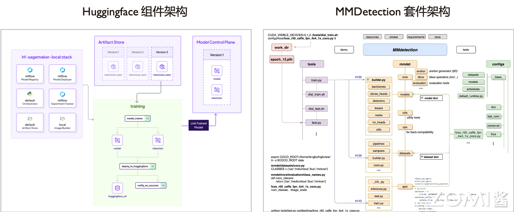
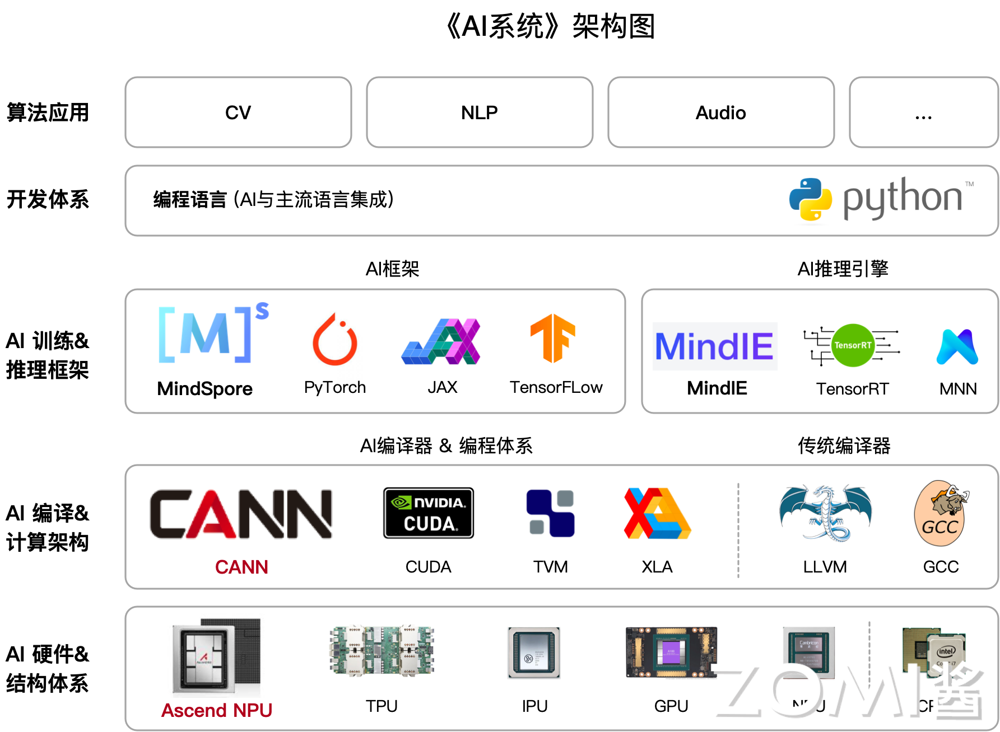
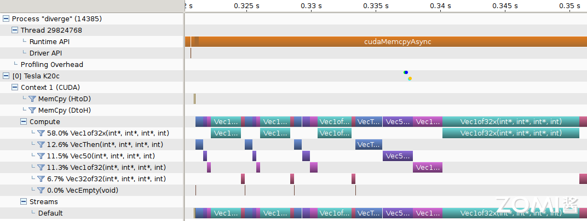
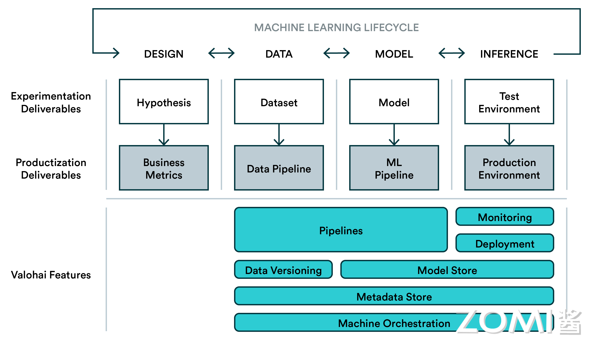

<!--Copyright © ZOMI 适用于[License](https://github.com/chenzomi12/AISystem)版权许可-->

# AI 系统全栈架构(DONE)

通过对 AI 的发展、以及模型算法、硬件与数据的趋势介绍，我们已经了解了 AI 系统的重要性。本节将介 AI 系统的设计目标、组成和生态，让读者形成 AI 系统的知识体系，为后续展开每个章节的内容做好铺垫。

AI 系统设计本身需要各个环节通盘考量，无论是系统性能，还是用户体验，亦或是稳定性等指标，甚至在开源如火如荼发展的今天，开源社区运营也成为 AI 系统推广本身不可忽视的环节。接下来将从不同的维度和技术层面展开 AI 系统的全景图。

## AI 系统概述

### 基本概念

从类比的角度理解 AI 系统：**AI 时代连接硬件和上层应用的中间层软硬件基础设施**。

因此在部分语境中，又有人称为 AI Infra 人工智能的基础设施，但是因为基础设施更偏向于底层硬件、集群等内容，而 AI 系统是多的是强调让 AI 执行起来的系统体系结构，因此更愿意称包括软硬件的内容为 AI 系统。

传统本地部署时代，三大基础软件（数据库、操作系统、中间件）实现控制硬件交互、存储管理数据、网络通信调度等共性功能，抽象并隔绝底层硬件系统的复杂性，让上层应用开发者能够专注于业务逻辑和应用功能本身的创新实现。

云时代同理，形成了 IaaS、PaaS、SaaS 三层架构，其中 PaaS 层提供应用开发环境和基础的数据分析管理服务。类比来看，我们认为，进入 AI 时代也有承担类似功能的、连接算力和应用的基础设施中间层即 AI 系统，提供基础模型服务、赋能模型微调和应用开发。

### 详细定义

开发者一般通过编程语言 Python 和 AI 开发框架（例如 PyTorch、MindSpore 等）API 编码和描述以上 AI 模型，声明训练作业和部署模型流程。由最开始 AlexNet 是作者直接通过 [CUDA](https://code.谷歌.com/archive/p/cuda-convnet) 实现网络模型，到目前有通过 Python 语言灵活和轻松调用的框架，到大家习惯使用 HuggingFace 进行神经网络语言模型训练，背后是系统工程师贴合实际需求不断研发新的工具，并推动深度学习生产力提升的结果。

但是这些 AI 编程语言和 AI 开发框架应对自动化机器学习、强化学习等多样执行方式，以及细分的应用场景显得越来越低效，不够灵活，需要用户自定义一些特殊优化，没有好的工具和系统的支撑，这些问题一定程度上会拖慢和阻碍算法工程师研发效率，影响算法本身的发展。因此，目前开源社区中也不断涌现针对特定应用领域而设计的框架和工具，例如 [Hugging Face](https://huggingface.co/) 提供语言预训练模型 ModelZoo 和社区，[FairSeq](https://github.com/pytorch/fairseq) 自然语言处理中的序列到序列模型开发套件和[MMDetection](https://github.com/open-mmlab/mmdetection) 物体检测套件，针对自动化机器学习设计的 [NNI](https://github.com/microsoft/nni) 加速库等，进而针对特定领域模型应用负载进行定制化设计和性能优化，并提供更简化的接口和应用体验。

由于不同领域的输入数据格式不同，预测输出结果不同，数据获取方式不同，造成模型结构和训练方式产生非常多样的需求，各家公司和组织不断研发新的针对特定领域的 AI 开发框架或上层应用接口封装，以支持特定领域数据科学家快速验证和实现新的 AI 想法，工程化部署和批量训练成熟的模型。如 Meta 推出的 Caffe 与 Torch 演化到 PyTorch，谷歌 TensorFlow 及新推出的 JAX，基于 PyTorch 构建的 HuggingFace 等。AI 开发工具与 AI 开发框架本身也是随着用户的模型构建与程序编写与部署需求不断演进。

这其中快速获取用户的原因，有一些是其提供了针对应用场景非常简化的模型操作，并提供模型中心快速微调相应的模型，有一些是因为其能支持大模型训练或者有特定领域模型结构的系统优化。

AI 系统自身设计挑战较高（如更大的规模、更大的超参数搜索空间、更复杂的模型结构设计），人工智能的代表性开发框架 PyTorch 是 Meta 开发，后续贡献给 Linux 开源基金会；TensorFlow 是谷歌（谷歌）从 2016 年开源；华为（HUAWEI）为了避免美国全面封锁 AI 领域推出自研的 AI 框架 MindSpore。

硬件厂商围绕其设计了大量的专有 AI 芯片（如 GPU、TPU、NPU 等）来加速 AI 算法的训练微调和部署推理，微软（Microsoft）、亚马逊（Amazon）、特斯拉（Tesla）等公司早已部署数以万计的 GPU 用于 AI 模型的训练，OpenAI 等公司不断挑战更大规模的分布式模型训练。

英伟达（NVIDIA）、华为（HUAWEI）、英特尔（Intel）、谷歌（谷歌）等公司不断根据 AI 模型特点设计新的 AI 加速器芯片和对应的 AI 加速模块，如张量核 Tensor Core、脉动阵列等提供更大算力 AI 加速器。

上述从顶层的 AI 算法应用、开发框架到底层应用所介绍的 AI 全栈相关内容中则是指 **AI 系统（AI System）**，是围绕深度学习而衍生和设计的系统，因此也叫做**深度学习系统（Deep Learning System）**。

但是 AI 系统很多也可以应用于机器学习算法或使用机器学习算法，例如自动化机器学习、集群管理系统等。同时这些系统设计方法具有一定的通用性，有些继承自机器学习系统或者可以借鉴用于机器学习系统。即使作为系统工程师，也需要密切关注算法和应用的演进，才能紧跟潮流设计出贴合应用实际的工具与系统。

## AI 系统设计目标

深度学习系统的设计目标可以总结为以下几个部分。

1. 高效编程语言、开发框架和工具链

设计更具表达能力和简洁的神经网络计算原语以及高级编程语言。让用户能够提升 AI 应用程序的开发效率，屏蔽底层硬件计算的细节，更灵活的原语支持。当前神经网络模型除了特定领域模型的算子和流程可以复用（如大语言模型 Transformer 架构在自然语言处理 NLP 领域被广泛作为基础结构），其新结构新算子的设计与开发仍遵循试错（Trial And Error）的方式进行。那么如何灵活表达新的计算算子，算子间的组合以及融合形式，屏蔽经典熟知的算子与基础模型，是算法工程师所需要语言、库与 AI 开发框架层所提供的功能支持。

更直观的编辑、调试和实验工具。让用户可以完整的进行神经网络模型的开发、测试、调整诊断与修复和优化程序，提升所开发 AI 应用程序的性能与鲁棒性。训练过程不是一蹴而就，其中伴随着损失函数 LOSS 曲线不收敛、Loss 值出现 NaN 无效值、内存溢出等算法问题与算法设计缺陷（Bug）。AI 工具链与 AI 系统本身如何在设计之初就考虑到这点，提供良好的可观测性、可调试性、允许用户注册自定义扩展等支持，是需要工具链与 AI 系统的设计者，所需要在 AI 系统的设计之初就需要提上日程的，否则之后更多是缝缝补补造成不好的开发体验与不能满足的需求，对用户来说就像使用一个黑盒且单片的工具。

支持 AI 生命周期中的各个环节：数据处理、模型开发与训练、模型压缩与推理、安全和隐私保护等。不仅能构建 AI 模型，能够支持全生命周期的 AI 程序开发，并在 AI 系统内对全生命周期进行分析与优化。当前的 AI 工程化场景，已经不是灵感一现和单一的优化就能迅速取得领先优势，更多的是能否有完善的 AI 基础设施，快速复现开源社区工作，批量验证新的想法进行试错，所以一套好的完善的全流程的生命周期管理能够大幅度提升 AI 算法层面的生产力。

2. AI 任务系统级支持

除了对深度学习训练与推理的支持，还能**支持强化学习、自动化机器学习等新的训练范式**。例如，需要不断和环境或模拟器交互以获取新数据的强化学习方式，批量大规模提交搜索空间的自动化机器学习方式等，这些新的范式造成对之前单一支持单模型之外，在多模型层面，训练与推理任务层面产生了新的系统抽象与资源，作业管理需求。

**提供更强大和可扩展的计算能力**。让用户的 AI 程序可扩展并部署于可以并行计算的节点或者集群，应对大数据和大模型的挑战。因为当前 AI 模型不断通过大模型，多模态大模型以产生更好的算法效果，促使 AI 系统需要支持更大的模型、更多模态的输入。同时由于企业 IT 基础设施不断完善，能够不断沉淀新的数据，也会伴随着大数据而衍生的问题。大模型与大数据促使存储与计算层面的系统，在摩尔定律失效的大背景下，迫切需要通过并行与分布式计算的方式，扩展算力与存储的支持。

**自动编译优化算法**。1）对计算图自动推导：尽可能的通过符号执行或即时编译 JIT 技术，获取更多的计算图信息，让 AI 开发框架或者 AI 编译器自动执行定制化的计算优化。2）根据不同体系结构自动并行化：面对部署场景的多样化体系结构，训练阶段异构硬件的趋势，AI 开发框架让用户透明的进行任务配置和并行化，以期以最为优化的方式在 AI 集群配置下，并行化、减少 I/O、充分利用通信带宽，逼近硬件提供的极限性能上限。

**云原生自动分布式化**。自动分布式并行扩展到多个计算节点，面对云与集群场景，自动将 AI 任务扩展与部署，进而支撑分布式计算、弹性计算，让用户按需使用资源，也是云原生背景下，AI 系统所需要考虑和支持的。

3. 探索并解决新挑战下系统设计、实现和演化

在 AI 系统中会随着 AI 算法的发展，出现了对动态图、动态 Shape 的支持需求，利用网络模型结构的稀疏性进行压缩加速优化，为了提升训练指标 TTA 实现混合精度训练与部署，还有混合训练范式（如强化学习）、多任务（如自动化机器学习）等特性支持。

提供在更大规模的企业级环境的部署需求。如云环境多租环境的训练部署需求：面对多组织，多研究员和工程师共享集群资源，以及大家迫切使用 GPU 资源的日益增长的需求，如何提供公平、稳定、高效的多租环境也是平台系统需要首先考虑的。

跨平台的推理部署需求。面对割裂的边缘侧硬件与软件栈，如何让模型训练一次，跨平台部署到不同软硬件平台，也是推理场景需要解决的重要问题。

最后是安全与隐私的需求。由于网络模型类似传统程序的功能，接受输入，处理后产生输出，但是相比传统程序，其解释性差，造成更容易产生安全问题，容易被攻击。同时模型本身的重要信息为权重，我们也要注意模型本身的隐私保护。同时如果是企业级环境或公有云环境，会有更高的安全和隐私保护要求。

了解完 AI 系统设计的宏观目标，可以进一步了解，当前在人工智能的大生态环境中 AI 系统的技术栈是如何构成的，整个技术栈中 AI 系统的各=处于哪个抽象层次，互相之间的关系是什么。

## AI 系统组成

如图所示，大致可以将 AI 系统分为以下几个具体的方向：

### 应用与开发层

负责提供用户前端的 AI 编程语言，接口和工具链。这一层尽可能让用户表达目标任务与 AI 算法，尽量少让用户关注底层实现（例如到底 AI 框架的实现是通过声明式编程方式还是命令式编程方式）是提升开发体验的较好的手段，但是过度的抽象会丧失灵活性的表达，在模型发展较快迭代频繁的时期用户还需要体验层兼顾灵活性和可调试性。开发体验层会调用，编排底层框架的接口提供更加简洁的用户开发体验。包括并不限于以下领域：

- **网络模型构建**：卷积神经网络 CNN、循环神经网络 RNN、Transformer 结构等，包括 if else 控制流等基本结构和算子支持与实现的 API。语言的基本语法和框架的 API 接口提供基本算子的支持。当前主要以使用 Python 语言内嵌调用 AI 开发框架的方式进行网络模型的开发，但是也出现控制流在原生语言层与模型中间表达割裂等问题。

- **模型算法实现**：算法一般被封装为 AI 开发框架的配置或 API 供用户选择，有些 AI 开发框架也提供拦截接口给用户一定程度灵活性定制自定义算法。模型算法实现与网络模型结构构件还是有着明显的区别，例如网络模型构建只提供模型层面的构建，但是 AI 的算法实现流程如到底是训练还是推理，是实现强化学习、监督学习还是无监督学习等，属于模型算法的实现过程，只是其中内部的算法模型结构的构建属于网络模型部分。

- **流水线和工作流支持**：流水线和工作流是实现模块解耦复用，可视化编程的前提，通过复用与可视化编程可以大幅降低组织内作业书写的门槛，如高性能数据加载器等。
  
- **工具链**: 如模型在不同硬件的迁移、在不同框架的迁移、模型转换、调试、可视化、类型系统等。就像传统的软件工程中调试器，可视化，类型系统等工具链的支撑，让整个开发过程中，跨平台，跨平台，问题诊断，缺陷验证等得以高效实现，目前 AI 系统领域也不断有类似工具产生，以支持整个 AI 工程化实践。

- **生命周期管理**：数据读取，训练与推理等流程开发与管理。机器学习领域的 DevOps 也就是 MLOps 的基础工具支持。其可以让重复模块被复用，同时让底层工具有精确的信息进行模块间的调度与多任务的优化，同时让各个环节模块化解耦，独立和更为快速的演进。

## AI 框架层

AI 框架不仅仅是指如 PyTorch 等训练框架，还包括推理框架。负责静态程序分析与计算图构建，编译优化等工作。AI 框架本身通过提供供用户编程的 API 获取用户表达的模型，数据读取等意图，在静态程序分析阶段完成尽可能的自动前向计算图构建，自动求导补全反向传播计算图，计算图整体编译优化，算子内循环编译优化等。包括并不限于以下领域：

- **计算图构建**：静态计算图、动态计算图构建等。不同的 AI 框架类型决定了其使用静态还是动态图进行构建，静态图有利于获取更多信息做全图优化，动态图有利于调试，目前实际处于一个融合的状态，如 PyTorch2.X 版本后推出 Dynamo 特性支持原生静态图。

- **自动求导**：高效地对网络模型自动求导等。由于网络模型中大部分算子较为通用，AI 框架提前封装好算子的自动求导函数，待用户触发训练过程自动透明的进行全模型的自动求导，以支持梯度下降等训练算法需要的权重梯度数据的获取。

- **中间表达构建**：多层次中间表达等。通过构建网络模型的中间表达及多层中间表达，让模型本身可以更好的被下层 AI 编译器编译生成高效的后端代码。
  
### 编译与运行时

负责 AI 模型在真正运行前的编译和系统运行时的动态调度与优化。当获取的网络模型计算图部署于单卡、多卡甚至是分布式 AI 集群的环境，运行期的框架需要对整体的计算图按照执行顺序调度算子与任务的执行、多路复用资源，做好内存等资源的分配与释放。包括并不限于以下部分：

- **编译优化**：如算子融合等。编译器根据算子的语义或者 IR 定义，对适合进行算子融合（多个算子和并为一个算子）的算子进行合并，降低内核启动与访存代价。同时 AI 编译器还支持循环优化等类似传统编译器的优化策略和面向深度学习的优化策略（如牺牲一定精度的计算图等价代换等）。

- **优化器**：运行时即时（Just-in-Time）优化，内省（Introspective）优化等。运行时根据硬件，隐藏的软件栈信息，数据分布等只能运行时所获取的信息，进一步对模型进行优化。

- **调度与执行**：调度优算子并行与调度，执行有单线程和多线程执行等。调度方面根据 NPU 提供的软件栈和硬件调度策略，以及模型的算子间并行机会，进行类装箱的并行调度。另外再算子执行过程中，如果特定 NPU 没有做过多的运行时调度与干预，框架可以设计高效的运行时算子内的线程调度策略。

- **硬件接口抽象**：GPU、NPU、TPU、CPU、FPGA 和 ASIC 等硬件的接口抽象。统一的硬件接口抽象可以复用编译优化策略，让优化方案与具体底层的 AI 硬件设备和 AI 体系结构适当解耦。

### 硬件体系结构与 AI 芯片

负责程序的真正执行、互联与加速。在更广的层面，作业与作业间需要平台提供调度，运行期资源分配与环境隔离。包括并不限于以下部分：

- **资源池化管理与调度**：异构资源集群管理等。将服务器资源池化，通过高效的调度器结合深度学习作业特点和异构硬件拓扑进行高效调度，这方面在对于云资源管理和云化较为重要。

- **可扩展的网络栈**：RDMA，InifiBand，NVLink 等。提供更高效的加速器到加速器的互联（例如 NVLink、NVSwitch 等）提供更高的网络带宽，更灵活的通信原语与高效的通信聚合算法（例如 AllReduce 算法）。

虽然 AI 系统在总的方向上分为开发体验层、框架层、编译与运行时和硬件体系结构和 AI 芯片 4 层结构。但是我们将在后续章节中，将会围绕核心系统软硬件，如 AI 训练和推理框架，AI 编译器，AI 芯片，部分涉及更广泛的 AI 系统生态中的重要内容如算法等展开介绍。

## AI 系统生态

除了以上重要的 AI 系统构成之外，随着人工智能应用越来越广泛，我们还可以看到更广泛的 AI 系统生态的构成。其中包含以下领域：

### 核心系统软硬件

通过核心系统软硬件，底层的基础架构已经可以给上层提供算力，存储，网络等资源池，可以按需给需要执行的深度学习作业隔离出指定规格的资源，执行深度学习作业，类似传统操作系统已经完成底层硬件的抽象与资源隔离，只需要用户的应用提交到系统中被执行和管理。

- **深度学习任务运行和优化环境**：提供更高的运行时性能，资源隔离与调度。当深度学习作业启动，深度学习框架或运行时提供更好的算子与任务调度，内存管理，I/O 管理，甚至未来随着作业愈发复杂，提供作业的多路复用（Multiplexing）等支持，打破设备商运行时库封装的局限性。

- **通用资源管理和调度系统**：提供更公平，高效率和稳定的平台支持。性能并不是系统设计本身的唯一考虑因素，在多租环境，还要兼顾公平，效率和稳定性，为用户提供更加可靠好用的平台。

- **新型硬件及相关高性能网络和计算栈**：随着加速器技术不断发展，网络互连技术提供更高的带宽，硬件层提供更高的算力与带宽支持模型训练与推理。系统需要更加灵活的支持在不同的硬件和规格假设下，不同作业如何静态与动态结合的自动优化与高性能执行。同时由于硬件的发展趋势不同，潜在可能会让性能瓶颈产生变化，系统设计较早判断并对应设计会产生新的系统设计机会。

### AI 算法和框架

通过深度学习算法与框架，用户可以表达模型设计和训练配置等需求，就像给提供了一套特定领域的“编程语言”，并且提供了相应的编译器及工具链可以翻译成运行时软硬件环境可以执行的指令。

- **广泛用途的高效新型通用 AI 算法**：提供更多样的模型支持，推进和支持模型效果的提升。支持新的算子（例如，控制流等），更加灵活的模型结构（例如，图模型等），模型的融合（例如，多专家系统等）支持。

- **多种深度学习框架的支持与进化**：由于多种框架与工具的存在，如何为用户提供更多样的框架的统一支持与优化对提升用户体验，复用已有代码有很强的实用价值。

- **神经网络编译架构及优化**：在编译期，通过静态分析与优化的方法，提供更优化的编译支持，提升模型的性能，正确性等。类似传统编译器，网络模型的计算图可以通过融合等手段优化，算子内可以应用大量循环优化。同时面向网络模型本身的特点，也逐渐有工作利用一些等价和非等价计算图转换进行优化。

### 更广泛的 AI 系统生态

随着深度学习高速发展，更大的搜索空间，运行时才能获取的数据，模型安全与隐私，部署推理的多样化需求变得日益迫切，我们需要考虑除训练以外更多的 AI 系统问题。
  
- **机器学习新模式（如强化学习）**：提供新训练范式的灵活执行，部署与同步支持等。由于训练数据可能需要以与环境交互的过程中才能获取，造成需要通过强化学习等新的训练范式进行模型训练，需要设计新的系统以支持灵活的训练范式。
  
- **自动机器学习（如自动化机器学习）**：当用户想试错（Trial And Error）的搜索空间达到一定量级，用户通过自动化机器学习工具与算法可以更高效的进行模型的探索与训练。自动化机器学习系统可以提供多任务的高效管理与调度支持，支持搜索空间定义的程序语言等。
  
- **安全（Security）与隐私（Privacy）**：数据与模型，类似传统的信息安全要保护的数据与程序，除了数据本身，模型类似传统程序本身的安全与隐私问题提出了新的挑战。我们需要思考人工智能模型与应用的安全与隐私保护支持。
  
- **模型推理、压缩与优化**：如果不需要训练，只需要执行前向传播过程，则是用户开始使用模型进行推理，基于深度学习特有性质进行高效的模型部署推理是除训练外很重要的系统问题。模型推理相比训练有更低的延迟要求，更严苛的资源供给，不需要求解梯度和训练，有更低的精度要求等，如何设计面向推理的系统提出了新的机会。同时网络模型本身可以通过模型压缩，量化等手段精简计算量与内存消耗，加速模型的部署。

## 小结与思考

本节围绕 AI 系统的组成和生态进行介绍，在初学 AI 系统我们可能会只关注 AI 开发框架（如 MindSpore），但当我们把系统放眼到整个基础软硬件架构体系中，会发现当前 AI 系统涉及很多方面，类似传统的操作系统（异构资源管理系统）、编译器（AI 编译优化）、Web 服务（推理系统）、软件云化（AI 集群调度）等问题在 AI 系统的场景中仍然会遇到，一些经典的理论与系统设计在今天仍然对 AI 系统发挥着重要的影响。

