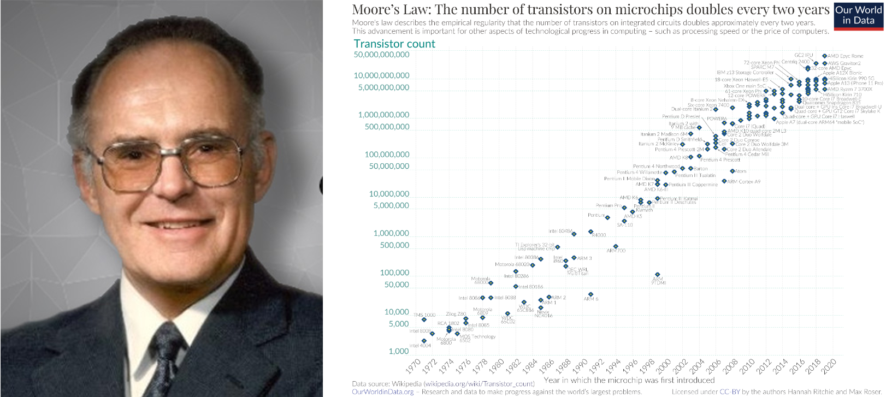
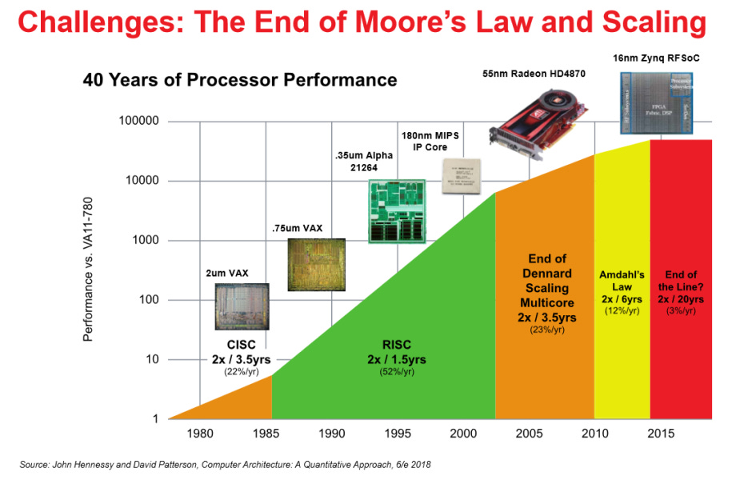
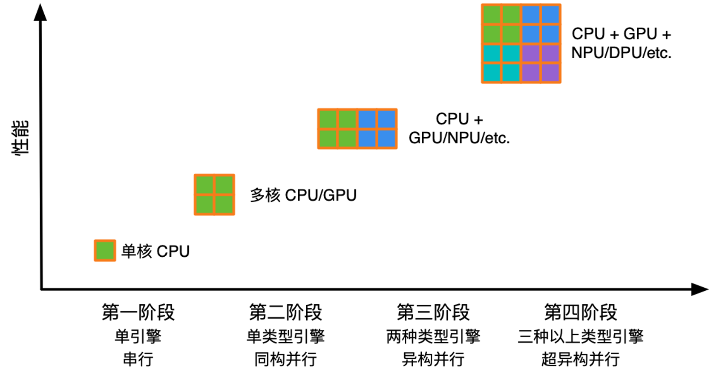

<!--Copyright ©  适用于[License](https://github.com/chenzomi12/AISystem)版权许可-->

<<<<<<< HEAD
# 课程内容(DONE)
=======
# 课程内容
>>>>>>> upstream/main

在整个 AI 系统的构建中，AI 算法、AI 框架、AI 编译器、AI 推理引擎等都是软件层面的概念，而 AI 芯片则是物理存在的实体，AI 芯片是所有内容的重要基础。

本系列课程将会通过对典型的 AI 模型结构的设计演进进行分析，来理解 AI 算法的计算体系如何影响 AI 芯片的设计指标，进而结合几种主流的 AI 芯片基础介绍，帮助大家对 AI 系统的整个体系知识有更全面的认识。

## 什么是 AI 芯片

首先我们了解一下芯片是什么？芯片的本质就是在半导体衬底上制作能实现一系列特定功能的集成电路。在发现半导体之前，人类只能用机械控制电，而半导体却能直接“用电来控制电”。计算机是我们日常生活中常见的工具，可以通过数字形式存储古往今外的人类文明信息，计算机里任何复杂功能，还原到最底层都能用 0 和 1 解决，进而可以通过半导体开关的通断，绕过机械维度，直接去操控微观的电子来处理信息。通过芯片这个物理接口，创造了我们今天的数字世界，让人类进入到一半物质世界一半数字世界的新时代。所以说芯片可能是物质世界与数字世界的唯一接口，芯片技术决定了我们信息技术的水平。

其次我们来谈谈人工智能的概念。人工智能（Artificial Intelligence，AI）是一门研究如何使计算机能够模拟和执行人类智能任务的科学和技术领域。它致力于开发能够感知、理解、学习、推理、决策和与人类进行交互的智能系统。人工智能的背景可以追溯到上世纪 50 年代，当时科学家们开始探索如何让机器模拟人类的智能行为。最初的人工智能研究集中在基于规则的推理和专家系统的开发上。

然而，由于计算机处理能力的限制以及缺乏足够的数据和算法，人工智能的发展进展缓慢。随着计算机技术和算法的进步，尤其是机器学习和深度学习的兴起，人工智能开始迎来爆发式的发展。机器学习使得计算机能够通过数据学习和改进性能，而深度学习则基于神经网络模型实现了更高级别的模式识别和抽象能力。

这些技术的发展推动了人工智能在各个领域的广泛应用，如自然语言处理、计算机视觉、语音识别等。人工智能的定义也在不断演变，现代人工智能强调计算机系统能够模仿人类智能的各个方面，包括感知、学习、推理和决策。人工智能的目标是使计算机具备智能的能力，能够自主地解决复杂问题，并与人类进行自然和智能的交互。

机器学习、深度学习算法是人工智能领域技术的重要载体，可以统称为 AI 算法，其计算模式与传统的算法有所不同。比如用来训练和推理的计算数据以非结构化为主，如图像、文本、语音等各种类型数据，并且具有高密度的计算和访存需求，这和传统的算法模式是非常不同的。计算机芯片体系结构在很大程度上影响了 AI 算法的性能。因此，了解 AI 算法与芯片计算体系结构之间的关系是非常重要的。

在 AI 应用还没有得到市场验证之前，通常使用已有的通用芯片（如 CPU）进行计算，可以避免专门研发 ASIC 芯片的高投入和高风险。但是这类通用芯片设计初衷并非专门针对深度学习，因而存在性能、功耗等方面的局限性。随着人工智能应用规模持续扩大，这类问题日益突显，待深度学习算法稳定后，AI 芯片可采用 ASIC 设计方法进行全定制，使性能、功耗和面积等指标面向深度学习算法做到最优。

如今随着 OpenAI 公司的 ChatGPT/GPT4 等模型的惊艳出场，引发了各个行业对人工智能技术的广泛关注和应用推动，更多 AI 算法需要部署，激发了更大的算力需求，无疑 AI 芯片是整个 AI 系统领域的重要基础。

## AI 芯片的分类

AI 芯片的广泛定义是指那些面向人工智能应用的芯片。按照不同的角度，AI 芯片可以有不同的分类划分，比如按照技术架构分为 CPU，GPU（Graphics Processing Unit，图形处理单元），半定制化的 FPGA（Field Programmable Gate Array，现场可编程门阵列），全定制化 ASIC（Application-Specific Integrated Circuit，专用集成电路）。

CPU、GPU、FPGA、ASIC 是目前 AI 计算过程中最主流的四种芯片类型，CPU、GPU、FPGA 是前期较为成熟的芯片架构，属于通用性芯片，ASIC 是为 AI 特定场景定制的芯片。他们的主要区别体现在计算效率、能耗和灵活性上面，对 AI 算法具有不同的支持程度。

- **CPU**：CPU 是冯诺依曼架构下的处理器，遵循“Fetch （取指）-Decode （译码）- Execute （执行）- Memory Access （访存）-Write Back （写回）”的处理流程。作为计算机的核心硬件单元，CPU 具有大量缓存和复杂的逻辑控制单元，非常擅长逻辑控制、串行的运算，不擅长复杂算法运算和处理并行重复的操作。CPU 能够支持所有的 AI 模型算法。

- **GPU**：图形处理器，最早应用于图像处理领域，与 CPU 相比，减少了大量数据预取和决策模块，增加了计算单元 ALU 的占比，从而在并行化计算效率上有较大优势。但 GPU 无法单独工作，必须由 CPU 进行控制调用才能工作，而且功耗比较高。随着技术的进步，以及越来越多 AI 算法通过 GPU 用来加速训练，GPU 的功能越来越强大，人们开始将 GPU 的能力扩展到一些计算密集的领域，这种扩展后设计的处理器称为 GPGPU（General-Purpose compution on Graphics Processing Unit）

- **FPGA**：其基本原理是在 FPGA 芯片内集成大量的基本门电路以及存储器，用户可以通过更新 FPGA 配置文件来定义这些门电路以及存储器之间的连线。与 CPU 和 GPU 相比，FPGA 同时拥有硬件流水线并行和数据并行处理能力，适用于以硬件流水线方式处理一条数据，且整数运算性能更高。FPGA 具有非常好的灵活性，可以针对不同的算法做不同的设计，对算法支持度很高，常用于深度学习算法中的推理阶段。不过 FPGA 需要直接与外部 DDR 数据交换数据，其性能不如 GPU 的内存接口高效，并且对开发人员的编程门槛相对较高。国外 FPGA 的有名厂商有 Xilinx（赛灵思）和 Altera（阿尔特拉）两家公司，国内有复旦微电子、紫光同创、安路科技等。

- **ASIC**：根据产品需求进行特定设计和制造的集成电路，能够在特定功能上进行强化，具有更高的处理速度和更低的功耗。但是研发周期长，成本高。比如神经网络计算芯片 NPU、Tensor 计算芯片 TPU 等都属于 ASIC 芯片。因为是针对特定领域定制，所以 ASIC 往往可以表现出比 GPU 和 CPU 更强的性能，ASIC 也是目前国内外许多 AI 芯片设计公司主要研究的方向，在预见的未来，市面上会越来越多 AI 领域专用 ASIC 芯片。

按照应用场景的角度，AI 芯片可以分为云端，边缘端两类。

- **云端**的场景又分为训练应用和推理应用，像电商网站的用户推荐系统、搜索引擎、短视频网站的 AI 变脸等都是属于推理应用。

- **边缘**的应用场景更加丰富，如智能手机、智能驾驶、智能安防等。通过 AI 芯片丰富的应用场景，可以看到人工智能技术对我们未来生活的影响程度。

## 后摩尔定律时代

摩尔定律是由英特尔（Intel）创始人之一戈登·摩尔（Gordon Moore）在 1965 年提出来的。其内容为：**当价格不变时，集成电路上可容纳的元器件的数目，约每隔 18-24 个月便会增加一倍，性能也将提升一倍。**

换言之，每一美元所能买到的电脑性能，将每隔 18-24 个月翻一倍以上。

这一趋势已经持续了半个多世纪，摩尔定律都非常准确的预测了半导体行业的发展趋势，成为指导计算机处理器制造的黄金准则，也成为了推动科技行业发展的“自我实现”的预言。

如今半个多世纪过去了，虽然半导体芯片制程的工艺还在不断推进，但是摩尔定律中的时间周期也在拉长。2017 年图灵奖得主、加州伯克利大学计算机科学教授、谷歌杰出工程师 David Patterson 表示：“现在，摩尔定律真的结束了，计算机体系结构将迎来下一个黄金时代“。

计算机芯片架构的发展历程确实非常丰富和有趣。从最早的单核 CPU 到多核 CPU，再到多核 GPU/NPU，以及现在的超异构集群体系，每一次技术进步都极大地推动了计算能力的提升和应用场景的拓展。下面简要回顾一下这些发展阶段：

- **单核 CPU**：这是计算机最早的核心处理单元，所有计算任务都由单个核心完成。随着技术的发展，单核 CPU 的性能逐渐达到瓶颈。

- **多核 CPU**：为了突破单核 CPU 的性能限制，多核 CPU 应运而生。通过在单个芯片上集成多个处理核心，可以同时执行多个任务，显著提高了计算效率。

- **多核 GPU/NPU**：GPU（图形处理单元）和 NPU（神经网络处理单元）是专门为图形处理和机器学习等特定任务设计的处理器。它们拥有大量的并行处理核心，非常适合处理大规模并行任务。

- **超异构集群体系**：随着计算需求的进一步增长，单一的处理器已经无法满足需求。超异构集群体系通过集成不同类型的处理器（如 CPU、GPU、NPU 等），以及通过高速网络连接，形成了一个高度灵活和可扩展的计算平台。这种体系可以根据不同的任务需求，动态调整资源分配，实现最优的计算效率。

这些技术的发展，不仅推动了硬件的进步，也为软件和应用的开发提供了更多可能性。随着人工智能、大数据、云计算等领域的快速发展，未来的计算机架构可能会有更多创新和突破。

未来软硬件协同设计、计算机体系结构安全性，以及芯片设计开发流程等方面都存在着很多创新与挑战，在这样的背景下，加油吧，下一个黄金时代的从业者们！

## 本节视频

<html>
<iframe src="https://player.bilibili.com/player.html?aid=353011957&bvid=BV1DX4y1D7PC&cid=1042315030&page=1&as_wide=1&high_quality=1&danmaku=0&t=30&autoplay=0" width="100%" height="500" scrolling="no" border="0" frameborder="no" framespacing="0" allowfullscreen="true"> </iframe>
</html>
