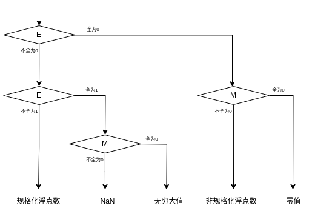
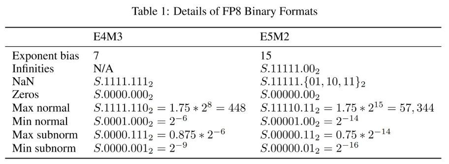

<!--Copyright ©  适用于[License](https://github.com/chenzomi12/AISystem)版权许可-->

<<<<<<< HEAD
# 计算之比特位宽(DONE)
=======
# 计算之比特位宽
>>>>>>> upstream/main

在前面的深度学习计算模式里面我们提到了模型的量化操作，通过建立一种有效的数据映射关系，使得模型以较小的精度损失获得更好的模型执行效率的收益。模型量化的具体操作就是将高比特的数据转换为低比特位宽表示。本节我们将对计算的比特位宽概念做一个更具体的了解。

## 比特位宽的定义

在计算机科学中，整数和浮点数是两种基本的数据类型，它们在计算机中可以用不同长度的比特表示，也就是比特位宽，比特位宽决定了它们的表示范围和数据精度。下面我们一起回顾一下计算机中整数和浮点数的表示定义。

### 整数类型

在计算机中，整数类型的表示通常采用二进制补码形式。二进制补码是一种用来表示有符号整数的方法，它具有以下特点：

- 符号位：整数的最高位（最左边的位）通常用作符号位，0 表示正数，1 表示负数。

- 数值表示：1）对于正数，其二进制补码与其二进制原码相同。2）对于负数，其二进制补码是其二进制原码取反（除了符号位，每一位取反，0 变为 1，1 变为 0），然后再加 1。

- 范围：对于 n 位比特位宽的整数类型，其表示范围为-2^(n-1)到 2^(n-1) - 1，其中有一位用于表示符号位。

举例说明，对于一个 8 位二进制补码整数：

- 0110 1100 表示正数 108。

- 1111 0011 表示负数-13。其二进制原码为 1000 1101，取反得到 1111 0010，加 1 得到补码。


### 浮点数类型

在计算机中，浮点数据类型的表示通常采用 IEEE 754 标准，该标准定义了两种精度的浮点数表示：单精度和双精度。

一个单精度浮点数通常由 32 位二进制组成，按照 IEEE 754 标准的定义，这 32 位被划分为三个部分：符号位、指数部分和尾数部分。

- 符号位：占用 1 位，表示数值的正负。

- 指数部分：占用 8 位，用于表示数值的阶码（数据范围）。

- 尾数部分：占用 23 位，用于表示数值的有效数字部分（小数精度）。

一个双精度浮点数通常由 64 位二进制组成，同样按照 IEEE 754 标准的定义，这 64 位被划分为三个部分：符号位、指数部分和尾数部分。同单精度不同的是，指数部分位宽是 11 位，尾数部分位宽是 52 位。单精度和双精度浮点数的取值范围和精度有所不同，双精度浮点数通常具有更高的精度和更大的取值范围。


IEEE 754 标准中浮点数根据指数的值会分为规格化，非规格化和特殊值，如零值、无穷大和 NaN (Not a Number)，它们的定义如下。规格化浮点数用于表示较大的数值，指数部分至少有一位为 1，可以表示更大的数值范围和更高的精度。非规格化浮点数用于表示接近于零的数值，指数部分全为 0，可以表示比规格化浮点数更接近于零的小数值。

- 规格化浮点数：指数部分至少有一位为 1，且不能全为 1。在规格化浮点数中，尾数部分的最高位总是 1，并且在存储时通常省略了这个最高位，以节省存储空间。规格化浮点数的指数部分表示了数值的阶码，而尾数部分表示了数值的有效数字。例如，对于单精度浮点数，规格化浮点数的指数范围是 1 到 254。

- 非规格化浮点数：指数部分全为 0，尾数部分不全是 0。在非规格化浮点数中，尾数部分的最高位不再强制为 1，而是可以为 0，这样可以表示非常接近于零的数值。非规格化浮点数可以用来增加浮点数的精度范围，但通常会失去一些精度。例如，在单精度浮点数中，当指数部分全为 0 时，尾数部分的最高位可以为 0，这时表示的数值接近于零。

- 特殊值有三种：1）零值：指数部分和尾数部分都为 0，符号位可以为 0 或 1，表示正零或负零，零值的真实值为 0。2）无穷大：指数部分全为 1，尾数部分全为 0，符号位分别为 0 和 1。无穷大的真实值为正无穷大和负无穷大。3）NaN：指数部分全为 1，尾数部分至少有一位为 1，符号位可以是任意值。NaN 表示浮点数的无效操作或不确定结果，NaN 的真实值通常没有实际意义。



对于规格化和非规格化浮点数，其真实值的计算公式定义如下，其中 S 是符号位，取指 0 或 1，表示浮点数的正负；E 是指数部分，决定了数值的范围；M 是尾数部分，决定了小数点的有效位数；E_bw 表示指数的位宽；B 表示指数的偏移量，B 的取值取决于浮点数的指数位宽，比如 E 的位宽是 8，$B=2^7-1=127$。

$$
\begin{align}
&规格化浮点数：(-1 )^S \times 2^{E-B} \times (1+M)\\
&非规格化浮点数：(-1 )^S \times 2^{1-B} \times M\\
&B=2^{E_{bw}-1}-1
\end{align}
$$

举例说明，对一个单精度浮点数的表示：

```
0 10000011 10100000000000000000000
```

- 符号位：0，S=0，表示正数，(-1)^0=1。
- 指数部分：10000011，E-B=130-127=3，表示指数为 2^3=8。
- 尾数部分：10100000000000000000000，表示尾数为 1.101，即 1.625（二进制转换为十进制）。

所以，这个单精度浮点数表示的数值为 8.625。
$$
(-1)^0 \times 2^{130-127} \times (1+0.625)=8.625
$$

## AI 的数据类型及应用

在 AI 模型中常用数据位宽有 8bit、16bit 和 32bit，根据不同的应用场景和模型训练推理阶段需求，可以选择不同位宽的数据类型。下图是现有 AI 模型中出现过的数据类型位宽和定义，可以看到关于浮点数据类型在 E 和 M 位宽有很多种设计，比如对同样的 16bit 和 8bit 位宽的浮点数，出现了不同的 E，M 位宽设计，这些数据类型的出现也是 AI 领域在具体实践应用中，对软件和硬件设计不断优化的表现。

### AI 不同数据类型格式


**FP32:** 单精度浮点数格式 ，FP32 是一种广泛使用的数据格式，其可以表示很大的实数范围，足够深度学习训练和推理中使用。每个数据占 4 个字节。

**TF32:** Tensor Float 32 是 Tensor Core 支持的新的数据类型，从英伟达 A100 中开始支持。TF32 比 FP32 减少了 13 位的小数部分精度位宽，所以其峰值计算速度相关 FP32 有了很大的提升。

**FP16:** P16 是一种半精度浮点格式，因为神经网络具有很强的冗余性，降低数据位宽的计算对于模型性能来说影响不大，FP16 和 FP32 混合精度训练模式被大量使用。

**BF16:** FP16 设计时并未考虑深度学习应用，其动态范围太窄。由谷歌开发的 16 位浮点格式称为“Brain Floating Point Format”，简称“bfloat16”，bfloat16 解决了 FP16 动态范围太窄的问题，提供与 FP32 相同的动态范围。其可以认为是直接将 FP32 的前 16 位截取获得的，在 Transformer 架构模型中有很好的表现，因此现在对大模型训练或者微调，都主要采用 BF16 的数据格式。

**FP8**: FP8 是 INIDIA 的 H100 GPU 产品中推出的一种 8bit 位宽浮点数据类型，有 E4M3 和 E5M2 两种设计，其中 E5M2 保持了 FP15 的数据范围，而 E4M3 则对数据精度有更好的支持。FP8 数据类型可以在保持与 FP16/BF16 相似的模型精度下，节省模型的内存占用以及提升吞吐量。基于 FP8 的类型在 LLM 领域的表现正在被加速探索中。

**Int**: Int 数据类型一般在 AI 模型中的特定应用场景中被使用，比如大量整数类型的任务场景，或者对资源受限的硬件平台进行模型量化，Int8 是一个不错的选择。

### FP8 实践应用

[FP8 数据类型](https://arxiv.org/pdf/2209.05433)是近两年才出现的浮点数，随着 2022 年英伟达 H100 GPU 产品对其支持的推出，目前已经有了很多的探索应用。下面我们来更具体的了解一下它的定义和应用情况。

FP32、FP16、BF16 和 FP8 E5M2 的浮点数表示都遵循前面提到的 IEEE754 浮点数据标准，FP8 的 E4M3 则不完全遵循 IEEE754 标准约定，主要不同在于当指数位全为 1 时候，去掉了无穷大类型的表示，约定仅当尾数全为 1 表示 NaN，否则仍然来表示规格化数据的值，这样可以增加数据的表示范围。比如当二进制序列为 0 1111 110 时候，表示的值为 1 * 2^8 * 1.75 =448。如果仍完全采用 IEEE754 标准，支持的最大的数据是 240。下表展示了 FP8 两种类型的数据范围一些细节。



FP8 的两种数据类型在神经网络训练的不同部分有不同的用途，在 DNN 训练过程中，这两种类型都都可能被使用。通常，前向传播的 Activations 和 Weights 需要更高的精度，因此在前向传播过程中最好使用 E4M3 数据类型；在反向传播过程中，通过网络传播的 Gradients 通常对精度损失不太敏感，但需要更高的动态范围，最好使用 E5M2 数据格式来存储它们。

AI 模型在业界长期依赖于 FP16 和 FP32 数据类型的训练，后来 BF16 数据类型解决了 GPT 模型计算过程中数据溢出问题也被广泛使用。随着英伟达的 GPU 产品开始推出 FP8 数据类型，除了英伟达本身技术团队对 FP8 应用的实践与支持，越来越多的机构也开始探索 FP8 在 LLM 上的性能表现。比如微软团队在 2023 年的一篇[论文](https://arxiv.org/pdf/2310.18313)提出一种用于训练 LLM 的 FP8 混合精度框架 FP8-LM，将 FP8 尽可能应用在大模型训练的计算、存储和通信中，使用 H100 训练 GPT-175B 的速度比 BF16 快 64%，节省 42% 的内存占用，给以后大规模 LLM 模型应用带来了很大的鼓舞。

数据位宽的降低可以带来了更大的吞吐和更高的计算性能，虽然精度有所降低，但是在 LLM 场景下，采用技术和工程手段，FP8 能够提供与更高精度类型相媲美的结果，同时带来显著的性能提升和能效改善，未来肯定会产生更多的[应用实践](https://developer.nvidia.com/zh-cn/blog/fp8-precision-performance/)，以后 AI 芯片的设计也要考虑对 FP8 数据类型的支持。

## 降低比特位宽

似乎 AI 模型设计中绕不开对低比特位宽数据的探索，在计算资源有限，成本有限的大环境背景下，这是一个必然的选择。高比特的数据位宽，可以保证模型的精度，但是硬件的计算和存储成本也会更高，而对不同的场景，有不同的模型精度需求，所以需要对不同的场景，设计使用不同精度的数据类型，以降低硬件执行的成本。

降低比特位宽其实就是降低数据的精度，对于 AI 芯片来说，降低比特位宽可以带来如下好处：

1. 降低 MAC 的输入和输出数据位宽，能够有效减少数据的搬运和存储开销。更小的内存搬移带来更低的功耗开销。

2. 减少 MAC 计算的开销和代价，比如，两个 int8 数据类型的相乘，累加和使用 16bit 位宽的寄存器即可，而 FP16 数据类型的相乘，累加和需要设计 32 位宽的寄存器。8bit 和 16bit 计算对硬件电路设计的复杂度影响也很大。


上面表格展示了降低位宽对芯片的功耗和面积影响程度。左图是对功耗的比较，随着比特位宽的增加，对应乘加操作的能耗在逐渐增加，从 SRAM 的数据搬移过程是功耗的主要来源；右图是对应芯片面积的比较，可以看到随着数据位宽的增加，需要的芯片面积也在成倍的增加。

针对 AI 芯片不同阶段的精度需求，市场上已经推出了 8-bit 的推理芯片产品和 16-bit 浮点数据的训练芯片产品。比如华为昇腾 910 和英伟达的 A100。


## 小结与思考

<<<<<<< HEAD
- FP8是一种新的8位浮点数精度格式，包含E4M3和E5M2两种编码，旨在减少深度学习模型训练和推理的计算需求，同时保持模型精度。

- FP8通过减少数据位宽，有效降低内存带宽压力、提升算力利用率，并简化推理部署过程，相比FP16和FP32混合精度训练，理论上可实现2倍速度提升和50%-75%的内存及通信成本节约。

- FP8混合精度训练框架FP8在训练大模型时，显著减少了内存使用并提升了训练速度，证明了FP8在大规模模型训练中的潜力和实用性。

- FP8面临的主要挑战包括数据下溢或上溢以及量化误差，通过技术如张量缩放和自适应缩放因子等策略，可以有效解决这些问题，保持模型训练的准确性和稳定性。
=======
- FP8 是一种新的 8 位浮点数精度格式，包含 E4M3 和 E5M2 两种编码，旨在减少神经网络模型训练和推理的计算需求，同时保持模型精度。

- FP8 通过减少数据位宽，有效降低内存带宽压力、提升算力利用率，并简化推理部署过程，相比 FP16 和 FP32 混合精度训练，理论上可实现 2 倍速度提升和 50%-75%的内存及通信成本节约。

- FP8 混合精度训练框架 FP8 在训练大模型时，显著减少了内存使用并提升了训练速度，证明了 FP8 在大规模模型训练中的潜力和实用性。

- FP8 面临的主要挑战包括数据下溢或上溢以及量化误差，通过技术如张量缩放和自适应缩放因子等策略，可以有效解决这些问题，保持模型训练的准确性和稳定性。
>>>>>>> upstream/main

## 本节视频

<html>
<iframe src="https://player.bilibili.com/player.html?aid=483611067&bvid=BV1WT411k724&cid=1054068788&page=1&as_wide=1&high_quality=1&danmaku=0&t=30&autoplay=0" width="100%" height="500" scrolling="no" border="0" frameborder="no" framespacing="0" allowfullscreen="true"> </iframe>
</html>
