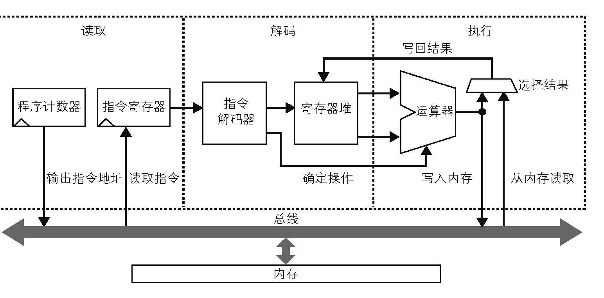
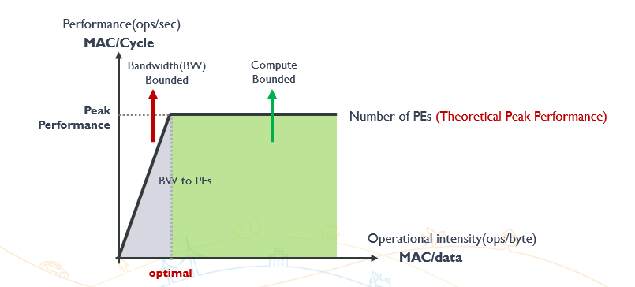
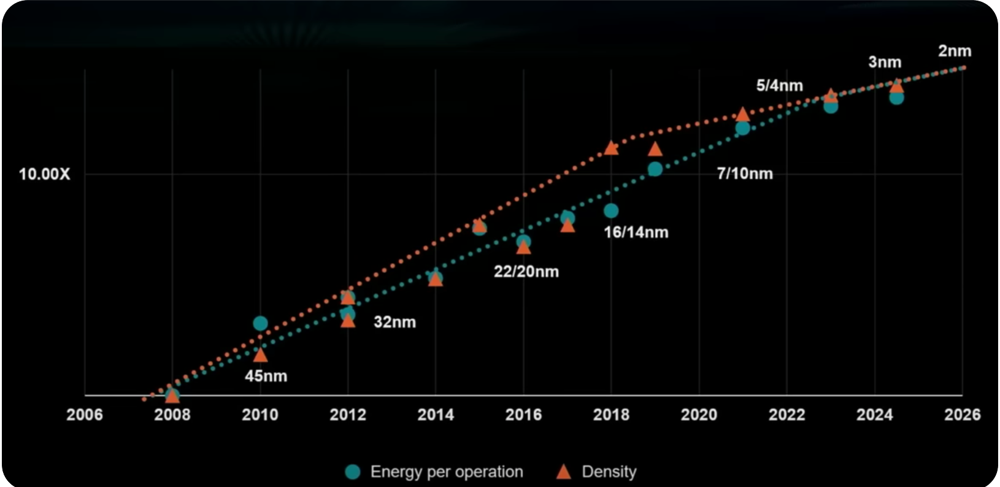
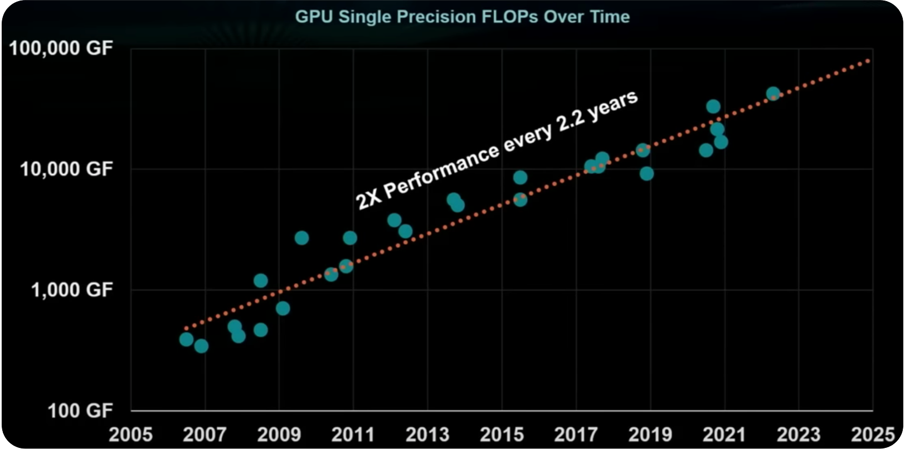
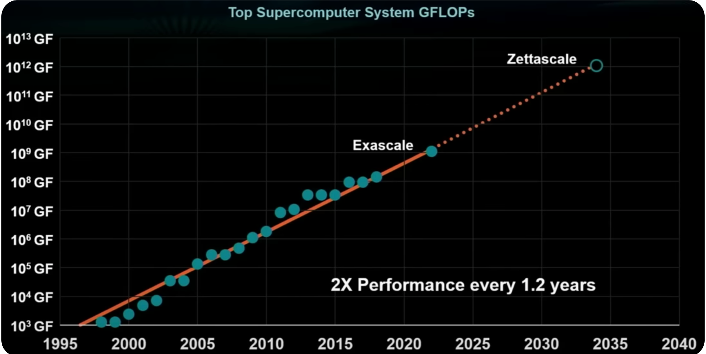

<!--Copyright 适用于[License](https://github.com/chenzomi12/AISystem)版权许可-->

<<<<<<< HEAD
# CPU（中央处理器）
在现代计算机科学领域，中央处理器（CPU）是计算机系统的核心部件，承担着执行指令和处理数据的关键任务。CPU 的设计和性能直接影响到整个系统的效率和能力。在这一节我们将详细探讨 CPU 的主要组成部分及其功能，解释其工作原理，并深入分析算力如何通过各种因素如核心数量、时钟频率和内存带宽来衡量和优化。我们还将通过算力敏感度的分析，探讨在高性能计算中操作强度、处理元素和带宽的平衡关系。最后，会展示当今 CPU 和相关技术在不同领域的性能趋势，包括逻辑电路技术、服务器性能、GPU 集群性能以及超级计算中心的演变。

下面是 CPU 的主要组成部分及其功能：

## CPU 的组成

CPU 是计算机的核心处理单元，由算术逻辑单元(ALU)、控制单元(CU)、存储单元、总线接口与时钟和其他关键组件组成，负责解释和执行指令来处理数据并协调系统操作。下图展示了计算机中央处理单元（CPU）的结构和主要组件

### 算术逻辑单元（ALU）

ALU 全称 Arithmetic logic unit，中文名为算术逻辑单元，是 CPU 中负责执行算术和逻辑运算的部分。它可以进行加法、减法、乘法、除法等算术运算，还可以执行与、或、非、异或等逻辑运算。

下图展示的是一个算术逻辑单元（ALU）的基本工作原理，图中的各个部分对应 ALU 的不同功能和输入/输出

图中的“操作数 A”和“操作数 B”代表的是输入到 ALU 中的两个数据。这些数据是 ALU 进行运算所需要的值，通常是从寄存器中提取的，在实际操作中，这些操作数可以是需要加、减、乘、除的数字，或是需要进行逻辑运算（如与、或、非）的位模式。

图中的操作码则是指示 ALU 应该执行哪种操作的信号。它是从控制单元发送到 ALU 的，告诉 ALU 当前要执行的操作类型（如加法、减法、乘法、除法、逻辑与、或、非等）。操作码的选择决定了 ALU 如何处理输入的操作数

图中的状态输入通常包含一些控制信号或标志位，这些信号可以影响 ALU 的操作方式。例如，状态输入可能指示 ALU 是否应该执行带符号的操作或处理溢出情况。

图中的运算结果是指 ALU 输出的结果。经过 ALU 处理后的数据结果会输出到这里，通常被存储回寄存器或直接用于下一步操作。这个结果可以是算术计算的结果（如加法的和、减法的差等）或逻辑运算的结果（如与操作的结果）。

图中的状态输出是 ALU 操作后生成的状态信息。这些信息可以包括零标志（表示结果为零）、进位标志（表示计算中发生了进位或借位）、溢出标志（表示结果超出了表示范围）等。状态输出通常反馈给控制单元，以便它可以决定后续的操作。例如，如果计算结果为零，控制单元可能会跳转到程序中的另一个部分。

### 控制单元（CU）

CU 全称(Control Unit),中文名为控制单元，控制单元是中央处理器（CPU）的核心部分之一，负责协调和控制计算机执行程序的过程。CU 的工作流程可以通过一系列的步骤来描述，这些步骤通常被称为取指（Fetch）、解码（Decode）和执行（Execute）周期。

首先在取指阶段，程序计数器（PC）的值被用作地址，通过地址总线发送到内存，内存中的指令在指定地址被读取，并通过数据总线发送到 CPU，读取的指令被存储在指令寄存器（IR）中，程序计数器（PC）**自动递增，以指向下一条指令的地址，准备下一次取指操作。

然后在解码阶段，则将指令寄存器中的机器指令翻译成操作码和操作数。首先指令译码器（Instruction Decoder）读取指令寄存器中的内容。然后将指令拆分成操作码（Opcode）和操作数（Operands）。紧接着控制信号生成器根据操作码生成适当的控制信号，指示 ALU（算术逻辑单元）、寄存器和其他组件执行具体的操作，确定需要哪些资源（如 ALU、内存、寄存器）来执行指令。

最后在执行阶段，ALU 将在算术和逻辑操作中接收控制信号并对操作数进行处理（如加减乘除、逻辑运算），如果指令涉及数据传输（如从内存读取或写入数据），控制单元会协调这些操作。如果是涉及结果存储，则处理结果将被存储在指定的寄存器或内存位置，然后及时更新状态寄存器（如零标志、进位标志等），反映指令执行的结果。

### 存储单元

寄存器是 CPU 内部的一种高速存储器，用于暂时存储数据和指令。常见的寄存器包括累加器（ACC）、程序计数器（PC）、指令寄存器（IR）、地址寄存器（MAR）、数据寄存器（MDR）等。

累加器（ACC - Accumulator）是最常见的通用寄存器之一，特别是在早期的 CPU 设计中。它的主要功能是用于算术和逻辑运算，由于频繁参与计算，累加器通常直接与 ALU（算术逻辑单元）相连。许多早期的计算机架构中，几乎所有的运算都通过累加器完成。

程序计数器（PC - Program Counter）用于跟踪当前执行的指令地址，程序计数器保存即将执行的下一条指令的内存地址。在每次指令执行后，程序计数器自动递增，以指向下一条指令。如果发生跳转指令（例如分支或函数调用），程序计数器会更新为跳转目标地址

指令寄存器（IR - Instruction Register）一般用于临时存储当前正在执行的指令，在从内存中获取指令后，指令首先被加载到指令寄存器。CPU 然后对指令进行解码，并执行指定的操作。指令寄存器可以帮助分离指令的获取（Fetch）阶段和执行（Execute）阶段，确保在指令解码和执行时，能够快速访问当前指令。

地址寄存器（MAR - Memory Address Register）用于存储当前正在访问的内存单元的地址，当 CPU 需要读取或写入内存数据时，地址寄存器保存目标内存地址。随后，CPU 会通过 MAR 将该地址发送到内存总线，以便访问所需的数据。

数据寄存器（MDR - Memory Data Register）用于存储从内存中读取或将写入内存的数据，当 CPU 从内存中读取数据时，数据会首先被加载到数据寄存器，然后再传输到需要使用的数据处理单元。同样，在写入操作中，数据首先被加载到数据寄存器，然后写入指定的内存地址。

### 总线接口与时钟

总线接口单元负责 CPU 与其他部件（如内存、输入/输出设备）之间的数据传输。总线包括数据总线、地址总线和控制总线。时钟是指计算机系统中的电子振荡器，它产生一系列恒定的、周期性的信号脉冲，用于同步系统中的各种操作。时钟频率通常以赫兹（Hz）为单位，表示每秒钟的脉冲数。

数据总线（Data Bus）用于在 CPU 和其他设备之间传输数据。数据总线的宽度（如 32 位、64 位）直接影响系统的数据传输速度。数据总线宽度越宽，CPU 可以在一个周期内传输的数据量越多，这有助于提高系统的整体性能。

地址总线（Address Bus）用于传输内存地址，指示数据在内存或 I/O 设备中的位置。地址总线的宽度决定了系统可以寻址的最大内存范围。

控制总线（Control Bus）传输控制信号，包括读/写信号、中断请求和时钟信号等，用于协调和控制不同设备之间的操作，确保数据传输的正确性和同步性。

CPU 时钟频率（Clock Frequency）是指 CPU 每秒可以执行的周期数。它是衡量 CPU 速度的一个重要指标。时钟频率越高，CPU 可以在每秒钟内执行更多的指令，从而提高处理能力。例如，一个运行在 3 GHz 时钟频率的 CPU 每秒可以执行 30 亿个周期。

时钟周期（Clock Cycle）是 CPU 执行一个基本操作（如读、写、计算等）的时间单位,一个时钟周期的长度与时钟频率成反比。更高的时钟频率意味着更短的时钟周期，从而允许更快的操作。
## CPU 的工作原理

CPU 的工作可以分为取指（Fetch）、译码（Decode）、执行（Execute）、访存（Memory Access）和写回（Write Back）五个阶段。这些阶段有序且循环地运行，形成了完整的指令周期。每个阶段都有其独特的功能和作用，共同确保指令的正确执行和数据的精确处理。下图是 CPU 中央处理器（CPU）执行指令的基本过程。

### 取指（Fetch）
在 CPU 执行指令的第一阶段，取指阶段主要由程序计数器和指令寄存器负责，程序计数器位于图的左侧，标注为“程序计数器”。程序计数器保存着下一条要执行的指令的内存地址，在取指阶段，程序计数器的值被输出到内存地址总线（图中总线箭头的方向指向内存），用于从内存读取指令。当内存中的指令地址被确定后，指令通过总线被读取并存储到“指令寄存器”中。

### 译码（Decode）
在取指之后，指令进入译码阶段，这个阶段由指令解码器和寄存器堆进行处理，指令解码器位于图的中央区域，从指令寄存器读取的指令被送到解码器进行解释，以此确定操作类型以及操作数的位置。图中靠近解码器的“寄存器堆”模块，用于提供指令中所需的操作数，根据解码器的指令，从寄存器堆中读取所需的数据。

### 执行（Execute）
在执行阶段，指令中的操作被实际执行，这一阶段主要由运算器完成，图的右侧区域标注为“运算器”，ALU 接收从寄存器堆或解码器传递过来的操作数并执行指定的操作（如加法、减法、逻辑与或逻辑或等）。

### 访存（Memory Access）
如果需要从内存中读取数据，CPU 会在从内存读取这一阶段与内存交互，从内存中取出数据作为操作数。如果指令需要将结果写回到内存中（如存储指令），CPU 会在写入内存这一阶段将计算结果存储到内存指定位置。

### 写回（Write Back）
最后，写回阶段将执行结果写入到寄存器或内存，如果指令的操作涉及寄存器，结果会被写回到指定的寄存器。如果操作结果需要存储在内存中，CPU 会确保结果被正确存储到内存中。
=======
# CPU 计算本质
>>>>>>> upstream/main

本节将深入探讨 CPU 的计算性能，从算力的敏感度和不同技术趋势中分析影响 CPU 性能的关键因素。我们将通过数据和实例，详细解释 CPU 算力的计算方法、算力与数据加载之间的平衡点，以及如何通过算力敏感度分析来识别和优化计算系统中的性能瓶颈。此外，我们还将观察服务器、GPU 和超级计算机等不同计算平台的性能发展趋势，以及它们如何影响着我们对 CPU 性能的理解和期望。

## 从数据看 CPU 计算

平常我们关注 CPU，一般都会更加关注 CPU 的算力 FLOPs，但是当我们更加深入到计算本质的时候，可能会更加关注 CPU 的内核，这个章节我们将会从算力的敏感度，以及服务器和 GPU 等性能趋势，来看一下决定 CPU 性能的效率究竟是什么。

### CPU 算力

算力(Computational Power)，即计算能力，是计算机系统或设备执行数值计算和处理任务的核心能力。提升算力不仅仅可以更快地完成复杂的计算任务，还能够显著的提高计算效率和性能，从而直接影响应用加载速度，游戏流畅度等用户体验。

1. **数据读取与 CPU 计算关系**

对于 CPU 来说，算力并不一定是最重要的。数据的加载和传输同样至关重要。如果内存每秒可以传输 200 GB 的数据（200 GBytes/sec），而计算单元每秒能够执行 2000 亿次双精度浮点运算（2000 GFLOPs），则需要考虑两者之间的平衡。

根据计算强度的公式：

$$
\text{Required Compute Intensity} = \frac{\text{FLOPs}}{\text{Data Rate}} = 80
$$

这意味着，为了使加载数据的成本值得，每加载一次数据，需要执行 80 次计算操作。

2. **操作与数据加载的平衡点**

为了平衡计算和数据加载，每从内存中加载一个数据，需要执行 80 次计算操作。这种平衡点确保了计算单元和内存带宽都能得到充分利用，避免了计算资源的浪费或内存带宽的瓶颈。

因此，虽然提升计算性能（算力）很重要，但如果数据加载和传输无法跟上，即使计算单元的算力再强大，整体效率也无法提升。优化数据传输速率和数据加载策略，与提升计算性能同样重要，以确保系统的整体效率。

3. **CPU 算力计算公式**

CPU 的算力通常用每秒执行的浮点运算次数（FLOPS，Floating Point Operations Per Second）来衡量，这是一个非常重要的指标，尤其是在科学计算、工程模拟和图形处理等需要大量计算的领域。算力的计算可以通过了解 CPU 的核心数、每个核心的时钟频率以及每个时钟周期能够执行的浮点运算次数来进行。

CPU 的算力可以通过以下公式计算：

$$
\text{算力 (FLOPS)} = \text{CPU 核心数} \times \text{每个核心的时钟频率 (Hz)} \times \text{每个时钟周期的浮点运算次数 (FLOP/cycle)}
$$

### 算力计算示例

1. 单核 CPU 算力计算

假设有一个单核 CPU，其时钟频率为 2.5 GHz，每个时钟周期可以执行 4 次浮点运算。

- **核心数**：1
- **时钟频率**：2.5 GHz = 2.5 × 10^9 Hz
- **每个时钟周期的浮点运算次数**：4 FLOP/cycle

算力计算：
 
$$
\text{算力 (FLOPS)} = 1 \times 2.5 \times 10^9 \times 4 = 10 \times 10^9 = 10 \text{ GFLOPS}
$$

2. 多核 CPU 算力计算

假设有一个四核 CPU，每个核心的时钟频率为 3.0 GHz，每个时钟周期可以执行 8 次浮点运算。

- **核心数**：4
- **时钟频率**：3.0 GHz = 3.0 × 10^9 Hz
- **每个时钟周期的浮点运算次数**：8 FLOP/cycle

算力计算：

$$
\text{算力 (FLOPS)} = 4 \times 3.0 \times 10^9 \times 8 = 96 \times 10^9 = 96 \text{ GFLOPS}
$$

3. 超级计算机算力计算

假设有一个超级计算机，有 10000 个 CPU，每个 CPU 有 8 个核心，每个核心的时钟频率为 2.5 GHz，每个时钟周期可以执行 16 次浮点运算。

- **CPU 数量**：10000
- **每个 CPU 的核心数**：8
- **时钟频率**：2.5 GHz = 2.5 × 10^9 Hz
- **每个时钟周期的浮点运算次数**：16 FLOP/cycle

单个 CPU 的算力：

$$
\text{单个 CPU 的算力 (FLOPS)} = 8 \times 2.5 \times 10^9 \times 16 = 320 \times 10^9 = 320 \text{ GFLOPS}
$$

整个超级计算机的算力：

$$
\text{超级计算机的算力 (FLOPS)} = 10,000 \times 320 \times 10^9 = 3.2 \times 10^6 \times 10^9 = 3.2 \text{ PFLOPS}
$$

### 影响 CPU 算力因素

1. 核心数量：核心数量是衡量 CPU 并行处理能力的重要指标之一。每个核心可以独立执行任务，更多的核心意味着 CPU 可以同时处理更多的任务，从而显著提升并行计算的能力。现代 CPU 通常设计为多核心架构，这使得它们在处理复杂的、多线程任务时具有明显的优势。

2. 时钟频率：时钟频率指的是 CPU 每秒钟可以执行的周期数，通常以 GHz（千兆赫兹）为单位。更高的时钟频率意味着 CPU 可以在更短的时间内完成更多的计算任务。

3. 每个时钟周期的浮点运算次数：现代 CPU 架构采用超标量设计和向量化技术来增加每个时钟周期内可以执行的浮点运算次数。浮点运算是处理复杂计算任务的关键，特别是在科学计算和图形处理领域。

4. 缓存和内存带宽：缓存和内存带宽是影响 CPU 数据访问速度的关键因素。高效的缓存系统和足够的内存带宽可以显著减少数据传输的延迟，提高整体计算效率。

5. 指令集架构：指令集架构（ISA）是 CPU 如何执行指令的基础。不同的 ISA（如 x86、ARM、RISC-V）对浮点运算的支持和优化程度有所不同，直接影响 CPU 的算力表现。

## 算力与敏感度

算力敏感度是指计算性能对不同参数变化的敏感程度。在计算系统中，进行算力敏感度分析可以帮助我们了解系统在不同操作条件和数据下的性能表现，并识别出可能存在的性能瓶颈。算力敏感度分析是优化计算系统性能的关键工具。通过理解和分析不同参数对性能的影响，我们能够更好地设计和优化计算系统，从而提升整体性能和效率。

### 算力敏感度关键要素

1. **操作强度（Operational Intensity）**：操作强度常用 ops/byte（操作次数/字节）表示，是指每字节数据进行的操作次数。这一概念在计算机科学中至关重要，尤其在高性能计算领域。操作强度衡量的是计算与内存访问之间的关系。操作强度越高，意味着处理器在处理数据时进行更多计算操作，而不是频繁访问内存。这种情况下，处理器需要的数据带宽相对较低，因为大部分时间花费在计算上，而非在数据传输上。反之，操作强度较低时，处理器的计算操作较少，大部分时间可能花费在内存数据的读取和写入上，这时对数据带宽的需求较高。

<<<<<<< HEAD

2. **处理元素（Processing Elements, PEs）**：处理元素是指计算系统中执行操作的基本单元。它们是计算的核心，负责实际的数据处理任务。在现代计算架构中，处理元素可以是一个独立的 CPU 核心、一个 GPU 流处理器，或是一个专用计算单元。系统中的处理元素数量和性能直接决定了系统的理论峰值性能。处理元素越多，或者它们的计算能力越强，系统能够在单位时间内完成的计算任务就越多，从而提升了系统的整体性能。现代高性能计算系统通常通过增加处理元素的数量或提升单个处理元素的效率来实现性能的提高。此外，处理元素的架构和设计也会影响系统的能源效率和热管理，进而影响到系统的实际应用场景和运行成本。

=======
2. **处理元素（Processing Elements, PEs）**：处理元素是指计算系统中执行操作的基本单元。它们是计算的核心，负责实际的数据处理任务。在现代计算架构中，处理元素可以是一个独立的 CPU 核心、一个 GPU 流处理器，或是一个专用计算单元。系统中的处理元素数量和性能直接决定了系统的理论峰值性能。处理元素越多，或者它们的计算能力越强，系统能够在单位时间内完成的计算任务就越多，从而提升了系统的整体性能。现代高性能计算系统通常通过增加处理元素的数量或提升单个处理元素的效率来实现性能的提高。此外，处理元素的架构和设计也会影响系统的能源效率和热管理，进而影响到系统的实际应用场景和运行成本。
>>>>>>> upstream/main

3. **带宽（Bandwidth）**：带宽是指系统在单位时间内可以处理的数据量，通常以 GB/s（千兆字节每秒）或 TB/s（太字节每秒）为单位来表示。带宽是计算系统中的一个关键指标，直接影响数据传输的效率。带宽限制是影响高操作强度应用性能的主要因素之一。当系统的操作强度较高时，处理器对内存的访问需求降低，此时带宽的瓶颈影响较小。然而，对于那些操作强度较低的应用，处理器频繁访问内存，对带宽的需求极大，如果带宽不足，就会限制系统的整体性能表现。通过优化带宽和存储器架构，可以在一定程度上缓解这些瓶颈问题，从而提升系统的计算效率。
   
4. **理论峰值性能（Theoretical Peak Performance）**：理论峰值性能是指系统在最佳条件下可以达到的最大性能，通常用于评估计算系统的潜在能力。它是通过考虑处理元素的数量、频率及其计算能力来计算的，通常以 FLOPS（每秒浮点运算次数）为单位表示。系统的理论峰值性能是由处理元素的数量、单个处理元素的运算能力，以及操作强度共同决定的。在设计和选择计算系统时，理论峰值性能提供了一个重要的参考指标。然而，实际运行中的性能通常低于理论峰值，因为现实中会遇到各种限制，如带宽瓶颈、内存延迟以及其他系统开销。因此，在实际应用中，优化系统以接近理论峰值性能是高性能计算领域的一个重要目标。通过提高处理元素的效率，优化操作强度，以及改进带宽，可以最大限度地发挥系统的潜在能力。
   
### 算力敏感度重要性

- **识别性能瓶颈**：通过算力敏感度分析，可以识别系统在不同条件下的性能瓶颈，从而优化系统设计。

- **优化资源分配**：了解不同参数对性能的影响，可以更有效地分配计算资源，提高整体系统效率。

- **性能预测**：算力敏感度分析可以帮助预测系统在不同工作负载下的性能表现，指导系统设计和改进。

下图深入解析了计算系统性能与操作强度、处理元素数量以及带宽之间的复杂关系。

当操作强度较低时，系统性能主要受限于带宽，因为处理器需要频繁从内存中读取和写入数据，导致大量时间花费在数据传输上。这一状态下，提升系统带宽可以显著提高性能，减轻传输瓶颈。图的左侧区域明确显示了这一带宽受限的状态。

随着操作强度的增加，处理器可以更多地专注于计算操作而非数据传输，此时系统的性能逐渐转向受限于处理元素的计算能力。也就是说，在高操作强度下，带宽不再是瓶颈，处理元素的数量和性能成为决定系统性能的关键因素。图的右侧区域反映了这种计算受限的状态。

在这两个极端之间，存在一个最佳性能区域。在这个区域内，操作强度与系统的资源利用达到了平衡，使得系统性能接近其理论峰值。这个平衡点是高性能计算中追求的目标，因为它代表了带宽和计算能力的最佳配合，使得系统可以以最优的效率运行。

### 算力发展趋势

1. 逻辑电路技术趋势预测

这张图展示了逻辑电路技术随时间的趋势预测，标题为“逻辑电路技术趋势预测”。纵轴表示性能倍数（如 1.00X 和 10.00X），而横轴表示时间，从 2006 年到 2026 年，展示了 20 年的技术变化。

图中的蓝色圆点代表每次操作的能耗（Energy per operation），而橙色三角形代表密度(Density)。红色虚线表示密度随时间的增长趋势，绿色虚线表示每次操作能耗随时间的变化趋势。体现了逻辑电路技术在过去 20 年间取得了显著进步，随着工艺节点的缩小，每次操作的能耗不断降低，而晶体管的密度不断增加。

2. X86 服务器的性能趋势

这张图展示了服务器性能随时间的变化趋势,纵轴表示性能（Performance），显示了性能倍数（如 10X 和 100X），而横轴表示时间（Time），从 2009 年 3 月到 2022 年 4 月，展示了近 13 年的服务器性能变化。

蓝色圆点代表不同时间点的服务器性能指标（SpecIntRate），我们可以在图中看到这些数据点随着时间推移不断上升。红色虚线表示性能增长的趋势，斜率表明性能的增长速度。图中说明了每 2.4 年服务器的性能就会翻倍，体现了在计算机硬件的领域，尤其在服务器性能的提升趋势。

3. GPU 集群性能趋势

这张图则展示了 GPU 性能随时间的变化趋势，纵轴表示单精度浮点运算性能（GFLOPs），显示性能倍数（如 1,000 GF 和 100,000 GF），而横轴表示时间（Time），从 2005 年到 2025 年，展示了近 20 年来的 GPU 性能的变化。

图中的蓝色圆点代表不同时间点的 GPU 性能指标（单精度浮点运算每秒次数，GFLOPs），可以看到这些数据点随着时间推移不断上升。红色虚线则表示性能增长的趋势，斜率表明性能的增长速度。图中说明了每 2.2 年 GPU 的性能翻倍，也同样体现了 GPU 性能的提升趋势。

4. 超算中心的性能趋势

这张图展示了超算中心性能随时间的变化趋势，纵轴表示浮点运算性能（GFLOPs），显示性能倍数（如 10^3 GF、10^6 GF、10^9 GF 和 10^13 GF），而横轴表示时间（Time），从 1995 年到 2040 年，展示了约 45 年的超算中心性能变化趋势。

5. 训练 AI 大模型的变化趋势

这张图展示了训练 AI 大模型所需时间随模型参数数量的变化趋势，纵轴表示训练时间，单位从“天”（Days）到“周”（Weeks）再到“月”（Months）；横轴表示模型参数的数量，范围从 2 亿到 1008 亿。

图中的折线代表了随着模型参数数量增加，训练时间的变化。可以看到，随着模型参数数量的增加，训练时间呈现出指数增长的趋势。例如，参数数量较少的 Megatron 和 T-NLG 训练时间在数天到数周之间，而参数数量更大的 GPT-3、MT-NLG 和 GLaM 的训练时间则显著增加，达到数月。图表底部的文字描述“Exponentially growing model sizes driving massive growth in compute and memory”进一步强调了模型规模的迅速增长，推动了计算和内存需求的巨大增长。

## 小结与思考

<<<<<<< HEAD
本节我们深入探讨了中央处理器（CPU）的核心组件、工作原理以及其算力的衡量和优化。通过分析了 CPU 的算术逻辑单元（ALU）、控制单元（CU）、存储单元、总线接口与时钟的功能，和具体的算力计算示例，理解了如何评估和提升计算性能。

通过算力敏感度分析，我们了解了操作强度、处理元素和带宽如何共同影响系统性能。以及展示了现代技术的趋势，发现服务器、GPU 和超算中心的性能正在迅速提升，说明计算系统的性能正以惊人的速度提升。随着逻辑电路技术的进步，服务器和 GPU 的性能不断突破新高，超级计算中心的算力达到前所未有的水平。在这样的背景下，新的计算架构和优化方法将不断涌现，推动科技进步和应用创新。

最后，在这节内容中，我们深刻认识到计算能力和数据传输速率在提升系统性能中同等重要。未来的计算系统设计需要更好地平衡这两者，以避免出现计算资源的浪费或内存带宽的瓶颈。如何在不同应用场景中找到这个平衡点，是一个值得持续探索的课题。

=======
- 算力衡量 CPU 性能：通过核心数量、时钟频率和内存带宽等因素衡量 CPU 算力，算力敏感度分析帮助理解不同参数对性能的影响，优化系统设计。

- CPU 性能和算力发展趋势：随着技术进步，CPU 性能持续提升，算力增长推动了高性能计算、服务器、GPU 集群和超级计算中心的发展，同时 AI 大模型训练时间随模型规模指数增长。

>>>>>>> upstream/main
## 本节视频

<html>
<iframe src="https://player.bilibili.com/player.html?aid=354490381&bvid=BV17X4y1k7eF&cid=1078936733&page=1&as_wide=1&high_quality=1&danmaku=0&t=30&autoplay=0" width="100%" height="500" scrolling="no" border="0" frameborder="no" framespacing="0" allowfullscreen="true"> </iframe>
</html>
