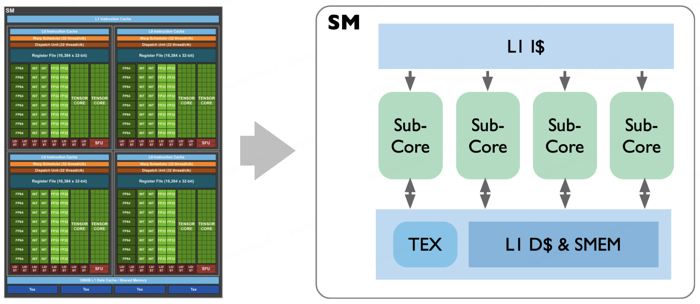
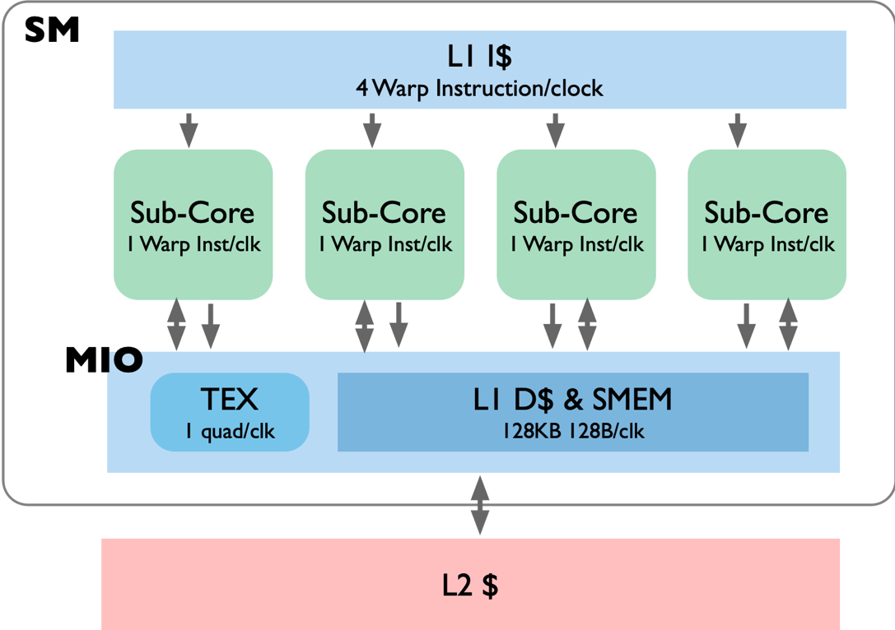
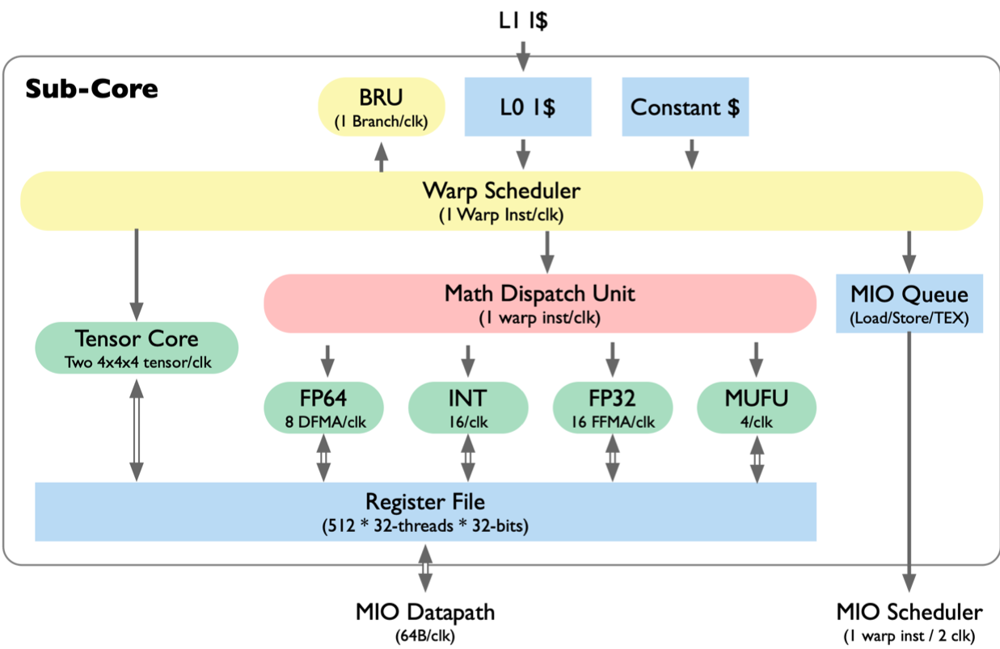
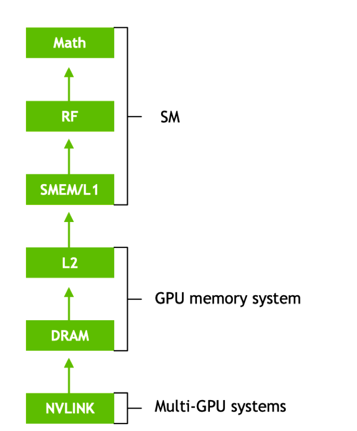
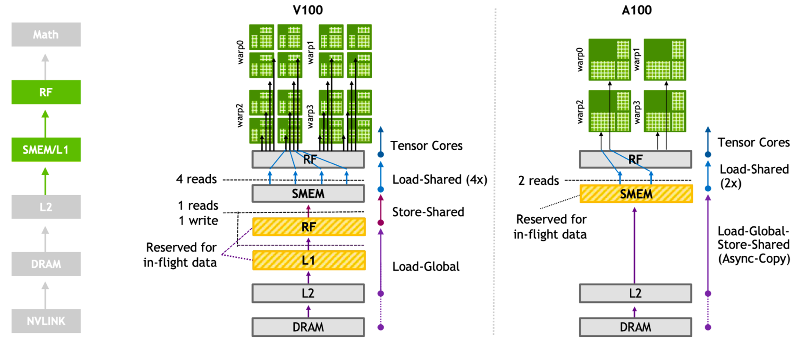
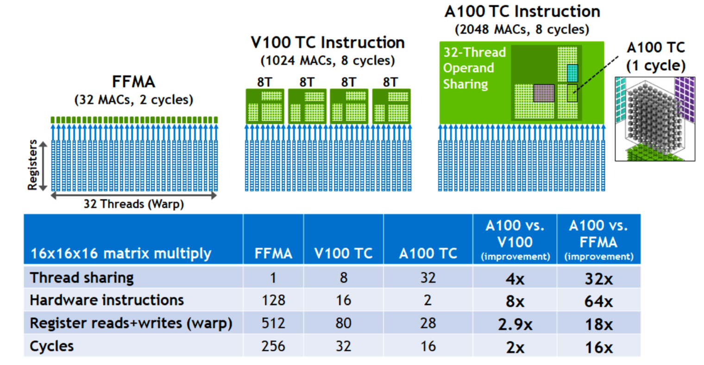
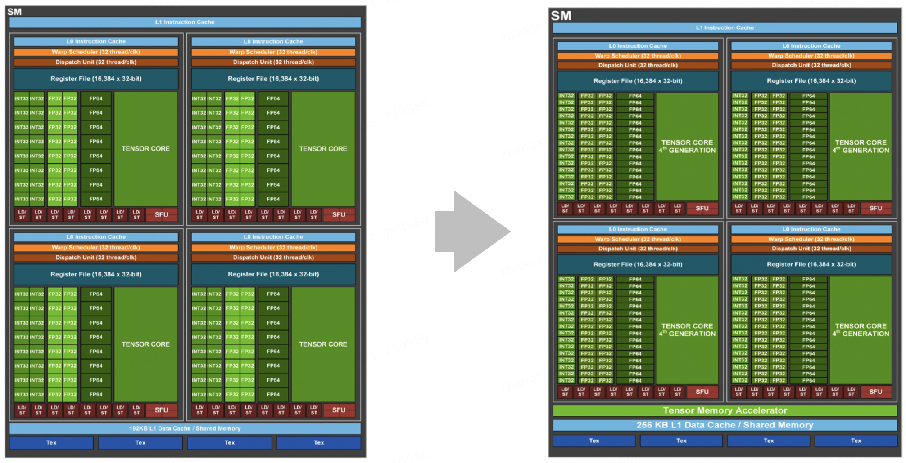
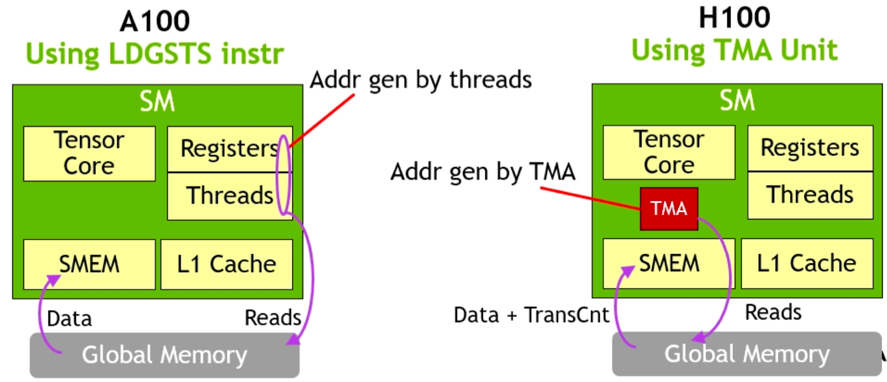
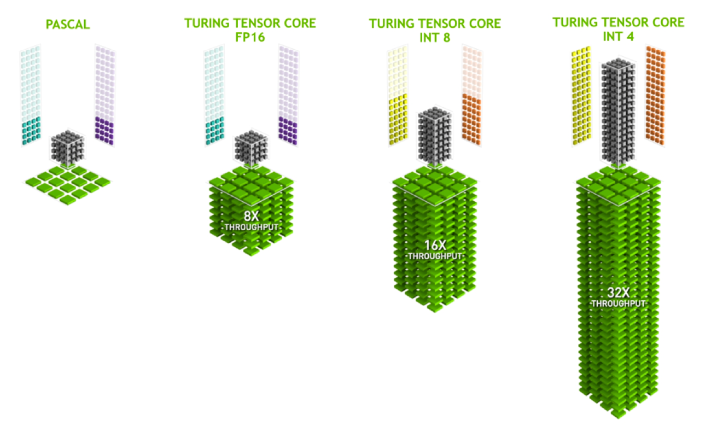

# TensorCore架构研进

自Volta架构时代起，Nvidia的GPU架构已经明显地转向深度学习领域的优化和创新。2017年，Volta架构横空出世，其中引入的张量核心（Tensor Core）设计可谓划时代之作，这一设计专门针对深度学习计算进行了优化，通过执行融合乘法加法操作，大幅提升了计算效率。与前一代Pascal架构相比，Volta架构在深度学习训练和推理方面的性能提升了3倍，这一飞跃性进步为深度学习的发展提供了强大的硬件支持。

紧随其后，在一年后的2018年，Nvidia发布了Turing架构，进一步增强了Tensor Core的功能。Turing架构不仅延续了对浮点运算的优化，还新增了对INT8、INT4、甚至是Binary(INT1)等整数格式的支持。这一举措不仅使大范围混合精度训练成为可能，更将GPU的性能吞吐量推向了新的高度，较Pascal GPU提升了惊人的32倍。此外，Turing架构还引入了先进的光线追踪(RT Core)技术。

2020年，Ampere架构的推出再次刷新了人们对Tensor Core的认知。Ampere架构新增了对TF32和BF16两种数据格式的支持，这些新的数据格式进一步提高了深度学习训练和推理的效率。同时，Ampere架构引入了对稀疏矩阵计算的支持，在处理深度学习等现代计算任务时，稀疏矩阵是一种常见的数据类型，其特点是矩阵中包含大量零值元素。传统的计算方法在处理这类数据时往往效率低下，而Ampere架构通过专门的稀疏矩阵计算优化，实现了对这类数据的高效处理，从而大幅提升了计算效率并降低了能耗。此外，Ampere架构还引入了Nvlink技术，这一技术为GPU之间的通信提供了前所未有的高速通道。在深度学习等需要大规模并行计算的任务中，GPU之间的数据交换往往成为性能瓶颈。而Nvlink技术通过提供高带宽、低延迟的连接，使得GPU之间的数据传输更加高效，从而进一步提升了整个系统的计算性能。

到了2022年，Nvidia发布了专为深度学习设计的Hopper架构。Hopper架构标志性的变化是引入了FP8张量核心，这一创新进一步加速了AI训练和推理过程。值得注意的是，Hopper架构去除了RT Core，以便为深度学习计算腾出更多空间，这一决策凸显了Nvidia对深度学习领域的专注和投入。此外，Hopper架构还引入了Transformer引擎，这使得它在处理如今广泛应用的Transformer模型时表现出色，进一步巩固了Nvidia在深度学习硬件领域的领导地位。

总的来说，从Volta到Hopper，Nvidia的GPU架构经历了一系列针对深度学习优化的重大创新和升级，每一次进步都在推动深度学习技术的边界。这些架构的发展不仅体现了Nvidia在硬件设计方面的前瞻性，也为深度学习的研究和应用提供了强大的计算支持，促进了人工智能技术的快速发展。

接下来，我们将逐一深入剖析每一代Tensor Core的独特之处，以揭示其背后的技术奥秘。

## 第一代TensorCore（Volta）

在开始介绍Volta架构中的第一代TensorCore之前，我们先来了解一下Volta架构的实现细节。

如上图所示，左边就是Volta SM的架构图，Volta架构中的Streaming Multiprocessor（SM）通过引入子核心（subCore）概念，提升了其执行效率和灵活性。在Volta架构中，一个SM由4个subCore组成，每个subCore可以被视为一个更小的、功能完备的执行单元，它们共同工作以提高整体的处理能力。

每个subCore内部包含了一定数量的CUDA核心，这是Nvidia GPU的基础计算单元，用于执行并行计算任务。除此之外，subCore还集成了专门的整数（INT）和浮点（FP）运算单元，这些单元能够同时进行整数和浮点计算，从而提高计算效率。更重要的是，subCore内还配备了一组张量核心（Tensor Core），这是Volta架构的核心创新之一，专为加速深度学习中的矩阵乘法和累加操作而设计，极大地提升了深度学习训练和推理的性能。

在Volta SM的结构中，如上图右边所示，揭示了其内部工作机制的细节。SM顶部的L1指令缓存负责存储即将执行的指令，并将这些指令发送到下方的四个subCore中。这种指令传输是单向的，确保了指令能够高效、有序地分配给每个执行单元。

在subCore完成计算任务后，其与位于SM底部的L1数据缓存（L1 Cache）和共享内存（Shared Memory）之间的交互则是双向的。这种设计允许subCore不仅可以读取下一批计算所需的数据，还可以将计算结果写回缓存或共享内存中，供其他subCore或SM中的其他组件使用。这种灵活的数据交互机制优化了数据流动，减少了内存访问延迟，进一步提升了整体的计算效率。

- Volta SM 微架构
  
接下来我们深入研究下 Volta GPU中的SM，首先SM它在处理寄存器的整体读写逻辑方面起着核心作用，是计算的关键单元。其次在每个SM的Sub-Core中，包含了多种功能单元，如Tensor Core（张量核心）、FP64、FP32、INT8等CUDA Core、RT Core和特殊函数处理单元MFU。

此外，每个Sub-Core中还设有Warp Scheduler，它负责有效调度执行计算单元的工作。数据被存储在寄存器中，通过高效的调度和数据流，实现快速并行的数据处理和计算过程。

值得注意的是，每个SM Sub-Core内含有两个4x4x4 Tensor Core。Warp Scheduler向Tensor Core发送矩阵乘法GEMM运算指令。Tensor Core接收来自寄存器文件的输入矩阵（A、B、C），执行多次4x4x4矩阵乘法操作，直至完成整个矩阵乘法，并将结果矩阵写回寄存器文件(Register File)中。

如上图所示，最上面是共享的L1缓存，每个时钟周期可以执行4个Warp指令，下属4个独立的SubCore,里面的数据是不进行缓存的，但是每个SubCore里有两个TensorCore, 这两个TensorCore中的数据是可以共享的，再往下有一个共享内存，每个时钟周期可以传输128B的数据，当所有的SM计算完这个权重矩阵就会将数据回传到L2 Cache 中，最后返回Host Cpu中。

- SubCore微架构

如上图所示，在一个SubCore内的微架构中，顶部依然是L1 Cache，紧随其后的是L0 Cache，也就是Register File。Register File负责将数据传输到Warp Scheduler，而具体的指令调度则依赖于Warp Scheduler。针对通用的矩阵计算任务，即CUDA Core计算，我们通过Math Dispatch Unit将指令分发到具体的FP64、INT、FP32和MUFU等执行单元进行计算。

然而，当调用WMMA相关的API或指令时，Warp Scheduler会直接触发TensorCore中的计算，每个TensorCore内含有两个4x4x4的矩阵，在每个时钟周期内并行进行计算，最终将结果存回Register File寄存器中。寄存器通过MIO的Data Pipeline与Shared Memory进行通讯。

另外，在Volta架构中相比P100有一个重要改进，即将L1缓存和共享内存合并为同一块空间，其中的共享内存SMEM为整个SM提供了96KB的存储空间。对L2 Cache也进行了更新，性能提升了5%到15%。

因此，在Volta架构中，SubCore微架构单独提供了一个TensorCore的指令，直接提供给Warp Scheduler使用，无需通过Math Dispatch Unit进行指令分发。

除了引入专门针对AI框架矩阵计算的TensorCore，Volta架构还减少了指令延迟，进一步提高了计算效率。这些设计和优化使得Volta架构对人工智能和深度学习任务有着更快的处理速度。

## 第二代TensorCore（Turing）

在Turing架构中，我们直接进入SubCore，即微内核，来了解Tensor Core的第二代。

如上图所示，与之前的版本相比，Turing架构的Tensor Core除了支持FP16类型之外，还增加了INT8和INT4等多种类型，这一变化使得Turing架构在处理不同精度的计算任务时更加得心应手。

此外，Turing架构还引入了FP16的FastPath，这一创新设计使得每个时钟周期可以执行高达32次的计算操作。与Volta架构中需要4到8个时钟周期才能完成单个多线程GEMM计算的情况相比，Turing架构的计算频率和吞吐量得到了显著提升。

值得一提的是，Turing架构还支持通过线程共享数据的本地内存（Local Memory）。换句话说，在Turing架构的Tensor Core层面，每个线程的私有寄存器被设计成了可共享的资源。通过一种透明的共享机制，Tensor Core能够充分利用这些寄存器资源，实现更高效的矩阵计算。这种设计使得Tensor Core在执行矩阵乘法等计算密集型任务时，能够充分利用线程间的协作，提高计算效率，还降低了系统的整体能耗。

Turing架构的第二代Tensor Core在距离上一代Volta架构仅一年的时间内推出，它不仅在数据类型支持上进行了扩展，还在计算效率和数据共享方面实现了优化更新。

## 第三代TensorCore（Ampere）

当谈及第三代Tensor Core的重大改变时，首先需要提到多级缓存和数据带宽方面的优化，下面我们就先来具体了解一下GPU中的多级带宽体系。

- Ampere多级带宽体系

如上图所示为Ampere架构多级带宽体系，我们从下往上看，最下面为这次架构升级所引入NVLink技术，它主要来优化单机多块GPU卡之间的数据互连访问。在传统的架构中，GPU之间的数据交换需要通过CPU和PCIe总线，这成为了数据传输的瓶颈。而NVLink技术允许GPU之间直接进行高速的数据传输，极大地提高了数据传输的效率和速度。

接下来，再往上一层，为L2 Cache缓存和DRAM，它们负责的是每块GPU卡内部的存储。L2 Cache缓存作为一个高速缓存，用于存储经常访问的数据，以减少对DRAM的访问延迟。DRAM则提供了更大的存储空间，用于存储GPU计算所需的大量数据。这两者的协同工作，使得GPU能够高效地处理大规模数据集。这里要说明的一点是我们所说的HBM其实就是多个DRAM的堆叠，它通过堆叠多个DRAM芯片来提高带宽和容量。

再往上一层，则为共享内存和L1 Cache，它们负责SM中数据存储，共享内存允许同一SM内的线程快速共享数据，通过共享内存，线程能够直接访问和修改共享数据，从而提高了数据访问的效率和并行计算的性能。L1缓存，主要用于缓存SM中经常访问的数据和指令。

而最上面是针对具体的计算任务Math模块，是负责GPU数学处理能力。Math模块包括Tensor Core和CUDA Core，分别针对不同的计算需求进行优化。Tensor Core是专为深度学习等计算密集型任务设计的，能够高效地执行矩阵乘法等张量运算。而CUDA Core则提供了更广泛的计算能力，支持各种通用的GPU计算任务。

- Movement Efficiently

在A100中，最显著的改进之一是"Movement Efficiently"，即数据搬运效率的提升，实现了三倍的速度提升，这主要得益于Ampere架构引入的异步内存拷贝机制。

在Ampere 之前的 GPU 架构中，如果要使用共享内存（Shared Memory），必须先把数据从全局内存（Global Memory）加载到寄存器中，然后再写入共享内存。这不仅浪费了宝贵的寄存器资源，还增加了数据搬运的时延，影响了GPU的整体性能。

如上图所示，Ampere 架构中提供异步内存拷贝机制，通过新指令LDGSTS（Load Global Storage Shared），实现全局内存直接加载到共享内存，避免了数据从全局内存到寄存器再到共享内存的繁琐操作，从而减少时延和功耗。

另外，A100还引入了软件层面的Sync Copy，这是一种异步拷贝机制，可以直接将L2 Cache中的全局内存传输到SMEM共享内存，然后直接执行，减少了数据搬运带来的时延和功耗。

此外，Ampere架构的Tensor Core还进行了优化，一个Warp提供了32个线程，相比于Volta架构中每个Tensor Core只有8个线程，这样的设计可以减少线程之间的数据搬运次数，从而进一步提高计算效率。综上所述，A100相较于V100在数据处理和计算效率方面有了显著的提升。

- TensorCore FFMA

当我们深入研究FFMA（Fuse Fold Math and Add）操作时，我们可以从上图中得到更多的信息。在这个图中，绿色的小块代表SubCore，也就是之前提到的SubCore。而图中连续的蓝色框代表寄存器Registers。

当寄存器仅使用CUDA Core时，所有数据都存储在寄存器中，每个寄存器针对一个CUDA Core进行数据传输。这样使用CUDA Core计算会非常慢。

在V100中，每个Tensor Core可以处理8个线程，每个线程拥有自己的寄存器。因此，在8个时钟周期内，可以执行1024次MAC操作。而在A100的Tensor Core中，每个Tensor Core可以处理32条线程，因此在8个时钟周期内，可以寄存2048次MAC操作，每个时钟周期处理其中一块的数据。

第三代Tensor Core的Ampere架构除了制造工艺的提升外，还提供了更多的线程，使硬件执行速度更快，数据传输更少，每个时钟周期的吞吐量更大。

观察这个图后，我们不禁要问：为什么使用Tensor Core比单纯使用CUDA Core执行更快呢？

针对矩阵计算而言，这是因为每次针对Tensor Core进行计算速度更快、处理更多数据、吞吐量更高。Tensor Core的引入提高了计算效率，尤其在大规模矩阵计算中表现出色。

## 第四代TensorCore（Hopper）

2022年Nvida提出的Hopper架构，这一创新架构中最为引人瞩目的便是第4代Tensor Core的亮相。

回顾Tensor Core的发展历程，前三代的Tensor Core均基于Warp-Level编程模式进行运作。尽管在NvidiaA100架构中引入了软件的异步加载机制，但其核心运算逻辑仍基于Web-Level编程模式进行。简而言之，这一模式要求先将数据从HBM（全局内存）加载到寄存器中，随后通过Warp Schedule调用Tensor Core完成矩阵运算，最终再将运算结果回传至寄存器，以便进行后续的连续运算。然而，这一流程中存在两大显著问题。

首先，数据的搬运与计算过程紧密耦合，这导致线程在加载矩阵数据时不得不独立地获取矩阵地址，简而言之，Tensor Core 准备数据时，warp 内线程分别加载矩阵数据 Data Tile，每一个线程都会获取独立矩阵块地址；为了隐藏数据加载的延时（全局内存到共享内存，共享内存到寄存器的数据加载），会构建多层级软流水（software pipeline），消耗寄存器数量及存储带宽。这一过程不仅消耗了大量的继承器资源，还极大地占用了存储带宽，进而影响了整体运算效率。

其次，这一模式的可扩展性受到了严重限制。由于多级缓存Cache的存储空间限制，单个 warp 的矩阵计算规格有上限，这直接限制了矩阵计算的规模。在大数据、大模型日益盛行的今天，这种限制无疑成为了制约计算性能进一步提升的瓶颈。

而第4代Tensor Core的引入，正是为了解决这些问题。Nvidia通过全新的设计和优化，它旨在实现数据搬运与计算的解耦，提升存储带宽的利用率，同时增强可扩展性，以应对日益复杂和庞大的计算任务。我们有理由相信，随着第4代Tensor Core的广泛应用，计算性能将迎来新的飞跃。

- Tensor Memory Accelerator

在第4代Tensor Core中，一个显著的创新是引入了Tensor Memory Accelerator（简称TMA），这一功能被称为增量内存加速。这一技术的出现，极大地提升了数据处理效率，为高性能计算领域注入了新的活力。

对比A100与H100的SM架构图，如上图所示，我们可以发现二者在结构上并没有太大的差异。然而，由于工艺制程的进步，H100中的CUDA Core和Tensor Core的密度得以显著提升。更为重要的是，H100中新增了Tensor Memory Accelerator，这一硬件化的数据异步加载机制使得全局内存的数据能够更为高效地异步加载到共享内存，进而供寄存器进行读写操作。

传统的Warp-Level编程模式要求所有线程都参与数据搬运和计算过程，这不仅消耗了大量的资源，还限制了计算规模的可扩展性。而单线程schedule模型则打破了这一束缚，它允许Tensor Core在不需要所有线程参与的情况下进行运算。这种设计大大减少了线程间的同步和协调开销，提高了计算效率。此外，使用TMA（Tensor Memory Access）之前，用户只需要一次性配置好首地址、偏移量等Tensor描述信息。这种一次性配置的方式简化了操作流程，减少了重复配置的开销，使得Tensor Core能够更加专注于计算任务本身。

在A100时代，虽然已经实现了软件层面的数据异步加载，但TMA的硬件化实现无疑将这一功能推向了新的高度。通过TMA，数据搬运与计算之间的耦合度得以降低，从而提高了整体运算效率。

- 分布式共享内存和warp group编程模式

如上图所示，在H100之前的架构中，线程的控制相对有限，主要基于Grid和Block的划分，分别对应硬件SM和Device，且局部数据只能通过 shared memory 限制在SM内部，不能跨SM。然而，在Hopper架构中，情况发生了显著变化。通过在硬件层面引入交叉互联网络，数据得以在4个SM之间进行拓展和共享，GPC内SM可以高效访问彼此的共享内存。这一创新使得SM之间能够实现高效的通信，从而打破了之前架构中SM间的数据隔阂。

此外，随着硬件架构的变革，软件编程模式也相应发生了调整。Warp group编程模式的提出，以及与之相关的Tensor Block Cluster概念，都体现了软硬件协同优化的思想。这种编程模式能够更好地利用Hopper架构的特性，实现更高效的计算性能。

更直观的从软件层面去看一下，有什么区别呢?

如上图左边所示, 就是没有进行分布式共享内存的，每个Thread Block都对应一个SM，每个SM内部拥有自己的共享内存。然而，SM与SM之间无法进行直接的数据交互，这意味着它们之间的通信必须通过全局内存进行。这种通信方式不仅增加了数据传输的时延，还可能导致寄存器的过度使用，降低了计算效率。

而在H100架构中，如上图右边所示，通过引入SM的Cluster或Block的Cluster，实现了硬件层面的分布式共享内存。这意味着SM与SM之间的数据可以直接进行互联，无需再通过全局内存进行中转。这种机制极大地减少了数据传输的时延，提高了数据交互的效率。同时，由于数据可以在SM之间直接共享，寄存器的使用也得到了更加合理的分配，减少了不必要的浪费。

此外，通过TMA将SM组织成一个更大的计算和存储单元，从而实现了数据从全局内存（global memory）到共享内存（shared memory）的异步加载，以及数据到寄存器的计算和矩阵乘法的流水线处理，最后通过硬件实现了矩阵乘法的流水线。硬件实现的矩阵乘法流水线确保了计算过程的连续性和高效性，使得GPU能够更快地处理大规模矩阵运算。

## Tensor Core的应用

最后一个内容，我们来探讨一下Tensor Core的应用。在H100架构中，Tensor Core的设计主要是针对大模型，特别是像GPT、ChatGPT这种基于transformer架构堆叠而成的大型语言模型。这些大模型在处理时面临着巨大的挑战，因为它们的输入包含大量的词汇，这些词汇需要被嵌入成具体的向量进行计算。同时，输出也是以向量的形式呈现，经过softmax处理后，会形成一个比词表更大的向量。

在处理这些大模型时，词向量的维度和矩阵的规模都会变得非常庞大，这给计算带来了极大的压力。而Tensor Core的数量是有限的，尽管在V100中，我们能够通过软件的方式将其扩展到16x16x16的规模，通过局部数据的搬运来提升计算效率，但这并不意味着我们能够轻松地处理所有嵌入的向量或大矩阵。

实际上，对于大模型的处理，我们需要更加精细地考虑数据的布局和计算的方式。例如，当input size达到1024，batch size为5120时，使用FP16进行训练，整个词汇表的大小可能超过三万个词汇。在transformer的Attention架构中，会涉及到大量的矩阵乘法运算。为了提高性能，我们通常需要对矩阵进行padding操作，使其维度成为8的倍数。这样一来，整体的计算性能会得到显著提升。

这就要求在软件编程时，我们需要深入理解硬件的特性，合理地进行数据布局和计算优化，以实现更高的计算效率。这种对矩阵进行padding的操作，我们称之为Padding Vocabulary Size，它是优化大模型计算性能的关键一步。
综上所述，Tensor Core的应用在大模型计算中发挥着重要的作用。通过深入了解硬件特性，并结合合理的软件编程优化，我们可以更好地利用Tensor Core的计算能力，提升大模型的训练效率。

## 小结

经过上述探讨，我们可以对历代的Tensor Core进行一个简要的总结。Tensor Core的演进主要带来了三大关键提升。

首先，是内存能力的提升，有效地打破了所谓的“内存墙”。随着技术的不断进步，Tensor Core在处理大规模数据时，能够更高效地利用和管理内存资源，从而显著提升了计算性能。

其次，Tensor Core在SM内部支持了更多样化的数据格式。从最初的帕斯卡标准的FP16，到现在支持的TF32、IP8、IP4等多种数据格式，这一变化不仅丰富了数据处理的方式，也使得Tensor Core能够更灵活地应对各种计算需求。

最后，随着硬件架构的升级，对应的软件编程模式也发生了相应的调整。为了充分利用新的硬件特性，CUDA编程模式也进行了相应的优化和创新，使得软件能够更高效地与硬件协同工作，从而进一步提升计算性能。

综上所述，Tensor Core的历代演进不仅在硬件层面实现了显著的提升，也在软件层面带来了更为丰富和高效的编程模式。这些进步共同推动了高性能计算领域的发展，使得我们能够更好地应对日益复杂的计算挑战。

## 本节视频

<html>
<iframe src="https://www.bilibili.com/video/BV1pL41187FH/?vd_source=997b612028a4d9f90d4179eb93284d60" width="100%" height="500" scrolling="no" border="0" frameborder="no" framespacing="0" allowfullscreen="true"> </iframe>
</html>
