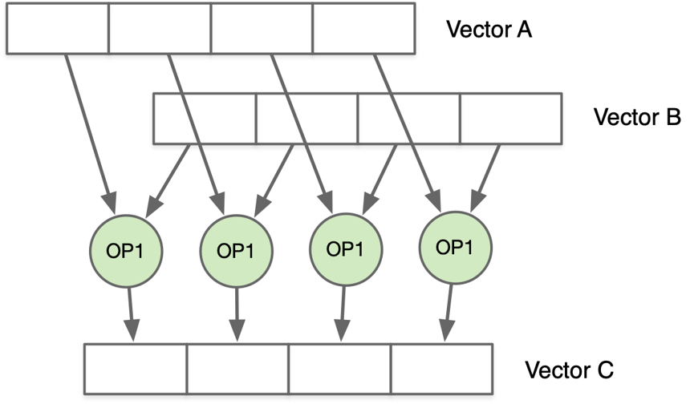
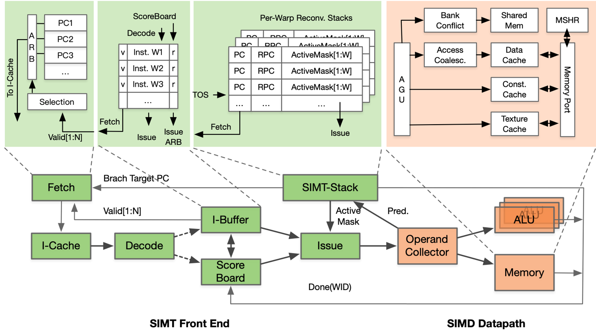
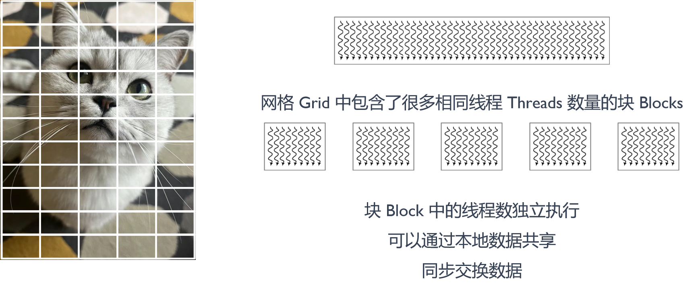

# SIMD、SIMT与AI芯片的关系

为了进一步探讨SIMD、SIMT与AI芯片之间的关系，本节将详细介绍SIMD（单指令多数据）和SIMT（单指令多线程）的计算本质，以及对NVIDIA CUDA底层实现SIMD/SIMT的原理进行讲解。

## SIMD计算本质

SIMD（Single Instruction Multiple Data，单指令多数据）是对多个进行同样操作的处理元素同时进行同等的计算操作，利用了数据级别的并行性，而不是并发性，有多个计算，但是只有一个进程在运行。SIMD允许使用单一命令对多个数据值进行操作，一般用于提升CPU计算能力实现数据并行的方法，此时仅需要更宽位数的计算单元（ALU）和较小的控制逻辑。

SIMD仍然是单线程，不是多线程操作，硬件上仅需要一个计算核心，只不过一次操作多个数据，需要与GPU的多线程并行有所区分，SIMD的计算本质是**在多个数据上并行进行相同操作的硬件部分**。例如将两个vector作为操作数，对于两个vector的操作数进行相同的乘法操作，下面以vector为4个元素为例，将向量A和向量B进行相乘计算得到结果C：

$$C[0: 3] = A[0: 3] × B[0: 3]$$



为了使SIMD实现一次乘法可以完成多个元素的计算，要求硬件上增加ALU单元的数量，因此会有多个Process Unit，同时也需要增加同一个功能单元的数据通路数量，由控制单元（Control Unit）将数据传送给Process Unit，从而实现相同时钟周期内硬件在整体上提升计算吞吐量。


但是在实际计算的过程中，SIMD会受到一定的约束：

- **缺点**：SIMD使用独立线程，该线程能同时进行多个数据元素的计算，但是由于ALU宽度的限制，其计算要求数据类型、格式、大小必须严格对齐。

- **优点**：在一定程度上可以提升计算性能，利用内存数据总线带宽，多个数据可以同时从内存读和写。如 C[0: 3] = A[0: 3] × B[0: 3] 操作在使用SIMD之后，代码量为原来的1/4，执行周期也相应降为原来的1/4。

SIMD本身是对指令的控制，以$C[0: 3] = A[0: 3] × B[0: 3]$ 计算为例，以下是计算机在没有使用SIMD时实际执行的指令，可以看出总共有4个ST，可以实现对四个元素进行逐元素相加或相乘。

```c
t1 = LD B, i
t2 = LD C, i
t3 = t1 + t2
ST A, i, t3

t1 = LD B, i+1
t2 = LD C, i+1
t3 = t1 + t2
ST A, i+1, t3

t1 = LD B, i+2
t2 = LD C, i+2
r3 = t1 + t2
ST A, i+2, t3

t1 = LD B, i+3
t2 = LD C, i+3
r3 = t1 + t2
ST A, i+3, t3
```

在使用SIMD之后，只需要一个ST，每个操作后面的4表示需要同时对四个元素进行操作，之后编译器会将上面的代码编译成硬件能够识别的SIMD指令，代码为原来的1/4，执行周期也相应地降为原来的1/4，执行效率得到显著提升。

```c
v1 = LD B, i, 4
v2 = LD C, i, 4
v3 = v1 + v2, 4
ST A, i, 4, v3
```

Intel从MMX开始支持SIMD，ARM通过NEON将SIMD扩展引入ARM-Cortex架构。NEON SIMD单元位宽是128-bit，包含16个128-bit寄存器，能够被用来当做32个64-bit寄存器。这些寄存器能被当做是同等数据类型的vector，此时数据是对齐的，数据的元素格式也都是相同的。因此可以使用一个进程对多个数据进行计算，一个寄存器位宽是128 bit，因此可以存放4个元素，每个元素是32 bit，向量B存放在s15寄存器中，向量C存放在s14寄存器中，然后将两个寄存器中的值做乘法，最后保存s15的计算结果，相关代码如下：

```c
//对四个数据同时进行乘法操作
A[3:0] = B[3:0]*C[3:0]

//一个寄存器128bit，可以存放4x32bit，s15寄存器存放向量B
vldmia.32 r0!, {s15}

//通过 s14 寄存器存放向量C
vldmia.32 r1!, {s14}

// s15=s15*s14
vmul.f32 s15, s15, s14

//保存s15的计算结果
vstmia.32 r2!, {s15}
```

> MMX（MultiMedia eXtensions）是Intel于1996年推出的一种SIMD指令集扩展，用于对多个数据元素同时执行相同的操作。这些指令包括数据移动指令、整数运算指令、逻辑运算指令等，可以同时处理多个数据元素，从而加速多媒体处理、图像处理等应用的计算速度。随着技术的发展，Intel后续推出了更多的SIMD指令集扩展，如SSE（Streaming SIMD Extensions）、AVX（Advanced Vector Extensions）等，进一步提高了处理器对SIMD计算的支持和性能。
> 
> ARM NEON技术在2004年推出的SIMD扩展技术，新的SIMD指令集，包括数据加载/存储指令、整数运算指令、浮点运算指令等，可以同时对多个数据元素执行相同的操作。这些指令能够充分利用处理器的并行计算能力，提高计算效率和性能，为多媒体处理、图像处理等应用提供了更高的计算性能和效率。

因此SIMD最重要且最本质的是改变了硬件计算单元的数量，还有数据读取通路的数量，从而对上层提供更多的指令集，在实际编程中，程序员很少会对SIMD里面的指令进行操作。

## SIMT计算本质

SIMT（Single Instruction Multiple Threads，单指令多线程）是NVIDIA提出基于GPU的新概念。与SIMD相比，二者都通过将同样的指令广播给多个执行单元来实现数据并行和计算。主要的不同在于SIMD要求所有的向量元素在统一的同步组里（一个线程内）同步执行，而SIMT允许多个线程在一个warp中独立执行。

SIMT类似CPU上的多线程，有多个计算核心系统，每一个核心中有独立的寄存器文件（Register File，RF）、计算单元（Arithmetic Logic Unit，ALU），但是没有独立指令缓存（Instruction Cache）、解码器、程序计数器（Program Counter register），命令从统一的指令缓存广播给多个SIMT核心。因此SIMT的所有核心各自独立，在不同的数据上执行相同的计算操作，即执行命令相同，多个线程各有各的处理单元，SIMD则是共用同一个ALU。

还是以之前的数组相乘$C[0: 3] = A[0: 3] × B[0: 3]$为例，两个等长数组Vector A与Vector B，需要每个元素逐一对应相乘后得到Vector C。SIMT给每个元素分配一个线程，一个线程只需要完成一个元素的乘法，所有线程并发（Concurrent）执行完成后，两个数组的相乘就完成了。


具体到SIMT的硬件结构，SIMT提供一个多核系统（SIMT Core Cluster），CPU负责将Kernel加载到SIMT Core Cluster中，每个核（SIMT Core）有独立的RF、ALU、Data Cache，但是只有一个指令计数寄存器（Program Counter）和一个指令译码寄存器，指令被同时广播给所有的SIMT核，从而执行具体的计算。GPU则是由多个SIMT Core Cluster组成，每个SIMT Core Cluster由多个Core构成，Core中有多个Thread Block。


GPU的SIMT可以看作是一个特殊的SIMD结构，SIMT硬件核心流水可以被分为SIMT前端（SIMT front-end）和SIMD后端（SIMD back-end）。流水线中存在三个调度循环：取指循环、指令发射循环和寄存器访问循环。

- 取指循环包含Fetch、I-Cache、Decode和I-Buffer四个阶段；

- 指令发射循环包含I-Buffer、Score Board、Issue和SIMT-Stack四个阶段；

- 寄存器访问循环包含Operand Collector、ALU 和 Memory三个阶段。


流水线中的三个调度循环共同组成SIMT硬件核心流水，其中取指是将具体的指令放在堆栈中，堆栈在运行时就会把所有的线程分发到具体的ALU中，在具体执行时采用SIMD的方式，SIMT主要完成具体线程的前端控制。



结合上述内容，SIMD和SIMT的主要区别和联系如下：

- SIMT与SIMD的基本原理是相同的，都是采用单指令多数据的思想。

- SIMT形式上是多线程，但是本质上在硬件端执行的还是单线程，使用多个核心来实现多线程并行。

- SIMT比SIMD更灵活，允许一条指令对数据分开寻址，可以实现每个线程独立寻址。

- SIMD必须连续取址，要求数据在类型、格式和大小方面是严格对齐的。

因此SIMT是SIMD的一种推广，在编程模式上更加灵活。

## NVIDIA CUDA实现

在图形图像处理中会将图像进行切分，网格（Grid）表示要执行的任务，大的网格会被分成多个小的网格，每个网格中包含了很多相同线程（Threads）数量的块（Blocks），此时线程分层执行，块中的线程独立执行，对像素数据进行处理和计算，可以共享数据，同步数据交换。



CUDA并行编程模型基于单程序多数据（Single Program Mutiple Data，SPMD）模式，关于SPMD与SIMT之间的联系和区别会在之后重点讲解。在CUDA编程中，grid是线程块（block）阵列集合，线程块映射到SM上进行计算处理。一个线程块可包含多个线程束，线程块的大小影响CUDA kernel程序的性能。在CUDA架构下，GPU执行时的最小单位是线程（thread），一个 block 中的线程可存取同一块共享的内存，而且可以快速进行同步。

与SIMD不同的是，SIMT允许程序员为独立、标量线程编写线程级的并行代码，还允许为协同线程编写数据并行代码。为了确保正确性，开发者可忽略SIMT行为，很少需要使一个warp块内的线程分支，而是通过维护相关代码，即可获得硬件并行带来的实现显著的性能提升。在一个线程块（Thread Block）中所有线程执行同一段代码，在英伟达GPU中这段代码称为kernel，每一个线程有一个自己的线程索引（threadIdx.x）用于计算内存地址和执行控制决策，每个线程在执行时被分配的唯一标识符，因此可以通过程序来准确控制每一个线程。


将多个线程块（Thread Block）组合在一起就会组成一个Grid线程组，因此线程块就可以看作是SM的基本调度单元，SM对应着具体的硬件单元，线程块则是编程所抽象出来的概念。因为有多个线程块进行组合，同时存在硬件计算单元在横向和纵向两个维度的排布，因此线程索引通常由块索引（Block Index）和线程内索引（Thread Index Within Block）组成。其中，Block Index用于标识当前线程所在的块（Block），而Thread Index Within Block用于标识当前线程在所在块中的位置。

使用blockIdx.x和blockDim.x来访问块索引和块维度（Block Dimension）中的x分量。blockIdx.x表示当前线程所在的块的x方向索引，在CUDA中，块索引是一个三维的向量，包括x、y和z三个分量。blockDim.x表示当前块的x方向维度大小，在CUDA中，块维度也是一个三维的向量，包括x、y和z三个分量。通过blockIdx.x和blockDim.x，可以方便地获取当前线程所在的块的x方向索引和当前块在x方向上的线程数量，从而进行相应的计算和操作。


回顾英伟达GPU软件和硬件之间的对应关系，线程对应于CUDA Core，线程以线程块为单位被分配到SM上，SM维护线程块和线程ID，SM管理和调度线程执行。每个线程块又按照每个Warp中共32个线程执行，Warp是SM的调度单位，Warp里的线程执行SIMD。Block线程块只在一个SM上通过Wrap进行调度，一旦在SM上调用了Block线程块，就会一直保留到执行完Kernel。SM可以同时保存多个Block线程块，块间并行的执行。


在AI框架的开发流程方面，首先会按照编程思想定义神经网络，然后根据AI框架编写对应的程序，AI框架会构建正向图，最后根据自动微分原理构建反向图。其中在神经网络中比较重要的算子是对矩阵乘的计算，以CUDA代码为例实现$C = A × B$计算，使用blockIdx.x和blockDim.x来访问块索引和块维度。

```c
#include <stdio.h>

#define N 4 // 矩阵大小

// 矩阵乘法的 CUDA 核函数
__global__ void matrixMultiplication(int *a, int *b, int *c) {
    // 使用blockIdx.x和blockDim.x来访问块索引和块维度
    int row = blockIdx.y * blockDim.y + threadIdx.y;
    int col = blockIdx.x * blockDim.x + threadIdx.x;

    int sum = 0;
    for (int k = 0; k < N; ++k) {
        sum += a[row * N + k] * b[k * N + col];
    }

    c[row * N + col] = sum;
}

int main() {
    int a[N][N], b[N][N], c[N][N];
    int *dev_a, *dev_b, *dev_c;

    // 分配内存
    cudaMalloc((void**)&dev_a, N * N * sizeof(int));
    cudaMalloc((void**)&dev_b, N * N * sizeof(int));
    cudaMalloc((void**)&dev_c, N * N * sizeof(int));

    // 初始化矩阵 a 和 b
    for (int i = 0; i < N; ++i) {
        for (int j = 0; j < N; ++j) {
            a[i][j] = i * N + j;
            b[i][j] = j * N + i;
        }
    }

    // 将矩阵 a 和 b 传输到设备
    cudaMemcpy(dev_a, a, N * N * sizeof(int), cudaMemcpyHostToDevice);
    cudaMemcpy(dev_b, b, N * N * sizeof(int), cudaMemcpyHostToDevice);

    // 定义块大小和网格大小
    dim3 blockSize(2, 2);
    dim3 gridSize(N / blockSize.x, N / blockSize.y);

    // 调用核函数
    matrixMultiplication<<<gridSize, blockSize>>>(dev_a, dev_b, dev_c);

    // 将结果传回主机
    cudaMemcpy(c, dev_c, N * N * sizeof(int), cudaMemcpyDeviceToHost);

    // 打印结果
    for (int i = 0; i < N; ++i) {
        for (int j = 0; j < N; ++j) {
            printf("%d ", c[i][j]);
        }
        printf("\n");
    }

    // 释放内存
    cudaFree(dev_a);
    cudaFree(dev_b);
    cudaFree(dev_c);

    return 0;
}
```

## 编程本质 vs 硬件执行本质

编程模型（Programming Model）是程序员用来编写程序的抽象概念，它定义了程序员如何组织和控制计算机程序的方式。编程模型提供了一种简化的视图，使程序员能够专注于程序的逻辑结构而不必考虑底层硬件细节。编程模型通常包括编程语言、数据结构、算法和并发机制等方面，用于描述程序的行为和交互。

硬件执行模型（Hardware Execution Model）描述了计算机硬件如何执行程序。它包括硬件结构、指令集架构、寄存器、内存层次结构、缓存、并行执行方式等方面。硬件执行模型决定了程序在计算机硬件上的实际执行方式，包括指令的执行顺序、数据的传输方式、并发执行的策略等，硬件执行SIMD和SIMT。二者的区别和联系如下：

- 区别：编程模型是从程序员的角度来描述程序的组织和行为，而硬件执行模型是从计算机硬件的角度来描述程序的执行方式。编程模型关注程序的逻辑结构和抽象行为，而硬件执行模型关注程序在实际硬件上的执行细节。

- 联系：编程模型和硬件执行模型之间存在联系，编程模型定义了程序的行为和交互方式，而硬件执行模型决定了程序如何在计算机硬件上执行。程序员编写的程序最终会被映射到硬件执行模型上执行。理解编程模型和硬件执行模型之间的关系可以帮助程序员优化程序性能，并充分利用硬件资源。

编程模型最终会通过编译器转换为硬件执行模型，因此二者在概念层面有明显的差异。

## 总结

本节主要对SIMD、SIMT进行了讲解，SIMD计算本质是一次加法运算操作完成多个元素的加法，因此在硬件层面需要增加ALU单元的数量，同时需要增加数据通路提升计算的吞吐量。SIMT硬件结构是一个多核系统，指令会被同时广播给所有的SIMT Core，每个SIMT Core中有多个线程块（Thread Block）实现并行，同时多个SIMT Core Cluster组成整个GPU Core。SIMT是SIMD的一种推广，在编程模式上更加灵活。

结合NVIDIA CUDA实现对SIMD和SIMT进行了对比，与SIMD不同的是SIMT允许程序员为独立、标量线程编写线程级的并行代码，还允许为协同线程编写数据并行代码。关于GPU编程本质和硬件执行本质，编程模型是程序员用来编写程序的抽象概念，编程模型最终会通过编译器转换为硬件执行模型，最终由硬件执行SIMD和SIMT。

## 本节视频

<html>
<iframe src="//player.bilibili.com/player.html?aid=744768610&bvid=BV1Kr4y1d7eW&cid=1236498445&p=1&as_wide=1&high_quality=1&danmaku=0&t=30&autoplay=0" width="100%" height="500" scrolling="no" border="0" frameborder="no" framespacing="0" allowfullscreen="true"> </iframe>
</html>