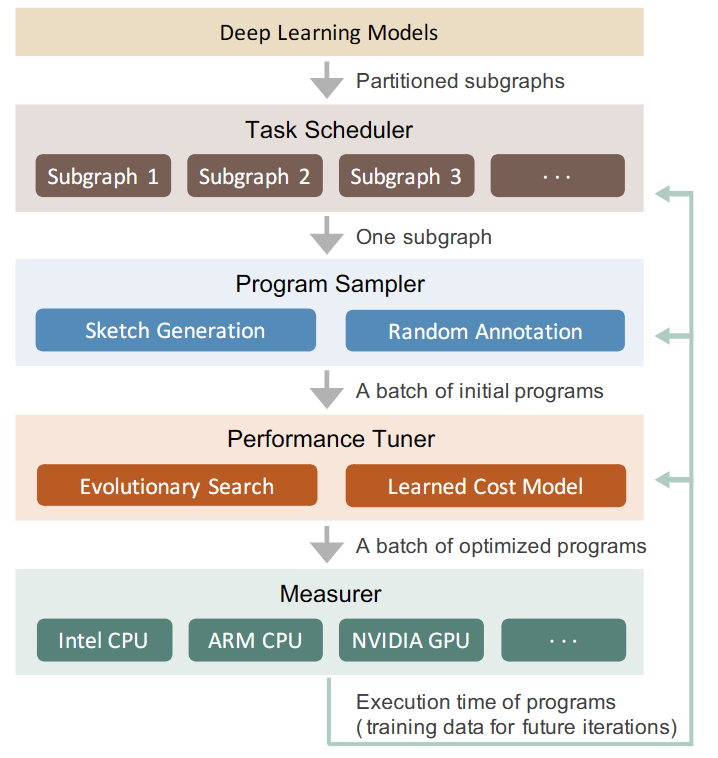

# Auto-Tuning 原理

在硬件平台驱动算子运行需要使用各种优化方式来提高性能，然而传统的手工编写算子库面临各种窘境，衍生出了自动生成高性能算子的的方式，称为自动调优。在本节我们首先分析传统算子库面临的挑战，之后介绍基于 TVM 的业界领先的三个自动调优系统。

## 高性能算子挑战

DNN 部署的硬件平台越来越多样化，包括 cpu、gpu、fpga 和 asic，这些硬件平台内部又具有不同的资源。为了在这些平台上部署 dnn，需要对 dnn 中使用的算子使用高性能的张量程序。传统方式为使用算子库，算子库包含了大量的预定义算子（Operators），这些算子是构建和执行深度学习模型的基本单元。例如对于 cuda 平台，使用 cudnn 库，预先由工程师编写兼容某种 gpu 硬件平台的大量算子，在运行时直接调用。然而这种传统方式面临着越来越多的挑战：

+ 优化手段的多样性：如前面的章节介绍，存在循环优化、存储优化、指令优化等多种优化方式，在编写程序时如何使用和编排这些优化是十分困难的事，不仅与硬件平台相关，也与要执行的程序相关，程序参数例如卷积核大小、特征图大小的变化也会影响优化方式的选择，再加上各种优化还涉及其优化因子如循环分块因子的选择。软硬件的组合使得编写一套高性能的算子库十分的耗费精力。

+ 优化方式的通用性：程序优化方式的选择受到多种因素影响，很难有一个通用的方式能覆盖所有场景，普遍的方式是为每一种硬件的每一套参数都维护一个算子实现。以卷积算子为例，这是深度学习中最常用的算子之一。在不同的硬件上，卷积算子的实现可能会有很大差异。在 CPU 上，卷积算子可能会使用高度优化的库，如 Intel 的 MKL 或 OpenBLAS，这些库针对特定的 CPU 架构进行了优化，可以利用 SIMD 指令集等硬件特性来加速计算。在 GPU 上，卷积算子的实现通常会利用 CUDA 或 OpenCL 等并行计算框架。GPU 的高并行性使得卷积操作可以通过并行化来大幅加速。此外，不同的 GPU 架构（如 NVIDIA 的 Volta、Turing 等）可能需要不同的优化策略。

+ 软硬件的快速更迭：随着新的处理器架构和专用 AI 加速器的不断涌现，硬件平台变得更加多样化。每种硬件都有其独特的特性和优化需求，算子库需要为这些不同的硬件提供定制化的算子实现，这大大增加了开发和维护的工作量。每当 NVIDIA 发布新的 CUDA 版本，引入新的 GPU 指令集时，算子库开发者必须更新 GPU 算子，以利用这些新特性来提升性能。再比如新的算子不断涌现，现在的卷积已经有几十种卷积，各种激活函数也在不断提出。每提出一个新算子，就需要在目标硬件平台实现一套算子库。

## 自动调优原理

为了以一种高效的方式在各种硬件平台上提供这些算子，已经引入了多种编译器技术，用户使用高层级声明性语言以类似于数学表达式的形式定义计算，编译器根据该定义生成优化的张量程序。从高层定义中自动生成高性能张量程序是非常困难的。根据目标平台的架构，编译器需要在一个非常大和复杂的空间中进行搜索，其中包含优化的组合选择（例如，分块、向量化、并行化，不同的组合导致的程序性能差异极大）。寻找高性能的程序需要搜索策略来覆盖一个全面的空间，并有效地探索它。

这一过程称为自动调优，指在编译过程中，编译器或相关工具自动调整和优化代码的执行参数，以提高程序在特定硬件上的运行效率。这通常涉及到对算法、内存访问模式、并行度等多个方面的优化。自动调优的目的是减少人工干预，使得程序能够自动适应不同的硬件环境和运行条件。在 AI 领域，这尤为重要，因为 AI 模型的计算复杂度通常很高，而且不同的硬件平台（如 CPU、GPU、FPGA 等）对计算和内存访问的优化需求各不相同。

自动调优的过程通常包括以下几个步骤：

1.  **性能分析**：通过分析程序的运行情况，识别性能瓶颈和优化机会。

2.  **参数搜索**：系统地探索不同的编译选项和运行参数，寻找最佳的配置。

3.  **性能评估**：对不同的配置进行测试，评估其对性能的影响。

4.  **反馈学习**：根据性能评估的结果，调整搜索策略，进一步优化参数选择。

自动调优可以显著提高 AI 应用的运行效率，尤其是在深度学习等计算密集型任务中。然而，由于 AI 应用的多样性和复杂性，自动调优仍然是一个活跃的研究领域，研究人员和工程师们正在不断探索更高效、更智能的调优方法。在自动调优中，TVM 是走在前列的 AI 编译器，其自动调优系统已经历经三代，本章将介绍 TVM 的这三代自动调优系统。

## AutoTVM 介绍

AutoTVM[^1]是 TVM 的第一代自动调优系统，其是基于模板的。

其总体流程如下图：


### 编写模板

AutoTVM 是基于模板的 tuner，对于每一个需要调优的算子，需要使用 TVM 的 DSL 编写调优的 knob，例如循环展开的因子、循环重排序的顺序等。例如对于矩阵乘法，可以编写这样的模板：

```python
@autotvm.template("tutorial/matmul")
def matmul(N, L, M, dtype):
    A = te.placeholder((N, L), name="A", dtype=dtype)
    B = te.placeholder((L, M), name="B", dtype=dtype)

    k = te.reduce_axis((0, L), name="k")
    C = te.compute((N, M), lambda i, j: te.sum(A[i, k] * B[k, j], axis=k), name="C")
    s = te.create_schedule(C.op)

    # schedule
    y, x = s[C].op.axis
    k = s[C].op.reduce_axis[0]

    ##### define space begin #####
    cfg = autotvm.get_config()
    cfg.define_split("tile_y", y, num_outputs=2)
    cfg.define_split("tile_x", x, num_outputs=2)
    ##### define space end #####

    # schedule according to config
    yo, yi = cfg["tile_y"].apply(s, C, y)
    xo, xi = cfg["tile_x"].apply(s, C, x)

    s[C].reorder(yo, xo, k, yi, xi)
    print('original')
    print(tvm.lower(s,[A, B, C],simple_mode=True))
    return s, [A, B, C]
```

生成的原始调度如下:

```python
for (i.outer: int32, 0, 512) {
    for (j.outer: int32, 0, 512) {
      C[((i.outer*512) + j.outer)] = 0f32
      for (k: int32, 0, 512) {
        let cse_var_2: int32 = (i.outer*512)
        let cse_var_1: int32 = (cse_var_2 + j.outer)
        C[cse_var_1] = (C[cse_var_1] + (A[(cse_var_2 + k)]*B[((k*512) + j.outer)]))
      }
    }
  }
```

将 i 轴和 j 轴定义为可 split 的调优轴，设置 num_outputs=2 表示单个轴会被拆分为两个轴，并且进行了循环重排序，最终循环轴会由之前的 i.outer、j.outer、k 变为 i.outer、j.outer、k、i.inner、j.inner。

例如将 i 从 512 拆分为 8 和 64，将 j 从 512 拆分为 128 和 4，生成的调度如下：

```python
for (i.outer: int32, 0, 8) {
    for (j.outer: int32, 0, 128) {
      for (i.inner.init: int32, 0, 64) {
        for (j.inner.init: int32, 0, 4) {
          C[((((i.outer*32768) + (i.inner.init*512)) + (j.outer*4)) + j.inner.init)] = 0f32
        }
      }
      for (k: int32, 0, 512) {
        for (i.inner: int32, 0, 64) {
          for (j.inner: int32, 0, 4) {
            let cse_var_3: int32 = (j.outer*4)
            let cse_var_2: int32 = ((i.outer*32768) + (i.inner*512))
            let cse_var_1: int32 = ((cse_var_2 + cse_var_3) + j.inner)
            C[cse_var_1] = (C[cse_var_1] + (A[(cse_var_2 + k)]*B[(((k*512) + cse_var_3) + j.inner)]))
          }
        }
      }
    }
  }
```

该函数有多种拆分因子的选择方式，例如直接指定 candidate，给定一系列拆分方式；给定拆分时的偏好策略，是直接用乘法因子或是只要 2 的幂次方的乘法因子.

### 指定任务

指定待调优的算子，如 resnet18 中所有的 conv2d，TVM 会根据事先编写的 conv2d 模板生成调度搜索空间。

### 指定调优参数

AutoTVM 有多个 tuner，根据 index 的 random tuner 和 grid tuner、基于遗传算法的 ga tuner、基于 Xgb 的 XGBTuner。tuner 影响的是对调度搜索空间的探索，搜索空间是巨大的难以穷举的，通过 tuner 来高效搜索相对更优的调度候选项。

### 性能评估

对于 XGBTuner 这个具有 cost module 的 tuner，调度候选项在硬件上测量之前会使用模型预测相对性能，选出相对优的一批再去运行，这样减少真实测量的次数，减少调优时间。

### 关键组件

以上框架的关键组件有：

-   代码生成器：不同的调度配置会导致不同的循环结构、内存存取顺序等，生成的代码大不相同，这里使用了 TVM 的代码生成。
-   代价模型：调度搜索空间是巨大的，穷举一遍是不可能的。代价模型的作用是不断修正调度配置，选出相对最佳的配置，减少调优时间，或者说在固定的调优时间达到更好的性能。
-   硬件测量环境：AutoTVM 有 RPC tracker，可以启动多个硬件平台进行调优。

## Ansor 介绍

AutoTVM 需要事先编写模板来组成调度的搜索空间，最佳性能的上限取决于模板的设计，这对模板的编写带来了很高的要求。作为第二代调优系统，Ansor[^2]（Auto Scheduler）取消了模板机制，优化过程可以自动、无干预的进行：无需手动指定优化方式，编译器自动应用调度原语。

Ansor 自动生成一个覆盖全面的优化的大搜索空间，并为空间中的每个张量程序提供被选择的机会。首先，它自动构建一个大的搜索空间，以覆盖给定计算定义的尽可能多的张量程序。其次，在大搜索空间中高效搜索，该搜索空间可能比现有模板可以覆盖的范围大几个数量级。最后，在优化具有许多子图的整个 DNN 时，识别对端到端性能至关重要的子图并对其进行优先级排序，因为资源是有限的，应该将调优时间和算力资源分配给对性能有更大影响的子图。



Ansor 有三个关键设计，分别是程序采样器、性能微调器、任务调度器。

### 程序采样器

为了在无模板的前提下自动生成搜索空间，递归地应用一组推导规则来扩展搜索空间；为了避免在搜索空间中陷入局部最优，使用随机抽取完整的程序给每个采样点相同概率。将搜索空间定为两级，高层结构称为草图（sketch），低级结构（分块大小、并行等）称为注解（annotation）。

递归地应用一组派生规则来生成草图，例如在 CPU 上使用这样一组规则来进行草图生成：

+   IsStrictInlinable(S,i)：表示 S 中的节点是否是个简单的逐元素算子如 relu，则可以内联

+   HasDataReuse：表示节点 i 是否是计算密集型，并且有丰富的算子内部数据重用机会如 matmul、conv2d

+   HasFusibleConsumer：表示 S 中的节点 i 是否只有一个节点 j，节点 j 可以融合到节点 i（如 matmul+bias_add，conv2d+relu

+   HasMoreReducetionParallel：表示节点在空间维几乎没有并行性，但是在 reduce 维有足够的并行性。（如计算一个矩阵 l2 范数，matmul 2x512 . 512x2）

对计算的定义进行静态分析，获得这些条件谓词的值。这个过程是解析计算的数学表达式的读写模式自动完成的。与 AutoTVM 中手写模板不同，手写模板同时指定了高层规则和低层规则，而草图只有高层结构。

草图只有分块结构，没有分块大小和循环标注如并行、展开和向量化，这部分由标注完成。给定一个草图列表，随机在草图上填充分块大小、对循环进行随机标注。

### 性能微调器

使用进化搜索和学习成本模型来微调采样程序的性能。

-   进化搜索
    在高质量程序的基础上进行突变。突变类型包括分块大小、并行、计算位置等。

-   成本模型
    基于梯度增强决策树作为底层模型

### 任务调度器

一个 DNN 可以被划分为许多独立的子图，对于某些子图，花费时间对他们进行调优并不能显著提升整个 DNN 的端到端的性能。为了提高调优效率，Ansor 动态的将不同的时间资源进行分配。

以优化单个 DNN 的端到端延迟为例，Ansor 对具有较高初始延迟的子图进行优先排序，因为乐观猜测可以快速减少其延迟。之后，如果 Ansor 花费了多次迭代而没有观察到其延迟的减少，那么 Ansor 就会离开子图。

Ansor 也存在诸多限制，例如不能对动态形状的图进行优化，也无法使用硬件平台特定指令支持，如 Intel VNNI、Nvidia Tensor Core。

## Meta Scheduler 介绍

Meta Schedule[^3]是第三代调优系统，在它之前，TVM 存在三套生成调度的 API：

+   手动调度：开发人员利用调度原语手动优化程序，程序性能高度依赖开发者的经验。

+   AutoTVM：开发者需要为每个算子设计一个调度生成的模板，从而使得调优器可以探索这个生成的调度空间。

+   Ansor：根据一组预定义的规则，自动生成调度模板作为设计空间。但是扩展 Ansor 到新的调度原语如张量化、流水线化等绝非易事。

上面三个系统都有独立的 API，且互不兼容。AutoTVM 要求用户学习一组新的 API，AutoScheduler 引入了另一组基于 C++ 的搜索规则。它增加了用户的心理负担和扩展现有系统的开销。

MetaSchedule 提供以下特性：

+   用于实现手动调优、AutoTVM 风格和 AutoScheduler 风格的统一 API。

+   所有调度原语的可扩展性，包括张量化和循环分块。 在自动调优中使用新的原语几乎不需要额外的努力。

+   自动化基础设施在其每个组件上都是可扩展的。每个组件的系统可以在纯 python 或 C++或两者中轻松自定义。例如，可以开发一个新的在 python 中的调度空间生成器或者新的 ProgramRunner 等。

Meta Scheduler 遵循下图的调优流程：


### 设计空间生成

底层系统记录了用户使用的所有调度原语，以及在采样指令上做出的随机决策，称为 Trace。Trace 可能包含零条或多条采样指令，这些指令引入调度中的不确定性，形成了一个可供探索的设计空间，例如哪一组分块大小在特定硬件上效果最佳。

### 探索设计空间

Meta Schedule 提供了多种内置的探索策略，可以详尽或高效地进行搜索 ，来实现高效的调度。其搜索策略与之前调优器的搜索策略类似，可以随机搜索，也可以使用成本模型进行指导。

### 数据库

所有度量记录都经过序列化并存储在数据库中。数据库记录的内容包括工作负载，序列化的 TensorIR;执行测量的硬件目标;参数类型：输入张量的形状和 dtype；运行时间等。

在 Meta scheduler 中，成本模型、数据库、特征提取器、程序运行器等都是可定制、易于扩展的。

## 小结

本节介绍了 TVM 中三代自动调优器的发展，从无模板、有模板、API 统一，明显的发展趋势是编译器越来越降低自动调优中人工参与的比重，增大这一过程的自动化。自动调优领域仍是个不断发展的领域，新硬件、新指令集、稀疏模型等仍需支持。

## 参考文献

[^1]:Chen T, Zheng L, Yan E, et al. Learning to optimize tensor programs[J]. Advances in Neural Information Processing Systems, 2018, 31.
[^2]:Zheng L, Jia C, Sun M, et al. Ansor: Generating {High-Performance} tensor programs for deep learning[C]//14th USENIX symposium on operating systems design and implementation (OSDI 20). 2020: 863-879.
[^3]:https://github.com/apache/tvm-rfcs/blob/main/rfcs/0005-meta-schedule-autotensorir.md

## 本节视频

<html>
<iframe src="https://player.bilibili.com/player.html?bvid=BV1uA411D7JF&as_wide=1&high_quality=1&danmaku=0&t=30&autoplay=0" width="100%" height="500" scrolling="no" border="0" frameborder="no" framespacing="0" allowfullscreen="true"> </iframe>
</html>
