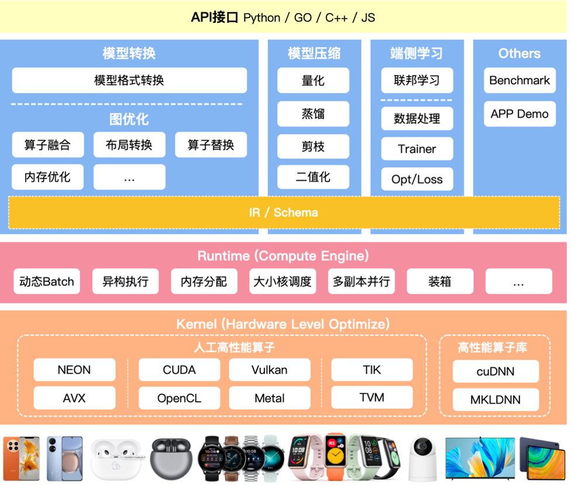

<!--Copyright © 适用于[License](https://github.com/chenzomi12/AISystem)版权许可-->

# 基本介绍

模型转换的主要任务是实现模型在不同框架之间的流转。随着深度学习技术的发展，训练框架和推理框架的功能逐渐分化。训练框架通常侧重于易用性和研究人员的算法设计，提供了分布式训练、自动求导、混合精度等功能，旨在让研究人员能够更快地生成高性能模型。

而推理框架则更专注于针对特定硬件平台的极致优化和加速，以实现模型在生产环境中的快速执行。由于训练框架和推理框架的职能和侧重点不同，且各个框架内部的模型表示方式各异，因此没有一个框架能够完全涵盖所有方面。模型转换成为了必不可少的环节，用于连接训练框架和推理框架，实现模型的顺利转换和部署。

## 推理引擎

推理引擎是推理系统中用来完成推理功能的模块。推理引擎分为 2 个主要的阶段：

- **优化阶段：** 模型转换工具，由模型转换和图优化构成；模型压缩工具、端侧学习和其他组件组成。

- **运行阶段：** 实际的推理引擎，负责 AI 模型的加载与执行，可分为调度与执行两层。



模型转换工具模块有两个部分：

1. **模型格式转换：** 把不同框架的格式转换到自己推理引擎的一个 IR（Intermediate Representation，中间表示）或者格式。

2. **计算图优化：** 计算图是深度学习编译框架的第一层中间表示。图优化是通过图的等价变换化简计算图，从而降低计算复杂度或内存开销。

### 转换模块挑战与目标

1. AI 框架算子的统一

神经网络模型本身包含众多算子，它们的重合度高但不完全相同。推理引擎需要用有限的算子去实现不同框架的算子。  

| 框架         | 导出方式         | 导出成功率 | 算子数（不完全统计） | 冗余度 |
|:----------:|:------------:|:-----:|:----------:|:---:|
| Caffe      | Caffe        | 高     | 52         | 低   |
| Tensorflow | I.X          | 高     | 1566       | 高   |
|            | Tflite       | 中     | 141        | 低   |
|            | Self         | 中     | 1200+      | 高   |
| Pytorch    | Onnx         | 中     | 165        | 低   |
|            | TorchScripts | 高     | 566        | 高   |

不同 AI 框架的算子冲突度非常高，其算子的定义也不太一样，例如 AI 框架 PyTorch 的 Padding 和 TensorFlow 的 Padding，它们 pad 的方式和方向不同。Pytorch 的 Conv 类可以任意指定 padding 步长，而 TensorFlow 的 Conv 类不可以指定 padding 步长，如果有此需求，需要用 tf.pad 类来指定。

一个推理引擎对接多个不同的 AI 框架，因此不可能把每一个 AI 框架的算子都实现一遍，需要推理引擎用有限的算子去对接或者实现不同的 AI 框架训练出来的网络模型。

目前比较好的解决方案是让推理引擎定义属于自己的算子定义和格式，来对接不同 AI 框架的算子层。

2. 支持不同框架的模型文件格式

主流的 PyTorch、MindSpore、PaddlePaddle、Tensorflow、Keras 等框架导出的模型文件格式不同，不同的 AI 框架训练出来的网络模型、算子之间是有差异的。同一框架的不同版本间也存在算子的增改。

这些模型文件格式通常包含了网络结构、权重参数、优化器状态等信息，以便于后续的模型部署和推理。以下是一些主流框架的模型文件格式示例：

| **AI 框架**     | **模型文件格式**                       |
|:------------:|:--------------------------------:|
| PyTorch      | .pt, .pth                        |
| MindSpore    | .ckpt, .mindir, .air, .onnx      |
| PaddlePaddle | .pdparams, .pdopt, .pdmodel      |
| TensorFlow   | .pb(Protocol Buffers), .h5(HDF5) |
| Keras        | .h5, .keras                      |


要解决这些问题，需要一个推理引擎，能够支持自定义计算图 IR，以便对接不同 AI 框架及其不同版本，将不同框架训练出的模型文件转换成统一的中间表示，然后再进行推理过程，从而实现模型文件格式的统一和跨框架的推理。

3. 支持主流网络结构

如 CNN、RNN、Transformer 等不同网络结构有各自擅长的领域，CNN 常用于图像处理（如图像分类、目标检测、语义分割等）、RNN 适合处理序列数据（如时间序列分析、语音识别等）、Transformer 则适用于自然语言处理领域（如机器翻译、文本生成等）。

推理引擎需要有丰富 Demo 和 Benchmark，展示如何使用推理引擎加载和执行不同的网络结构，并通过 Benchmark 来评估推理引擎在处理不同网络结构时的性能，提供主流模型性能和功能基准，来保证推理引擎的可用性。

以 Nvidia 的 TensorRT 为例，[TensorRT Demos](https://github.com/jkjung-avt/tensorrt_demos)提供了一些示例，展示了如何使用 TensorRT 优化 Caffe、TensorFlow、DarkNet 和 PyTorch 模型。[MLPerf Benchmarks](https://www.nvidia.com/en-us/data-center/resources/mlperf-benchmarks/)提供了一套全面的基准测试，能够评估不同硬件、软件和服务在机器学习任务上的性能。MLPerf 测试套件包括多种工作负载和场景，如图像分类、自然语言处理、推荐系统、目标检测、医学图像分割等，覆盖了从云端到边缘计算的多样化需求。

4. 支持各类输入输出

在神经网络当中有多输入多输出，任意维度的输入输出，动态输入（即输入数据的形状可能在运行时改变），带控制流的模型（即模型中包含条件语句、循环语句等）。

为了解决这些问题，推理引擎需要具备一些特性，比如可扩展性（即能够灵活地适应不同的输入输出形式）和 AI 特性（例如动态形状，即能够处理动态变化的输入形状）。

以 ONNX 为例，要实现 ONNX 模型的动态输入尺寸，首先需要加载原始 ONNX 模型，可以通过 ONNX 提供的 Python API 实现，例如使用`onnxruntime.InferenceSession`加载模型。

然后创建输入张量，并将其尺寸设置为想要的动态尺寸。这里的关键是要了解哪些维度是可以动态变化的，哪些维度是固定的。例如，对于图像分类任务，输入图像的高度和宽度可能是可变的，而通道数通常是固定的。可以使用 Python 的 numpy 库创建一个具有动态尺寸的输入张量。

将创建的输入张量传递给 ONNX 运行时库，并调用 `InferenceSession`的`run`方法进行模型推理。这个方法会接受输入张量，并返回模型的输出张量。这一步会执行模型的前向传播，产生输出结果。

最后使用 ONNX 运行时库获取输出张量并处理结果。输出张量可能包含模型的预测结果或其他相关信息，可以根据具体任务的需要对其进行处理和分析。

以下是一个完整的示例，首先定义一个简单的神经网络模型，并将其导出为动态输入的 ONNX 格式：

```python
import torch
import torch.nn as nn
 
class Model_Net(nn.Module):
    def __init__(self):
        super(Model_Net, self).__init__()
        self.layer1 = nn.Sequential(
 
            nn.Conv2d(in_channels=3, out_channels=64, kernel_size=3, stride=1, padding=1),
            nn.BatchNorm2d(64),
            nn.ReLU(inplace=True),
 
            nn.Conv2d(in_channels=64, out_channels=256, kernel_size=3, stride=1, padding=1),
            nn.BatchNorm2d(256),
            nn.ReLU(inplace=True),
        )
        
    def forward(self, data):
        data = self.layer1(data)
        return data
 
if __name__ == "__main__":
 
    # 设置输入参数
    Batch_size = 8
    Channel = 3
    Height = 256
    Width = 256
    input_data = torch.rand((Batch_size, Channel, Height, Width))
 
    # 实例化模型
    model = Model_Net()

    # 导出为动态输入
    input_name = 'input'
    output_name = 'output'
    torch.onnx.export(model, 
                      input_data, 
                      "Dynamics_InputNet.onnx",
                      opset_version=11,
                      input_names=[input_name],
                      output_names=[output_name],
                      dynamic_axes={
                          input_name: {0: 'batch_size', 2: 'input_height', 3: 'input_width'},
                          output_name: {0: 'batch_size', 2: 'output_height', 3: 'output_width'}})
```

接下来测试刚刚保存的 ONNX 模型：

```python
import numpy as np
import onnx
import onnxruntime

# 生成两个随机输入数据
input_data1 = np.random.rand(4, 3, 256, 256).astype(np.float32)
input_data2 = np.random.rand(8, 3, 512, 512).astype(np.float32)

# 导入 ONNX 模型
Onnx_file = "./Dynamics_InputNet.onnx"  # 模型文件路径
Model = onnx.load(Onnx_file)  # 加载 ONNX 模型
onnx.checker.check_model(Model)  # 验证 ONNX 模型是否准确

# 使用 onnxruntime 进行推理
# 创建推理会话
model = onnxruntime.InferenceSession(Onnx_file, providers=['TensorrtExecutionProvider', 'CUDAExecutionProvider', 'CPUExecutionProvider'])
input_name = model.get_inputs()[0].name  # 获取模型输入的名称
output_name = model.get_outputs()[0].name  # 获取模型输出的名称

# 对两组输入数据进行推理
output1 = model.run([output_name], {input_name: input_data1})  # 对第一组输入数据进行推理
output2 = model.run([output_name], {input_name: input_data2})  # 对第二组输入数据进行推理

# 打印输出结果的形状
print('output1.shape: ', np.squeeze(np.array(output1), 0).shape)  # 打印第一组输入数据的输出结果形状
print('output2.shape: ', np.squeeze(np.array(output2), 0).shape)  # 打印第二组输入数据的输出结果形状
```

得到以下结果：

```
output1.shape:  (4, 256, 256, 256)
output2.shape:  (8, 256, 512, 512)
```

由输出结果可知，动态输入模型可以接受不同形状的输入数据，其输出的形状也会随之变化。

### 优化模块挑战与目标

1. 结构冗余

深度学习网络模型中存在的一些无效计算节点（在训练过程中，可能会产生一些在推理时不必要的计算节点）、重复的计算子图（模型的不同部分执行了相同的计算）或相同的结构模块，它们在保留相同计算图语义的情况下可以被无损地移除。

通过计算图优化，采取算子融合（将多个算子合并成一个，例如，将卷积操作和批量归一化操作融合成一个操作，这样可以减少内存带宽消耗并提升计算效率）、算子替换（用更高效的算子替换低效的，例如，使用更高效的矩阵乘法库（如 cuBLAS）替换标准的矩阵乘法算子）、常量折叠（在推理过程中，如果某些算子的输入是常量，可以提前计算这些常量表达式，将结果直接作为输入，减少推理时的计算量）等方法来减少结构冗余。

2. 精度冗余

精度冗余是指在深度学习模型中，使用的数值精度（如 FP32 浮点数）可能超出实际需求，导致不必要的计算资源浪费。例如，在某些推理任务中，FP32 精度可能远高于实际需要的精度水平。通过降低数值精度（如使用 FP16 或 INT8），可以显著减少存储和计算成本，而对模型性能的影响微乎其微。
   
可以通过模型压缩技术来减少模型大小和计算复杂度，同时尽量保持模型的性能：

- 低比特量化：即将参数和激活量化为更低位。推理引擎数据单元是张量，一般为 FP32 浮点数，FP32 表示的特征范围在某些场景存在冗余，可压缩到 FP16/INT8 甚至更低；数据中可能存大量 0 或者重复数据。FP32 到 FP16 量化即使用 16 位表示一个浮点数，相比 FP32 减少了一半的存储需求，并且 FP16 计算通常比 FP32 更快。在许多实际应用中，FP16 足够满足模型的精度要求，特别是在图像和语音处理任务中。FP32 到 INT8 量化即将参数和激活值缩小到 8 位表示。尽管 INT8 的表示范围较小，但通过适当的量化和反量化技术，可以保持模型的性能。INT8 量化通常需要先进行模型的量化感知训练（Quantization-Aware Training, QAT），以在训练过程中考虑量化误差。
- 剪枝：通过移除模型中不重要的参数或神经元来减少模型复杂度，可以分为结构化剪枝和非结构化剪枝。非结构化剪枝即移除**单个参数（权重）**，这些权重对模型输出的影响很小。这种方法可以显著减少模型的参数量，但可能导致稀疏矩阵操作，计算效率不一定提高。结构化剪枝会移除**整个神经元、通道或卷积核**，这种方法通常更适合硬件加速。剪枝后，模型的结构变得更加紧凑，易于实现计算加速。
- 蒸馏：通过训练较小的学生模型来模仿较大教师模型行为。学生模型的目标是尽可能复制教师模型的输出，从而在保留教师模型性能的同时显著减小模型大小。具体来说，首先训练一个性能优异但复杂度高的大模型（教师模型），然后使用教师模型的输出作为目标，训练一个较小的模型（学生模型）。学生模型通过模仿教师模型的软标签（Soft Labels）来学习复杂模型的行为。

3. 算法冗余

算法冗余指的是在深度学习模型的实现中，算子或者 Kernel 层面的实现算法本身存在计算冗余，比如均值模糊的滑窗与拉普拉斯的滑窗实现方式相同。这种冗余会导致额外的计算开销和资源浪费，影响模型的性能和效率。

推理引擎需要统一算子和计算图表达，针对发现的计算冗余进行统一。下面介绍一些常用的消除算法冗余的方法：

- 优化算子实现：统一算子库，使用经过高度优化的统一算子库，如英伟达的 cuDNN、Intel 的 MKL-DNN。这些库提供了针对不同硬件平台优化的算子实现，能够显著提高计算效率。对于特定的任务或模型，可以编写定制的算子，以最大化利用硬件特性。例如，针对特定卷积操作设计专门的 GPU 内核。
- 算子融合：将多个连续的算子合并为一个算子，从而减少中间结果的存储和读取，提高内存访问效率。例如，将卷积操作和激活函数（如 ReLU）合并在一起执行。
- 重复计算消除：在计算图中，如果某些子图在不同部分被重复使用，可以重用这些子图的计算结果。例如，在 ResNet 模型中，不同层次可能会多次使用相同的残差块（Residual Block）。也可以将中间计算结果缓存起来，避免重复计算。例如，在动态神经网络中，可以缓存前向传播的中间结果以加速后向传播。

4. 读写冗余

读写冗余指的是在计算过程中，存在不必要的内存读写操作，或者内存访问模式低效，导致内存带宽浪费和性能下降。例如重复读写内存（同一数据在计算过程中被多次读写）、内存访问不连续（数据在内存中的布局不连续，导致缓存命中率低，增加了内存访问延迟）、内存对齐不当（数据在内存中的对齐方式不合适，不能充分利用硬件的高效读写特性）。

通过数据排布优化和内存分配优化等方法来减少读写冗余，提高内存访问的效率：

- 数据排布优化：重排数据在内存中的布局，使得数据访问更具局部性，从而提高缓存命中率。例如，将张量从 CHW（通道-高度-宽度）格式转换为 HWC（高度-宽度-通道）格式以适应特定的硬件访问模式。
- 内存分配优化：可以使用内存池管理内存分配和释放，减少内存碎片化，提高内存分配效率。例如，在 TensorFlow 中，内存池机制可以有效管理内存，减少内存分配开销。

## 转换模块架构

### 转换模块架构

Converter 转换模块由前端转换部分 Frontends 和图优化部分 Graph Optimize 构成。前者 Frontends 负责支持不同的 AI 训练框架；后者 Graph Optimize 通过算子融合、算子替代、布局调整等方式优化计算图。


1. 格式转换

格式转换即图中 IR 上面的部分。是指将不同 AI 框架的模型转换成统一的中间表示，后续的优化都基于这种统一的 IR 进行。不同的 AI 框架有不同的 API，不能通过一个 Converter 就把所有的 AI 框架都转换过来。

针对 MindSpore，有 MindSpore Converter；针对 PyTorch，有 ONNX Converter。通过不同的 Converter，把不同的 AI 框架统一转换成自己的推理引擎的 IR（Intermediate Representation，中间表示），后面的图优化都是基于这个 IR 进行修改。

2. 图优化

图优化主要研究如何通过优化计算图的结构和执行方式来提高模型的效率和性能。其中最核心的有算子融合、算子替换、布局调整、内存分配等。

  - 算子融合：深度学习模型中，通常会有多个算子（操作）连续地作用于张量数据。算子融合就是将这些连续的算子合并成一个更大的算子，以减少计算和内存访问的开销。例如，将卷积操作和激活函数操作合并成一个单独的操作，这样可以避免中间结果的存储和传输，提高计算效率。

  - 算子替换：算子替换是指用一个算子替换模型中的另一个算子，使得在保持计算结果不变的前提下，模型在在线部署时更加友好，更容易实现高效执行。例如，将标准卷积替换为深度可分离卷积（Depthwise Separable Convolution），以减少计算量和参数数量。

  - 布局调整：优化张量布局是指重新组织模型中张量的存储方式，以更高效地执行依赖于数据格式的运算。不同的硬件或软件框架可能对数据的布局有不同的偏好，因此通过调整张量的布局，可以提高模型在特定环境下的性能。例如，将张量从 NHWC（批量-高度-宽度-通道）格式转换为 NCHW（批量-通道-高度-宽度）格式，以适应不同硬件的优化需求。许多 GPU 在处理 NCHW 格式的数据时效率更高。

  - 内存分配：在深度学习模型的计算过程中，会涉及大量的内存操作，包括内存分配和释放。优化内存分配可以通过分析计算图来检查每个运算的峰值内存使用量，并在必要时插入 CPU-GPU 内存复制操作，以将 GPU 内存中的数据交换到 CPU，从而减少峰值内存使用量，避免内存溢出或性能下降的问题。

### 离线模块流程

通过不同的转换器，把不同 AI 框架训练出来的网络模型转换成推理引擎的 IR，再进行后续的优化。优化模块分成三段。

1. Pre Optimize：主要进行语法检查和初步的优化，确保计算图在语法和结构上的简洁性和正确性。以下是几种常用的方法：

  - 公共表达式消除（Common Subexpression Elimination, CSE）：是指在计算图中，识别并消除重复出现的子表达式。通过合并这些重复的子表达式，可以减少冗余计算，提高计算效率。
  - 死代码消除（Dead Code Elimination, DCE）：移除那些对最终输出没有影响的代码或操作。这些代码在计算过程中不产生任何有用的结果，因此可以安全地移除，以减少计算和内存开销。
  - 代数简化（Algebraic Simplification）：利用代数法则（如交换律、结合律等）来简化和优化计算图中的算术操作。通过重排或简化算术表达式，可以提高计算效率，可以通过子图替换的方式完成。

2. Optimize：主要针对计算图中的算子进行优化，以提高执行效率和性能。

  - 算子融合（Operator Fusion）：将多个连续的算子合并为一个算子，从而减少计算和内存访问开销。例如，将卷积操作和激活函数合并，可以避免中间结果的存储和传输:

  ```python
  z = ReLU(Conv(x, w))  // 合并为一个算子
  ```

  - 算子替换（Operator Replacement）：算子替换，即将模型中某些算子替换计算逻辑一致但对于在线部署更友好的算子。例如，将标准卷积替换为深度可分离卷积，以减少计算量：

  ```python
  z = DepthwiseConv(x, w_depth) + PointwiseConv(x, w_point)
  ```
  - 常量折叠（Constant Folding）:在编译阶段，预先计算出所有可以静态确定的常量表达式，并将其结果直接嵌入计算图中,减少了推理时的计算量。

3. Pos Optimize：主要针对内存和数据访问模式进行优化，以减少读写冗余和提高数据访问效率。

  - 数据格式转换：根据计算需求和硬件特点，调整张量的数据布局。例如，将图像数据从 NHWC（批量-高度-宽度-通道）格式转换为 NCHW（批量-通道-高度-宽度）格式，以利用 GPU 的高效计算能力。
  - 内存布局计算：优化数据在内存中的布局，以提高数据访问的局部性和缓存命中率。这可以通过重新组织内存中的数据结构来实现。例如，在矩阵乘法中，使用块状存储（blocking），将大矩阵分成小块存储和计算，以提高缓存利用率。
  - 重复算子合并：识别计算图中重复的算子，并将其合并为一个算子，以减少冗余计算和内存访问。例如计算图中有多个相同的卷积操作，可以合并为一个共享的卷积操作。


## 总结

本节主要介绍了推理引擎优化阶段的模型转换工具，它由转换模块和图优化模块组成。我们还介绍了转换模块和优化模块的挑战和目标，并简要介绍了其架构和工作流程。具体的流程细节和优化策略将在后续文章中介绍。

## 本节视频

<html>
<iframe src="https://www.bilibili.com/video/BV1724y1z7ep/?spm_id_from=333.880.my_history.page.click&vd_source=57ec244afa109ba4ee6346389a5f32f7" width="100%" height="500" scrolling="no" border="0" frameborder="no" framespacing="0" allowfullscreen="true"> </iframe>
</html>

## 参考文章

1. [AI 框架部署方案之模型转换](https://zhuanlan.zhihu.com/p/396781295)
2. [AI 技术方案（个人总结）](https://zhuanlan.zhihu.com/p/658734035)
3. [人工智能系统 System for AI   课程介绍 Lecture Introduction](https://microsoft.github.io/AI-System/SystemforAI-9-Compilation%20and%20Optimization.pdf)
4. [【AI】推理引擎的模型转换模块](https://blog.csdn.net/weixin_45651194/article/details/132921090)
5. [Pytorch 和 TensorFlow 在 padding 实现上的区别](https://zhuanlan.zhihu.com/p/535729752)
6. [训练模型到推理模型的转换及优化](https://openmlsys.github.io/chapter_model_deployment/model_converter_and_optimizer.html)
7. [使用 Grappler 优化 TensorFlow 计算图](https://www.tensorflow.org/guide/graph_optimization?hl=zh-cn)
8. [死代码消除](https://decaf-lang.gitbook.io/decaf-book/rust-kuang-jia-fen-jie-duan-zhi-dao/pa4-zhong-jian-dai-ma-you-hua/si-dai-ma-xiao-chu)
9. [AI 编译器之前端优化-下（笔记）](https://zhuanlan.zhihu.com/p/599949051)
10. [PyTorch 官方教程中文版](https://pytorch123.com/ThirdSection/SaveModel/)
11. [MindSpore 教程](https://www.mindspore.cn/tutorial/zh-CN/r1.2/save_load_model.html)
12. [TensorFlow Core](https://www.tensorflow.org/tutorials/keras/save_and_load?hl=zh-cn)
13. [保存和加载 Keras 模型](https://www.tensorflow.org/guide/keras/save_and_serialize?hl=zh-cn)
14. [探索 ONNX 模型：动态输入尺寸的实践与解决方案](https://cloud.baidu.com/article/3251524)
15. [Pytorch 复习笔记--导出 Onnx 模型为动态输入和静态输入](https://blog.csdn.net/weixin_43863869/article/details/128638397)