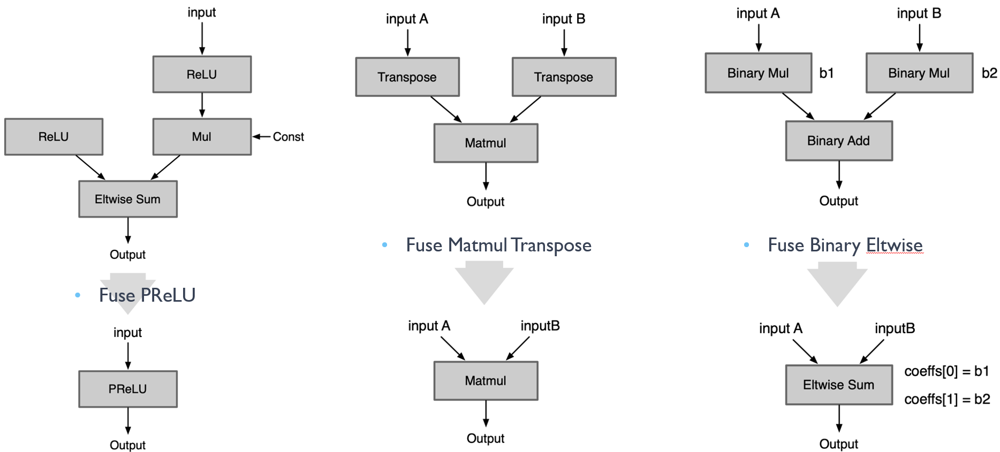
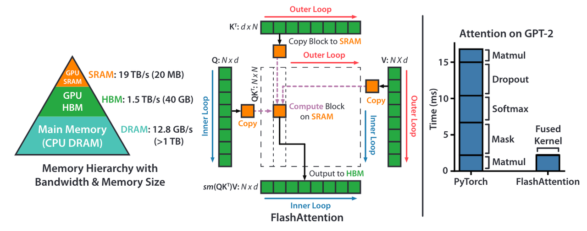
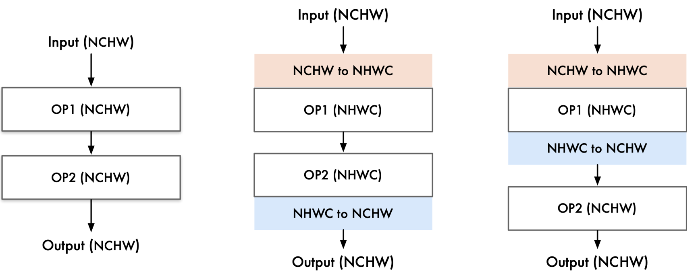
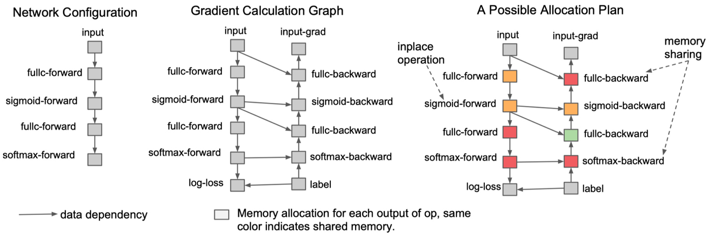

<!--Copyright © 适用于[License](https://github.com/chenzomi12/AISystem)版权许可-->

# 通用图优化技术

========== 一句话介绍本节要介绍的内容，下面这段话融合到里面的内容。
========== 图片按规范命名，文档名字是 01Optimizer.md, 那么图片是 01Optimizer01.png，这种

Basic: 基础优化涵盖了所有保留计算图语义的修改，如：O1 常量折叠、O2 冗余节点消除和 O3 有限数量的算子融合。

Extended: 扩展优化仅在运行特定后端，如 CPU、CUDA、NPU  后端执行提供程序时适用。其针对硬件进行特殊且复杂的 Kernel 融合策略和方法。

Layout & Memory: 布局转换优化，主要是不同 AI 框架，在不同的硬件后端训练又在不同的硬件后端执行，数据的存储和排布格式不同。


最后我们来到了第二个和第三个步骤，除了前面提到的算子替换和算子前移等内容，图优化还包括以下几种常见的优化策略：

算子融合：将多个算子融合为一个算子，以减少数据在算子之间的传输，加快计算速度。

数据节点转换：是指改变数据节点的数据类型或者存储格式，以改善模型的性能。

内存优化：优化数据的存储和访问方式，以减少内存占用和数据访问的时间。

## 计算图优化详解

### 其他图优化

某些复杂的算子在一些深度学习框架上可能没有直接实现，而是通过一系列基本算子的组合来实现。但是，这种组合方式可能会导致计算效率降低，因为每个算子之间的数据传输都需要额外的时间和空间。此外，过多的算子也会使得网络图变得复杂，难以理解和优化。

这时，如果推理引擎实现了该 Op，就可以把这些组合转成这个 Op，能够使得网络图更加简明清晰。具体示例如下：

Fuse Layer Norm：组合实现的 Norm Op 直接转换成一个 Op

Fuse PReLU：组合实现的 PReLU Op 直接转换成一个 Op

Fuse Matmul Transpose：有些框架的矩阵乘法 Matmul 层自身是不带转置操作的，当需要转置的矩阵乘法时需要前面加一个 transpose 层。如 Onnx 的 Matmul 自身有是否转置的参数，因此可以将前面的 transpose 层转换为参数即可

Fuse Binary Eltwise：x3 = x1 *b1+x2 *b2，把 BinaryOp Add 转换成 Eltwise Sum，而 Eltwise Sum 是有参数 coeffs，可以完成上述乘法的效果，因此把两个 BinaryOp Mul 的系数融合到 Eltwise Sum 的参数 coeffs

Fuse Reduction with Global Pooling：对一个三维 tensor 先后两次分别进行 w 维度的 reduction mean 和 h 维度的 reducetion mean，最终只剩下 c 这个维度，就等于进行了一次 global_mean_pooling



### Flash Attention

========== Flash Attention 深度解读一下，直接贴一个代码上来不合适，深入深入再深入理解下这个内容哈。

这里要特别提及的一篇工作是 FlashAttention。Transformer 结构已成为自然语言处理和图像分类等应用中最常用的架构。尽管 Transformer 在规模上不断增大和加深，但处理更长上下文仍然是一个挑战，因为核心的自注意力模块在序列长度上具有二次方的时间和内存复杂度。这导致在处理长序列时速度变慢且内存需求巨大。



在传统算法中，一种方式是将 Mask 和 SoftMax 部分融合，以减少访存次数。然而，FlashAttention 则更加激进，它将从输入 Q,K,V 到输出 O 的整个过程进行融合，以避免 S,P 矩阵的存储开销，实现端到端的延迟缩减。

为了让计算过程的结果完全在 SRAM 中，摆脱对 HBM 的依赖，可以采用分片操作，每次进行部分计算，确保这些计算结果能在 SRAM 内进行交互，待得到对应的结果后再进行输出。

代码实现：https://github.com/openai/triton/blob/main/python/tutorials/06-fused-attention.py#L17

```python
def _fwd_kernel(
    Q, K, V, sm_scale,
    L, M,
    Out,
    stride_qz, stride_qh, stride_qm, stride_qk,
    stride_kz, stride_kh, stride_kn, stride_kk,
    stride_vz, stride_vh, stride_vk, stride_vn,
    stride_oz, stride_oh, stride_om, stride_on,
    Z, H, N_CTX,
    BLOCK_M: tl.constexpr, BLOCK_DMODEL: tl.constexpr,
    BLOCK_N: tl.constexpr,
):
    start_m = tl.program_id(0)
    off_hz = tl.program_id(1)
    # initialize offsets
    offs_m = start_m * BLOCK_M + tl.arange(0, BLOCK_M)
    offs_n = tl.arange(0, BLOCK_N)
    offs_d = tl.arange(0, BLOCK_DMODEL)
    off_q = off_hz * stride_qh + offs_m[:, None] * stride_qm + offs_d[None, :] * stride_qk
    off_k = off_hz * stride_qh + offs_n[None, :] * stride_kn + offs_d[:, None] * stride_kk
    off_v = off_hz * stride_qh + offs_n[:, None] * stride_qm + offs_d[None, :] * stride_qk
    # Initialize pointers to Q, K, V
    q_ptrs = Q + off_q
    k_ptrs = K + off_k
    v_ptrs = V + off_v
    # initialize pointer to m and l
    m_prev = tl.zeros([BLOCK_M], dtype=tl.float32) - float("inf")
    l_prev = tl.zeros([BLOCK_M], dtype=tl.float32)
    acc = tl.zeros([BLOCK_M, BLOCK_DMODEL], dtype=tl.float32)
    # load q: it will stay in SRAM throughout
    q = tl.load(q_ptrs)
    # loop over k, v and update accumulator
    for start_n in range(0, (start_m + 1) * BLOCK_M, BLOCK_N):
        # -- compute qk ----
        k = tl.load(k_ptrs)
        qk = tl.zeros([BLOCK_M, BLOCK_N], dtype=tl.float32)
        qk += tl.dot(q, k)
        qk *= sm_scale
        qk = tl.where(offs_m[:, None] >= (start_n + offs_n[None, :]), qk, float("-inf"))
        # compute new m
        m_curr = tl.maximum(tl.max(qk, 1), m_prev)
        # correct old l
        l_prev *= tl.exp(m_prev - m_curr)
        # attention weights
        p = tl.exp(qk - m_curr[:, None])
        l_curr = tl.sum(p, 1) + l_prev
        # rescale operands of matmuls
        l_rcp = 1. / l_curr
        p *= l_rcp[:, None]
        acc *= (l_prev * l_rcp)[:, None]
        # update acc
        p = p.to(Q.dtype.element_ty)
        v = tl.load(v_ptrs)
        acc += tl.dot(p, v)
        # update m_i and l_i
        l_prev = l_curr
        m_prev = m_curr
        # update pointers
        k_ptrs += BLOCK_N * stride_kn
        v_ptrs += BLOCK_N * stride_vk
    # rematerialize offsets to save registers
    start_m = tl.program_id(0)
    offs_m = start_m * BLOCK_M + tl.arange(0, BLOCK_M)
    # write back l and m
    l_ptrs = L + off_hz * N_CTX + offs_m
    m_ptrs = M + off_hz * N_CTX + offs_m
    tl.store(l_ptrs, l_prev)
    tl.store(m_ptrs, m_prev)
    # initialize pointers to output
    offs_n = tl.arange(0, BLOCK_DMODEL)
    off_o = off_hz * stride_oh + offs_m[:, None] * stride_om + offs_n[None, :] * stride_on
    out_ptrs = Out + off_o
    tl.store(out_ptrs, acc)
```

FlashAttention 在速度和内存占用方面都表现出明显的优势，并取得了良好的效果。目前，FlashAttention 已经经过广泛验证, torch2.0 中已提供 flashattention 的实现。

FlashAttention 的优点在于充分考虑了在计算任务中 IO 的重要性，并通过分块计算的方式开发了一种快速、节省显存、精确无近似的注意力实现方法。这使得我们更便于训练具有更长上下文的 Transformer 模型，并且为后续注意力算法的优化提供了一个基准。

### layout and memory 优化

针对网络模型，特别是在处理算子（操作符）时。算子在这里可以理解为模型中完成特定任务的一种函数或者操作，例如卷积，矩阵乘法等。

当上一层和下一层的算子相同时，我们可能不需要进行数据节点转换。因为这两层已经在进行相同的操作，再进行转换可能不会带来额外的优化效果。

当上一层的输入和下一层的输入不同时，我们就需要进行数据节点转换。具体来说，我们需要插入特定的算子来处理这种输入的变化。这个过程也是图优化的一部分。

如果在某些情况下，我们发现有些算子在当前的计算图中是多余的，或者说并没有为模型的性能提升做出贡献，那么我们需要删除这些算子。

具体示例如下：



内存优化是一种计算机系统优化技术，主要目的是提高系统的运行性能，通过更有效地使用和管理内存资源来达到这个目的。

Inplace operation：是一种内存优化手段，它在当前的内存块上直接进行操作，而不需要额外开辟新的内存。如果一块内存不再需要，且下一个操作是 element-wise（元素级操作，比如加法、乘法等），我们就可以使用原地操作，直接在原内存上进行计算，覆盖原有的数据。这样做的好处是可以节省内存，减少内存的分配和回收开销，从而提高程序的运行效率。

Memory sharing：是另一种内存优化策略。它在内存使用上进行优化，当两个数据的内存大小相同，且有一个数据参与计算后不再需要时，我们可以让后一个数据直接覆盖前一个数据的内存。这样做的好处是可以减少内存的开销，节省内存空间，提高内存的使用效率。



## 小结与思考

本节深入探讨了网络模型优化的几个关键方面，包括算子融合、数据节点转换和内存优化。首先，我们讨论了算子融合，这是一种减少数据在算子之间传输的技术，可以有效地提升计算速度。通过将多个算子融合为一个算子，我们可以减少数据传输的次数，从而提升计算效率。

其次，我们介绍了数据节点转换，这是一种改变数据节点的数据类型或存储格式的方法，旨在改善模型的性能。通过对数据节点进行适当的转换，我们可以使模型更好地适应特定的计算或存储需求，从而提高模型的性能。

最后，我们研究了内存优化，这是一种优化数据的存储和访问方式的技术，旨在减少内存占用和数据访问的时间。通过改进数据的存储方式和访问策略，我们可以更有效地使用内存资源，从而提升程序的运行效率。

## 本节视频

<html>
<iframe src="https://player.bilibili.com/player.html?isOutside=true&aid=436279990&bvid=BV1Qj411T7Ef&cid=992509078&p=1&as_wide=1&high_quality=1&danmaku=0&t=30&autoplay=0" width="100%" height="500" scrolling="no" border="0" frameborder="no" framespacing="0" allowfullscreen="true"> </iframe>
</html>
