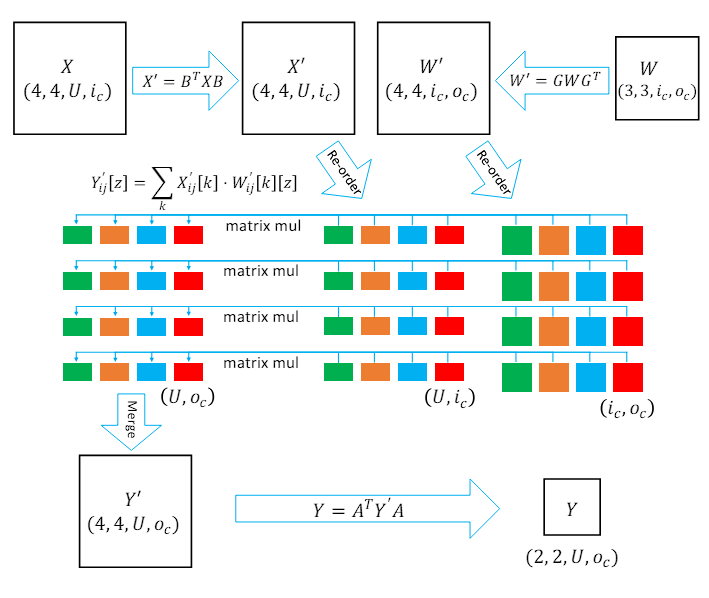

<!--Copyright © ZOMI 适用于[License](https://github.com/chenzomi12/AISystem)版权许可-->

# 推理内存布局

<<<<<<< HEAD
从前文的简单介绍中，我们提到了可以从内存布局上对推理引擎的Kernel进行优化，接下来，我们将先介绍CPU和GPU的基础内存知识，NCHWX内存排布格式以及详细展开描述MNN这个针对移动应用量身定制的通用高效推理引擎中通过数据内存重新排布进行的内核优化。
=======
从前文的简单介绍中，我们提到了可以从内存布局上对推理引擎的 Kernel 进行优化，接下来，我们将从内存，内存布局方面采用的多种经典方法来详细介绍。
>>>>>>> upstream/main

========== 在推理引擎的内存布局，有一个很重要的事情就是主要是运行在推理卡，或者 CPU 上面。所以可以重点看看在推理芯片上是内存布局有哪些格式优化点。CPU 也是，我看过一些文章，你也可以重点多看看相关的论文。

<<<<<<< HEAD
CPU内存主要架构图如下图所示，其中比较关键的是有主存，以及其上的多级缓存架构，CPU运行的速度太快，相对而言内存的读写速度就非常慢。如果CPU每次都要等内存操作完成，才可以继续后续的操作，那效率会非常低下。由此设计出了多级缓存架构，缓存级别越小，越靠近CPU，同样也意味着速度越快，但是对应的容量越少。

当CPU需要取数据时，如果通过索引得知缓存中没有该数据，那么此时CPU需要从RAM主存中先获取数据，然后将该数据及其临近数据加载到Cache缓存中，以便利用访问局部性提升访问命中率。当然多级缓存也会带来问题，即数据同步问题，当出现多核和乱序时，如何保证数据同步也需要提供一种内存屏障的规则。
=======
https://blog.csdn.net/hsqyc/article/details/115602310
https://discuss.tf.wiki/t/topic/872
https://github.com/alibaba-developer/Ali-Open-Source/blob/master/%E9%98%BF%E9%87%8C%E5%BC%80%E6%BA%90%EF%BC%81%E8%BD%BB%E9%87%8F%E7%BA%A7%E6%B7%B1%E5%BA%A6%E5%AD%A6%E4%B9%A0%E7%AB%AF%E4%BE%A7%E6%8E%A8%E7%90%86%E5%BC%95%E6%93%8E%20MNN.md
>>>>>>> upstream/main

<<<<<<< HEAD
GPU内存主要架构图如下图所示，在主缓存等主要架构上，与CPU没太多的区别，也是多级缓存架构，其调度执行模式主要是按照SIMT模式进行，由许多 SM 组成。

SM（Streaming Multiprocessors）：可以理解为一个 GPU 计算单元的小集合，好比多核 CPU 的一个核 —— 但 CPU 的一个核一般运行一个线程，而 SM 能够运行多个轻量线程，每一个 SM 有自己的 Wrap scheduler 、寄存器（Register）、指令缓存、L1缓存、共享内存。Wrap scheduler：运算规划器，可以理解为运算时一个 warp 抓一把线程扔进了 cores 里面进行计算。

GPU互相之间一般是通过PCIe桥直接传输数据，或者是通过NVLink这种专用的超高速数据传输通道来传输数据。
=======
## CPU 系统内存
>>>>>>> upstream/main

CPU 内存主要架构图如下图所示，其中比较关键的是有主存，以及其上的多级缓存架构，CPU 运行的速度太快，相对而言内存的读写速度就非常慢。如果 CPU 每次都要等内存操作完成，才可以继续后续的操作，那效率会非常低下。由此设计出了多级缓存架构，缓存级别越小，越靠近 CPU，同样也意味着速度越快，但是对应的容量越少。

<<<<<<< HEAD
## NCHWX

在推理引擎中，或者底层Kernel层实际上为了更加适配到DSA或者ASIC专用芯片会使用NCHWX内存排布格式，那么下面我们来详细了解一下NCHWX数据排布格式。

由于典型的卷积神经网络随着层数的增加，其特征图在下采样后的长和宽逐渐减小，但是通道数随着卷积的过滤器的个数不断增大是越来越大的，经常会出现通道数为128，256等很深的特征图。这些很深的特征图与过滤器数很多的卷积层进行运算的运算量很大。为了充分利用有限的矩阵计算单元，进行了通道维度的拆分是很有必要的。根据不同数据结构特点，常见的有分别对Channel维进行了Channel/4，Channel/32和Channel/64的拆分，下图为NCHWX的物理存储结构。

具体来说，先取Channel方向的数据，按照NCHW4来进行举例，先取17/13/X，再取W方向的数据，再取H方向的数据。
=======
当 CPU 需要取数据时，如果通过索引得知缓存中没有该数据，那么此时 CPU 需要从 RAM 主存中先获取数据，然后将该数据及其临近数据加载到 Cache 缓存中，以便利用访问局部性提升访问命中率。当然多级缓存也会带来问题，即数据同步问题，当出现多核和乱序时，如何保证数据同步也需要提供一种内存屏障的规则。

GPU 内存主要架构图如下图所示，在主缓存等主要架构上，与 CPU 没太多的区别，也是多级缓存架构，其调度执行模式主要是按照 SIMT 模式进行，由许多 SM 组成。SM（Streaming Multiprocessors）：可以理解为一个 GPU 计算单元的小集合，好比多核 CPU 的一个核 —— 但 CPU 的一个核一般运行一个线程，而 SM 能够运行多个轻量线程，每一个 SM 有自己的 Wrap scheduler 、寄存器（Register）、指令缓存、L1 缓存、共享内存。

Wrap scheduler：运算规划器，可以理解为运算时一个 warp 抓一把线程扔进了 cores 里面进行计算。GPU 互相之间一般是通过 PCIe 桥直接传输数据，或者是通过 NVLink 这种专用的超高速数据传输通道来传输数据。

### 内存对齐方式

如下图所示，右侧代表着数据，左侧代表着内存的多个地址，数据存放在内存的某个地址中。内存对齐指的是数据元素按照一定的规则在空间上排列，而不是顺序的一个接一个的排放。数据在内存中存储时相对于起始地址的偏移量是数据大小的整数倍，称为自然对齐，相对应的通过编译器或语言的指令强制变量按照特定的对齐方式存储，称为强制对齐。

内存对齐的原因：从硬件的层面来看，虽然数据在内存中是按照字节进行存储，但是处理器从内存中读取数据是通过总线通讯，总线默认传输的是字，即处理器按照字节块的方式读取内存，举个例子，比如 32 位系统从内存中以 4 字节为粒度进行读取，64 位系统从内存中以 8 字节为粒度进行读取，所以当在处理器上进行未对齐的地址访问时，处理器将读取多个字，还有些处理器平台不支持访问任意地址上的任意数据。

详细的举例子展开来讲，以 4 字节存取粒度的处理器为例，如上图所示，我们现在要读取一个 int 变量，其有 4 个字节，假如没有内存对齐机制，将一个 int 放在地址为 1 的位置，那么我们需要读取的有地址 1234，具体操作时首先需要从地址 0 开始读取，然后取其较高的三位 123，剔除首字节 0，第二次从地址 4 开始读取，然后只取其较低的一位 4，之后将两个数据合并，总体上来说，如果有内存对齐，如下图所示，我们只需读取一次，而没有内存对齐机制，将导致访问请求数据所需的内存事务数增加至 2 倍。

总结一下，现代处理器上的内存子系统仅限于以其字大小的粒度和对齐方式访问内存。下面我们来总结一下内存中字粒度访问和内存对齐的原因。

原因一为速度问题，现代处理器具有多个级别的高速缓存，数据必须通过这些缓存；支持单字节读取将使内存子系统的吞吐量与执行单元的吞吐量紧密地绑定，会消耗大量 CPU 资源，成为瓶颈。CPU 总是以其字的大小进行内存读取，进行未对齐的内存访问时，处理器将读取多个字，需要读取变量所跨越内存的所有字，同时进行处理。将导致访问请求数据所需要的内存事务增加 2 倍。

原因二为原子性，CPU 可以在一个对齐的内存字上操作，意味着没有指令可以中断该操作。这对于许多无锁数据结构和其他并发范式的正确性至关重要。除此之外，内存对齐还可以用于优化缓存和 SIMD 指令，内存对齐有助于利用缓存行的特性。

缓存通常以固定大小的缓存行存储数据，如果数据按照缓存行对齐，可以最大程度地减少对内存的访问次数，提高缓存的命中率。对齐的内存访问对于使用 SIMD 指令集的操作更为重要。这些指令集通常要求数据在内存中按照一定的对齐方式排列，以便能够一次性处理多个数据。

## Tensor 内存布局

Tensor 是神经网络中的一个基本数据结构，可以看作是一个多维数组，其在内存中排布为按字节存储。他的重要属性有形状和基本数据类型，形状能够决定张量的维度，以及各个维度的数量组成方式。基本数据类型决定了其每个元素占用内存的字节数，以及存在的方式。其在内存中索引占据的范围由其形状决定。

零维张量只有一个数，一维张量有多个数，二维张量是一个矩阵，也是用来表达一个黑白图片常用的，三维张量常用于表达彩色图片，四维张量常用于表达多张彩色图片，五维六维等一般是因为硬件方便处理等原因对维度再次进行了分割。

在深度学习领域中，多维数据通过多维数组存储，比如卷积神经网络的特征图通常用四维数组保存：四个维度分别为“N”batch 批量大小，一般指图像数量，“C”channels 特征图通道数，“H”height 特征图的高度，和“W”width 特征图的宽度。比如自然语言领域，数据通常用三维数组保存，三个维度分别为“N”batch 批量大小，“S”sequece 句子数量，“W”word 单词数量。

在计算机内存里存储的时候，是线性的存储，根据排列顺序的区别，行为主序的称为行优先存储，列为主序的称为列优先存储。

行优先存储和列优先存储并没有绝对的好坏关系，相对比较通用的结论是：对于行优先遍历的，使用行优先存储，对于列优先遍历的，使用列优先存储。相邻操作访存地址应该尽可能接近。

通常根据这个原则去排布数据能够得到较优的访存。这是由缓存的结构决定的。这个原则被称为访存的空间局部性，也即相近的代码（指令）最好访问相邻的数据，这样硬件能够提供更好的性能。

### NCHW 格式

如下图所示，这个例子中的图片分为红绿蓝三个通道，假设我们使用的是"NCHW"的数据排布方式，这里我们先将各方向的定义在这个图中详细说明，1 2 3 这个方向为 W，1 4 这个方向为 H，1 7 13 这个方向为 C，N 方向只有一个图片，暂时不讨论，"NCHW"的数据排布方式，是先取 W 方向的数据，即 123，再取 H 方向的数据，即 123 456，再取 C 方向的数据，即 123456 789/10/11/12 13/14/15/16/17/18，在计算机中存储时即为图示下侧的序列。

简单地来说，也就是先在一个通道中，按照 W 方向/H 方向存储数据，接着再到剩余通道中按同样方式存储数据，其突出特点是同一个通道的数值连续排布，更适合需要对每个通道单独运算的操作，如 MaxPooling 最大池化操作，"NCHW"的计算时需要的存储更多，一次存储对应一个通道的数据，适合 GPU 运算，正好利用了 GPU 内存带宽较大并且并行性强的特点，其访存与计算的控制逻辑相对简单。

如下图所示，按照"NCHW"的数据排布方式，我们的目标是计算灰度值，那么我们需要先将通道一的数据加载进内存，乘以 0.299，然后每次计算都可能需要加载一整个完整通道的数据，通道二所有数据值乘以 0.587，通道三所有数据值乘以 0.114，最后将三个通道结果相加得到灰度值，三个操作是独立的，可以在 GPU 上并行完成。

### NHWC 格式

同样的图片，假设我们使用的是"NHWC"的数据排布方式，按照上文定义的方向，我们先取 C 方向的数据，即 17/13，再取 W 方向的数据，即 17/13 28/14 39/15，再取 H 方向的数据，即 17/13 28/14 39/15 4/10/16 5/11/17 6/12/18，在计算机中存储时即为上所图示下侧的序列。

简单地来说，先把不同通道中同一位置的元素存储，再按照 W 方向/H 方向按照同样方式存储数据，其突出特点为不同通道中的同一位置元素顺序存储，因此更适合那些需要对不同通道的同一数据做某种运算的操作，比如“Conv1x1”1x1 卷积操作。"NHWC"更适合多核 CPU 运算，CPU 的内存带宽相对较小，每个像素计算的时延较低，临时空间也很小，有时计算机采取异步的方式边读边算来减小访存时间，计算控制灵活且复杂。

如下图所示，按照"NHWC"的数据排布方式，我们的目标是计算灰度值，假设我们现在有 3 个 cpu 的核，那么就可以通过 3 个核分别并行处理这三个通道的同一位置元素，最后进行累加得到灰度值。

### NCHWX 格式
>>>>>>> upstream/main

由于典型的卷积神经网络随着层数的增加，其特征图在下采样后的长和宽逐渐减小，但是通道数随着卷积的过滤器的个数不断增大是越来越大的，经常会出现通道数为 128，256 等很深的特征图。这些很深的特征图与过滤器数很多的卷积层进行运算的运算量很大。

为了充分利用有限的矩阵计算单元，进行了通道维度的拆分是很有必要的。根据不同数据结构特点，常见的有分别对 Channel 维进行了 Channel/4，Channel/32 和 Channel/64 的拆分，下图为 NCHWX 的物理存储结构。具体来说，先取 Channel 方向的数据，按照 NCHW4 来进行举例，先取 17/13/X，再取 W 方向的数据，再取 H 方向的数据。

<<<<<<< HEAD
## MNN

MNN 是一个轻量级的深度学习端侧推理引擎，核心解决深度神经网络模型在端侧推理运行问题，涵盖深度神经网络模型的优化、转换和推理。

其对WinoGrad卷积计算进行内核优化，重新排布了其数据格式，下面我们来进行详细介绍。

### WinoGrad卷积计算

首先我们先给出针对WinoGrad二维卷积计算的公式：

$$
\begin{align}
Y = A^T[[GWG^T]\odot[B^XB]]A
\end{align}
$$

其中，$W$ 为 $r \times r$ 的卷积核，$X$ 为 $(m + r -1) \times (m + r -1)$ 的图像块。

可以看出Hadamard 积是 Winograd 卷积中必不可少的步骤（见上公式）。但它存在内存访问耗时较长的问题，拖累了整个计算过程。

事实上，对Hadamard 积的求和可以转换为点积。

将多个点积组合在一起可以得到矩阵乘法，这是并行性和分摊内存访问开销的不错的方式。

通过这种方式，我们在数据布局重新排序的基础上将 Hadamard 积转换为矩阵乘法。

MNN在WinoGrad卷积计算优化中使用的数据排布格式为NC4HW4。它将 4个数据元素拆分为一个单元，为张量创建一个新维度。4个元素连续放置在内存中，以便利用 CPU 中的矢量寄存器在单个指令（即 SIMD）中计算这4个数据。

MNN中数据重新排布后，对WinoGrad卷积的计算如下图所示：

我们看数据格式重新排布后的重要计算公式：

$$
\begin{align}
Y’_{ij}[z] = \sum_kX’_{ij}[k]\ast W’_{ij}[k][z]
\end{align}
$$

令参与计算的X’矩阵与W’矩阵以及中间矩阵Y’的前两个维度都为4。

CPU 中的矢量寄存器在单个指令中能够一次计算4组在内存中连续存储的数据，一个指令就可以计算4次matrix mul，充分利用了SIMD的并行计算能力。

总结一下，MNN对数据格式进行 NC4HW4 重排后，可以充分利用 ARM CPU 指令集的特性，实现对卷积等操作进行加速；同时可以较少 cache miss，提高内存命中率。

当然，对于较大的 feature 特征图，如果其 channel 不是 4 的倍数，则会导致补充 0 过多，导致内存占用过高，同时也相应的增加计算量。

## 小结
=======

NCHWX 的格式能够更好的适配 SIMT，其中 Cuda 的 DP4A 模块计算时执行两个 4 元素向量 A(int8)和 B(int8)（每个向量包含存储在 32 位字中的 4 个单字节值）之间的向量点积，将结果存储为 32 位整数，这个过程与 NCHW4 十分适配，一次正好取出 4 个元素进行计算。

为了最大化 CUDA 的 Tensor core 计算单元的卷积算子的吞吐，NCHW32 和 NCHW64 分别针对 int8 和 int4 数据类型进行计算,对 Cache 更友好，减少 Cache 未命中的概率；Kernel 实现层面易进行 Padding，减少边界分支判断，代码逻辑简单。

## 小结与思考
>>>>>>> upstream/main

在本节中我们介绍了

1.CPU 和 GPU 内存中都有重要的多级缓存架构，来保证 CPU/GPU 核要访问内存时，不用每次都等内存操作完成，才可以继续后续的操作，可以从缓存中读取。

2.NCHWX 的格式能够更好的适配SIMT，为了充分利用有限的矩阵计算单元，进行了通道维度的拆分，还对Cache更友好，减少Cache未命中的概率；Kernel实现层面易进行Padding，减少边界分支判断，代码逻辑简单。

<<<<<<< HEAD
3.MNN中针对WinoGrad卷积计算进行内核优化，重新排布了其数据格式为NC4HW4，CPU 中的矢量寄存器在单个指令中能够一次计算4组在内存中连续存储的数据，充分利用了SIMD的并行计算能力。

## 本节视频

<html>
<iframe src="https://player.bilibili.com/player.html?isOutside=true&aid=352822140&bvid=BV1eX4y1X7mL&cid=1034535797&p=1&as_wide=1&high_quality=1&danmaku=0&t=30&autoplay=0" width="100%" height="500" scrolling="no" border="0" frameborder="no" framespacing="0" allowfullscreen="true"> </iframe>
</html>
=======
3.卷积神经网络的特征图通常用四维数组保存，有两种常见的数据排布方式，"NHWC"更适合多核 CPU 运算，"NCHW"更适合在 GPU 上并行完成。

3.NCHWX 的格式能够更好的适配 SIMT，为了充分利用有限的矩阵计算单元，进行了通道维度的拆分，还对 Cache 更友好，减少 Cache 未命中的概率；Kernel 实现层面易进行 Padding，减少边界分支判断，代码逻辑简单。

>>>>>>> upstream/main
