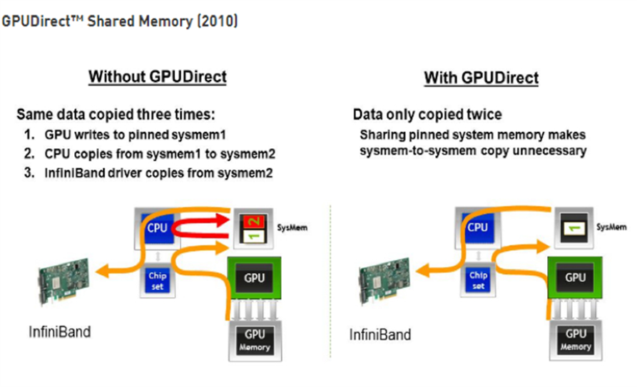
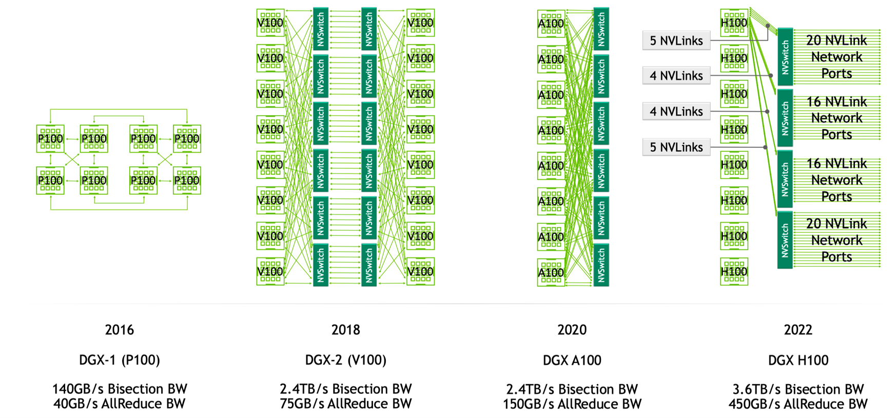
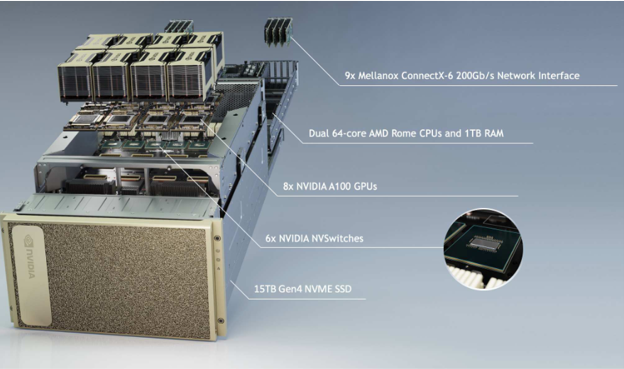
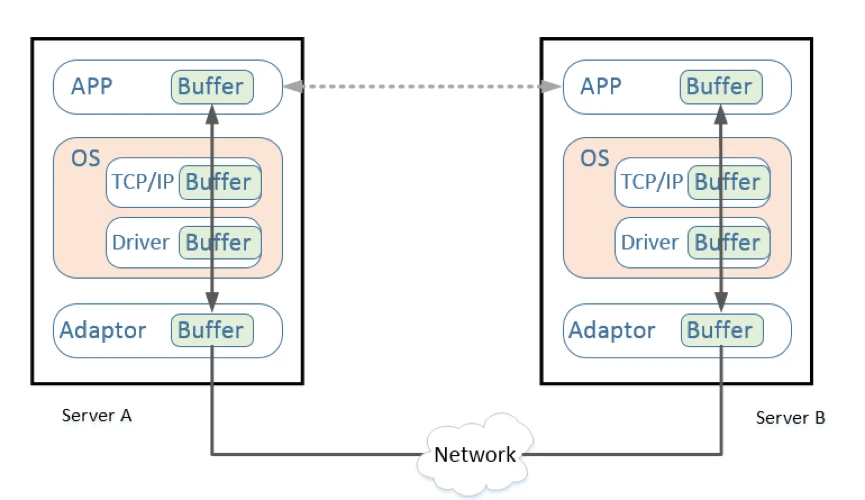
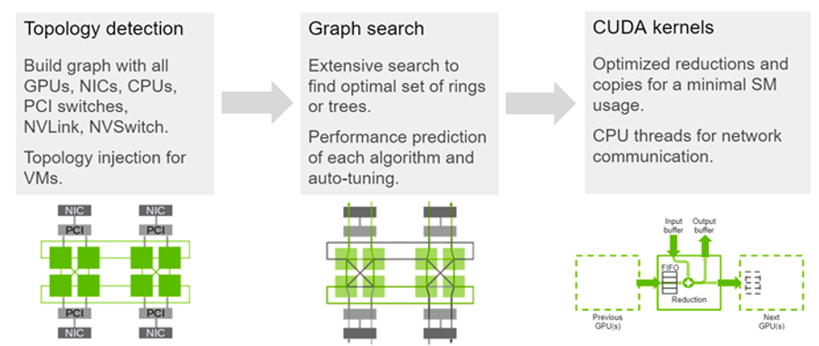

# AI 集群通信软硬件

随着大模型的出现，它所需的算力和参数存储并非有限单卡能力能够满足的。比如：A100 的单卡算力只有 312 TFLOPS，而 GPT-3 则需要 314 ZFLOPs 的总算力，两者相差了 9 个数量级。GPT-3 的 1750 亿参数本身就需要 700 GB 的显存空间（每个参数按照 4 个字节计算），而英伟达 A100 GPU 只有 80 GB 显存。

有限的单卡能力和模型的巨大的存储、计算需求之间的矛盾，是可以通过分布式训练的方法解决，但是分布式训练又会遇到集群通信的性能问题。分布式训练过程中需要在多个 GPU 之间或者多台机器之间传输大量的网络模型参数进行梯度同步或者参数更新等操作，协同完成训练任务，一旦某一个环节通信存在性能瓶颈或问题，将影响全局的分布式训练，因此 AI 集群通信是分布式训练的重要部分。本文将重点介绍 AI 集群通信软硬件的基本内容。

## 硬件通信方式

AI 集群通信的硬件通信一般实现方式分为**机器内通信**和**机器间通信**两种类型。

### 机器内通信

机器内通信指单台服务器内的 GPU 或者其他 AI 计算卡进行集合通信，仅在机器内部，一般分为共享内存、PCIE、NVLink 三种方式。

**共享内存**

早期 GPU 需要将数据从显存复制到 GPU 驱动在系统内存中 pin 住的 Memory 1，再从 Memory 1 复制到 Memory 2，之后才能再做进一步传输。然而使用了 GPUDirect Shared Memory 之后，内存空间实现了共享，减少了一次数据复制，降低了数据交换延迟。多个 GPU，或者 GPU 与网卡，或者 GPU 与其他设备之间可以通过访问 GPUDirect Shared Memory 方式访问**同一台**主机上的内存资源。注意：共享内存方式，设备双方须满足在同一台机器上的条件。

**PCIE**

PCIE 全称“Peripheral Component Interconnect Express”，即“高速外围组件互联接口”。它是一种串行总线接口标准，用于连接计算机系统中的各种设备。它可拓展性强，可以支持的设备有：显卡、固态硬盘、无线网卡、有线网卡、声卡、视频采集卡、PCIe 转接 M.2 接口、PCIe 转 USB 接口、PCIe 转接 Tpye-C 接口等。总的来说，PCIE 是现代计算机系统中不可或缺的一部分，它为各种设备提供了高速、灵活和可靠的连接方式。

目前 PCIE 已经迭代更新过多个版本，每个版本的带宽数据如下：

PCIe 的设计旨在使所有硬件设备能够高效地与计算机的 CPU 进行通信。然而，尽管最新的 PCIe 版本（比如 PCIe 4.0 和 5.0)提供了非常高的数据传输速度，但它们仍然不能满足一些特别高性能应用的需求。

英伟达推出了能够提升 GPU 通信性能的技术——GPUDirect P2P 技术，使 GPU 可以通过 PCI Express 直接访问目标 GPU 的显存，避免了通过拷贝到 CPU host memory 作为中转，大大降低了数据交换的延迟，但受限于 PCI Express 总线协议以及拓扑结构的一些限制，依旧无法做到更高的带宽。

**NVLink**

在大模型训练过程中，GPU 间通信的带宽通常在数百 GB/s 以上，PCIe 总线的数据传输速率容易成为瓶颈，且 GPU 发出的信号需要先传递到 PCIe Switch, PCIe Switch 中涉及到数据的处理，CPU 会对数据进行分发调度，这些都会引入额外的网络延迟，影响 GPU 并行计算的效率和性能。为此，此后，英伟达提出了 NVLink 总线协议。

NVLink 是一种高速互连技术，旨在加快 CPU 与 GPU、GPU 与 GPU 之间的数据传输速度，提高系统性能。NVLink 通过 GPU 之间的直接互联，可扩展服务器内的多 GPU I/O，相较于传统 PCIe 总线可提供更高效、低延迟的互联解决方案。

NVLink 的首个版本于 2014 年发布，首次引入了高速 GPU 互连。2016 年发布的 P100 搭载了第一代 NVLink，提供 160GB/s 的带宽，相当于当时 PCIe 3.0 x16 带宽（双向）的 5 倍。之后陆续发布了很多新版本，V100 搭载的 NVLink2 将带宽提升到 300GB/s ，A100 搭载了 NVLink3 带宽为 600GB/s。H100 中包含 18 条第四代 NVLink 链路，总带宽（双向）达到 900 GB/s，是 PCIe 5.0 x16 带宽（双向）的 7 倍。日前英伟达在 2024GTC 大会上发布了最新的 Blackwell 结构的 B200 芯片，搭载 NVLink5 链路可达到双向带宽 1800GB/s。几代的 NVLink 性能对比如表格   

|                          | NVLink 5      | NVLink 4   | NVLink 3   | NVLink 2   | NVLink 1   |
| ------------------------ | ------------- | ---------- | ---------- | ---------- | ---------- |
| Signaling Rate           | 200 Gbps      | 100 Gbps   | 50 Gbps    | 25 Gbps    | 20 Gbps    |
| Lanes/Link               | 2             | 2          | 4          | 8          | 8          |
| Bandwidth/Direction/Link | 50 GB/sec     | 25 GB/sec  | 25 GB/sec  | 25 GB/sec  | 20 GB/sec  |
| Total Bandwidth/Link     | 100 GB/sec    | 50 GB/sec  | 50 GB/sec  | 50 GB/sec  | 40 GB/sec  |
| Links/Chip               | 18(Blackwell) | 18 (H100)  | 12 (A100)  | 6 (V100)   | 4 (P100)   |
| Bandwidth/Chip           | 1800 GB/sec   | 900 GB/sec | 600 GB/sec | 300 GB/sec | 160 GB/sec |

NVLink 高速互联主要有两种：

第一种是以桥接器的形式实现。可通过桥接器将两张卡的 NVLink 接口连接在一起。

另一种是在主板上集成 NVLink 接口。

**NVSwitch**
为了解决 GPU 之间通信不均衡问题，英伟达引入 NVSwitch。NVSwitch 芯片是一种类似交换机的物理芯片（ASIC），通过 NVLink 接口可以将多个 GPU 高速互联到一起，可创建无缝、高带宽的多节点 GPU 集群，实现所有 GPU 在一个具有全带宽连接的集群中协同工作，从而提升服务器内部多个 GPU 之间的通信效率和带宽。NVLink 和 NVSwitch 的结合使英伟达得以高效地将 AI 性能扩展到多个 GPU。

NVSwitch 是英伟达公司提供的产品，目前不单独出售，只和英伟达自家的硬件设备打包一起卖，所以外界很少见过它，下图为英伟达的 DGX A100 机器。

### 机器间通信

机器间通信指多台服务器内的 GPU 或者其他 AI 计算卡进行跨机，跨网络集合通信，一般分为 TCP/IP 网络、RDMA 网络两种方式。

**TCP/IP**

由于计算数量巨大，多机多卡的计算/训练已经是一个常态，多台机器间的通信是影响分布式训练行的一个重要指标。在传统的 TCP/IP 网络通信中，如下图所示，数据发送方需要将数据进行多次内存拷贝，并经过一系列的网络协议的数据包处理工作；数据接收方在应用程序中处理数据前，也需要经过多次内存拷贝和一系列的网络协议的数据包处理工作。经过这一系列的内存拷贝、数据包处理以及网络传输延时等，server 间的通信时延往往在毫秒级别，不能够满足多机多卡场景对于网络通信的高带宽、低延迟的需求。

当然在无 RDMA 网卡时，想要实现机器之间通信，也可以通过普通网卡进行 TCP/IP 通信，只是这样传输带宽将大大降低，延迟也会增加。

**RDMA(Remote Direct Memory Access)**

RDMA 是为了解决网络传输中数据处理延迟而产生的一种远端内存直接访问技术，主要有三点特性：

**CPU Offload**：无需 CPU 干预，应用程序可以访问远程主机内存而不消耗远程主机中的任何 CPU。远程主机内存能够被读取而不需要远程主机上的进程（或 CPU)参与。

**Kernel Bypass**：RDMA 提供一个专有的 Verbs interface 而不是传统的 TCP/IP Socket interface。应用程序可以直接在用户态执行数据传输，不需要在内核态与用户态之间做上下文切换。

**Zero Copy**：每个应用程序都能直接访问集群中的设备的虚拟内存，这意味着应用程序能够直接执行数据传输，在不涉及到网络软件栈的情况下，数据能够被直接发送到缓冲区或者能够直接从缓冲区里接收，而不需要被复制到网络层。

目前有三种 RDMA 相关协议分别 Infiniband、RoCE 和 iWARP。
**Infiniband（IB）**：专为 RDMA 设计的网络，从硬件层面保证可靠传输，同时由于这是一种新的网络技术，需要支持该技术的 NIC 和交换机，价格高昂。

**RoCE(RDMA over Converged Ethernet)**：RoCE 是一种允许通过以太网进行 RDMA 的网络协议。RoCE 有 2 个版本：RoCE v1 和 RoCE v2。RoCE v1 是一种链路层协议，允许在同一个广播域下的任意两台主机直接访问；RoCE v2 基于 UDP 层协议，实现了路由功能，RoCE v2 针对 RoCE v1 进行了一些改进，如引入 IP 解决扩展性问题，可以跨二层组网等。可以使用普通的以太网交换机，但是需要支持 RoCE 的网卡。

**iWARP（internet Wide Area RDMA Protocol）**：允许在 TCP 上执行 RDMA 的网络协议。在大型组网的情况下，iWARP 的大量 TCP 连接会占用大量的内存资源，对系统规格要求较高。可以使用普通的以太网交换机，但是需要支持 iWARP 的网卡。
介绍下硬件网卡信息

通常 AI 集群跨机通信，一般采用**GPUDirect RDMA**技术，实现高速网络传输。所谓 GPUDirect RDMA，就是 server1 的 GPU 可以通过**同一 root complex** 下的 RDMA 网卡直接访问 server2 的 GPU 内存。而在没有这项技术之前，GPU 需要先将数据从 GPU 内存搬移到系统内存，然后再利用 RDMA 传输到 server2，server2 的 GPU 还要做一次数据从系统内存到 GPU 内存的搬移动作。GPUDirect RDMA 技术使得进一步减少了 GPU 通信的数据复制次数，通信延迟进一步降低。

## 软件篇

通信软件指用于分布式训练时，多个计算设备之间的集合通信。在分布式系统中，各个节点间往往存在大量的集合通信需求，而我们可以用消息传递接口 (Message Passing Interface，MPI，一套集合通信相关的接口标准) 来定义一些比较底层的消息通信行为。譬如 Reduce、AllReduce、Scatter、Gather、AllGather 等。

常见的集合通信库（如：Open MPI、Gloo、NCCL 等）都在 MPI 的基础上，对各种集合通信的模式和算法作了各自的实现。

**MPI(Message Passing Interface)**: 定义了多个原语的消息传递接口，这一接口主要还用于多进程的通信。MPI 系统通信方式是建立在点对点通信之上。而集合通信是建立在端到端通信的基础上在一组进程内的通信原语。对于目前大型的 AI 集群，一般利用 MPI 进行跨机器多进程通信。成熟的软件库有 Open-MPI、Intel-MPI 等等

**XCCL(X Collective Communication Library)**泛指一类用于集合通信的软件库，包含 NCCL、HCCL、 BCCL 和 Byte CCL 等，它们的功能都是类似，一般都是基于开源 NCCL 进行优化或者改造，使得适用于自研的 AI 芯片架构，实现设备之间的集合通信。这里主要介绍下 NCCL 库。英伟达的 NCCL 提供编程抽象，通过高级拓扑检测、通用路径搜索和针对英伟达架构优化的算法，针对每个平台和拓扑进行高度调整。NCCL API 从 CPU 启动，GPU 执行，在 GPU 内存之间移动或交换数据。最后利用 NVLink 聚合多个高速 NIC 的带宽，实现多设备多机器多集群之间的集合通信。

**GLoo**是一个用于高性能集合通信的库，特别适用于分布式深度学习和大模型训练。它是 Meta 开发的一个开源课程，旨在提供高效、可扩展的通信基础设施，以支持在分布式环境下进行模型训练和推理。

如下是三种常见的集合通信库在 CPU 和 GPU 设备支持集合原语的情况，不难看出，mpi 主要用于 cpu 间的通信，NCCL 主要用于 GPU 间的通信

## 小结与思考

当下正是大模型落地的关键时期，各行各业都依赖大模型进行垂直领域的软件重构和赋能，AI 集群已从百卡、千卡扩大至万卡规模。在大型 AI 集群中进行分布式训练时，通信是必要环节，通信与计算的时间比例往往决定了分布式机器学习系统加速比的上限。我们需要不断地优化 AI 集群的软硬件通信，才能让集群性能发挥的更大。
