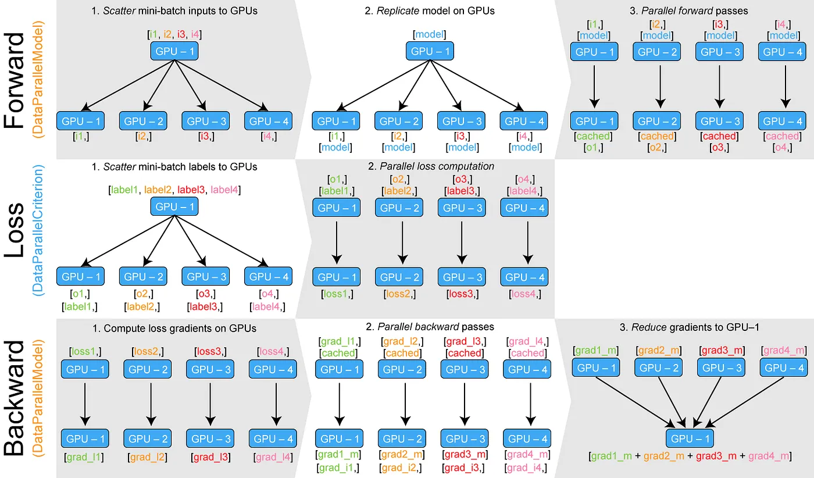

<!--适用于[License](https://github.com/chenzomi12/AISystem/blob/main/LICENSE)版权许可-->

# 数据并行

数据并行 $^{[1]}$ 就是将原本在单一设备上进行的数据训练过程，扩展到多个设备并行计算，再将各设备的计算结果进行同步汇总，以期达到理想情况下设备数量倍的加速效果。数据并行分为**数据并行（DP）**和**分布式数据并行（DDP）**两种模式。

相比数据并行，尽管分布式数据并行实现更为复杂，但在选择数据并行算法时，我们仍应优先考虑分布式数据并行。简单来说，它更高效、更易优化，且可以很好地与其他并行算法相结合。

> **设备**：这里代指NVIDIA GPU。NVIDIA GPU 属于 SPMD（Single Program Multiple Data）架构，即所有处理单元执行相同的程序代码。**一般由一个主机线程或进程来控制单块GPU设备**。在PyTorch中，由于Python的GIL（Global Interpreter Lock）限制，通常采用多进程方式。

## 数据并行（DP）

数据并行采用单进程、多线程方式，且只能在单台机器上运行。其算法可分为三个步骤：

- **前向传播**：将mini-batch数据平均分配到每个设备上。如果mini-batch设置过小，将导致设备内并行度不足，从而降低训练速度;在通信开销的影响下，甚至可能出现比单设备慢的情况。接下来进行分布式初始化，在某一设备上随机初始化模型和优化器，然后将它们复制到每个设备上，保证各设备的模型、优化器完全相同，甚至使用相同的随机种子。初始化完成后，各设备根据分配到的数据和模型同时进行前向传播。

- **损失计算**与**反向传播**：前向传播完成后，每个设备分别计算模型损失并进行反向传播。得到梯度后，将梯度传递到某一设备进行累加，再将累加后的梯度同步到每个设备上进行参数更新。这样可确保各设备的模型保持一致，避免使用其他模型的梯度进行参数更新而导致收敛性问题。


:width:`650px`

但由于通常使用Python作为深度学习开发语言，并采用基于动态图的框架（如：PyTorch），数据并行往往受到Python的GIL限制，导致设备利用率和训练速度低下。另一方面，在累加梯度时，数据并行会在单一设备上进行全局梯度累积，降低了算法的并行度，也增加了该设备的负载。

## 分布式数据并行（DDP）

分布式数据并行的流程与数据并行类似，但引入了多进程，避免了Python多线程的GIL限制，同时针对通信做了大量优化。每个进程启动一个单独的主训练脚本副本，也可扩展到多台网络连接的机器，进一步扩大分布式规模和效率。针对通信的优化主要采用了**分桶Ring-AllReduce算法**和**图优化算法**。与数据并行的其他区别包括：

- 每个设备将获得一份完整的mini-batch数据，而非mini-batch数据的拆分。
- 各设备负载均衡，不会出现单一设备负载过高的情况。  
- 只在反向传播时进行集合通信，且只同步梯度。

```python
import os
import torch
import torch.nn as nn
import torch.optim as optim
import torch.distributed as dist
import torch.multiprocessing as mp
from torch.nn.parallel import DistributedDataParallel as DDP

def setup(rank, world_size):
    os.environ['MASTER_ADDR'] = 'localhost'
    os.environ['MASTER_PORT'] = '12355'

    # initialize the process group
    dist.init_process_group('gloo', rank=rank, world_size=world_size)

def cleanup():
    dist.destroy_process_group()

class ToyModel(nn.Module):
    def __init__(self):
        super(ToyModel, self).__init__()
        self.net = nn.Linear(10, 5)

    def forward(self, x):
        return self.net(x)

def demo_basic(rank, world_size):
    print(f'Running basic DDP example on rank {rank}.')
    setup(rank, world_size)

    # create model and move it to GPU with id rank
    model = ToyModel().to(rank)
    ddp_model = DDP(model, device_ids=[rank])

    loss_fn = nn.MSELoss()
    optimizer = optim.SGD(ddp_model.parameters(), lr=0.001)

    optimizer.zero_grad()
    outputs = ddp_model(torch.randn(20, 10))
    labels = torch.randn(20, 5).to(rank)
    loss_fn(outputs, labels).backward()
    optimizer.step()

    cleanup()

def run_demo(demo_fn, world_size):
    mp.spawn(demo_fn,
             args=(world_size,),
             nprocs=world_size,
             join=True)

if __name__ == '__main__':
    run_demo(demo_basic, 2)

# Running basic DDP example on rank 1.
# Running basic DDP example on rank 0.
```

### 计算与通信的重叠

在分布式训练中，每个进程通常会在完成当前网络反向传播的同时进行梯度更新，以隐藏通信延迟。在部分梯度计算完成后，就立即进行通信，一般通过钩子函数实现。在通信的同时也会继续计算梯度，这样不必等待所有计算完成后再集中通信，也不必在计算完成后等待通信，可以将通信过程覆盖到计算时间内，充分利用设备，提高了设备使用率。


:width:`650px`

### 同步和异步的梯度平均与参数平均  

之前的介绍都是基于同步梯度平均进行分布式训练。数据并行性是通过在优化器步骤之前进行梯度通信来实现的，以确保使用完全相同的梯度集更新所有模型副本的参数，因此各模型副本在迭代中可保持一致。这种方式虽然保证了模型一致性和收敛性，但不同设备之间需要相互等待，造成了部分计算资源浪费。

在异步梯度平均或参数平均中，训练过程具有更强的异步性，不需要模型保持同步一致，因此设备等待时间更少，设备利用率更高，但也可能对收敛带来一定影响。

### 数据并行的开源实现

- [DeepSpeed](https://github.com/microsoft/DeepSpeed)：微软推出的分布式训练框架
- [Megatron-LM](https://github.com/NVIDIA/Megatron-LM)：英伟达推出的分布式训练框架  
- [ColossalAI](https://github.com/hpcaitech/ColossalAI)：潞晨科技推出的分布式训练框架
- [Horovod](https://github.com/horovod/horovod)：LF AI & Data Foundation 推出的分布式训练框架 
- [BytePS](https://github.com/bytedance/byteps)：字节跳动推出的分布式训练框架
- [PyTorch](https://pytorch.org/tutorials/intermediate/ddp_tutorial.html)、[TensorFlow](https://tensorflow.google.cn/guide/distributed_training?hl=zh-cn) 提供的数据并行接口

## 参考文献:

[1] Li S, Zhao Y, Varma R, et al. Pytorch distributed: Experiences on accelerating data parallel training[J]. arXiv preprint arXiv:2006.15704, 2020.